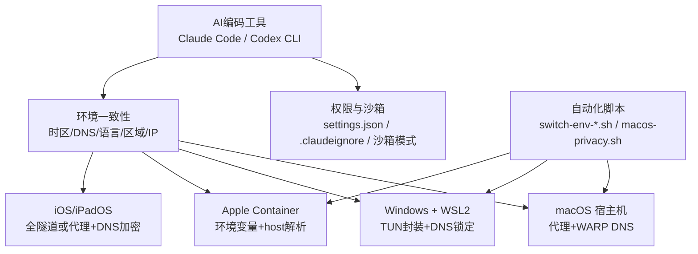
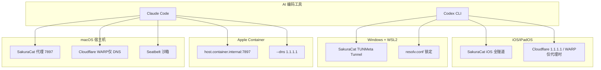
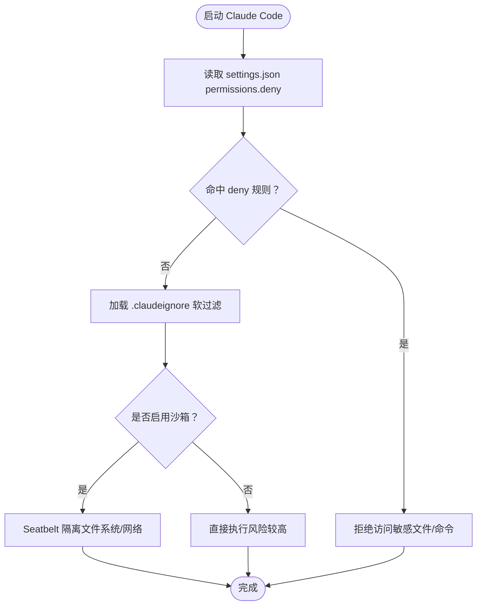
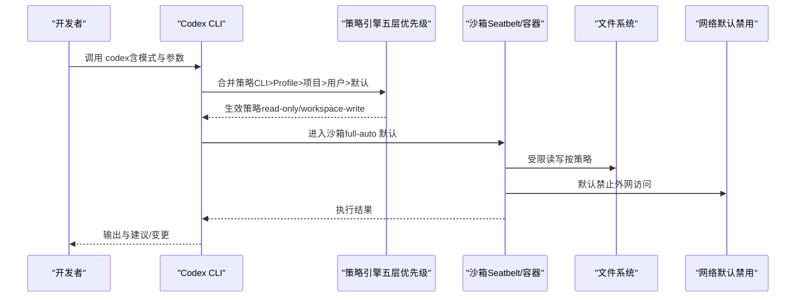
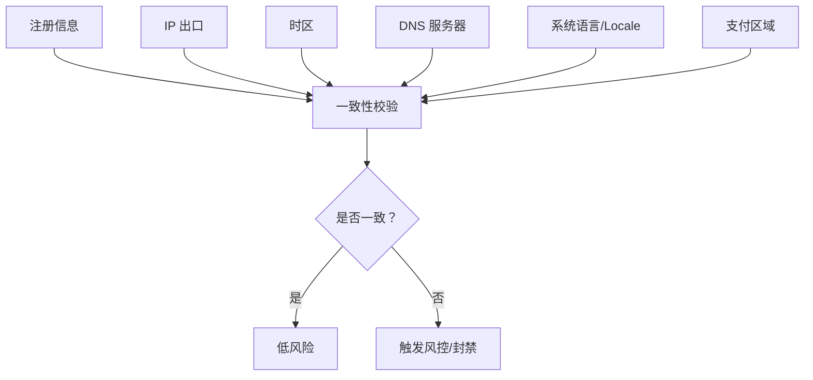
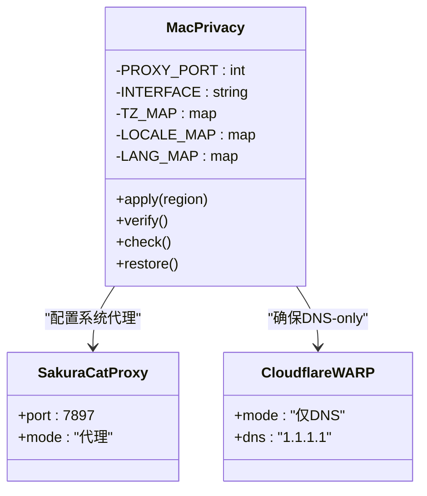
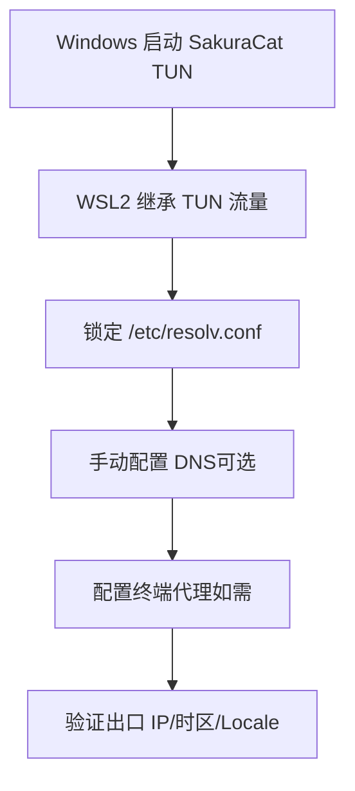
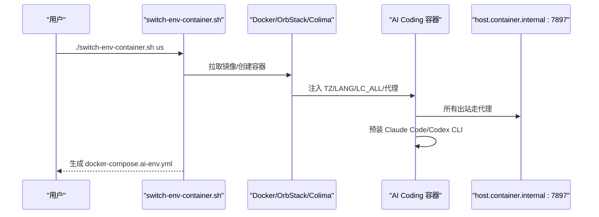
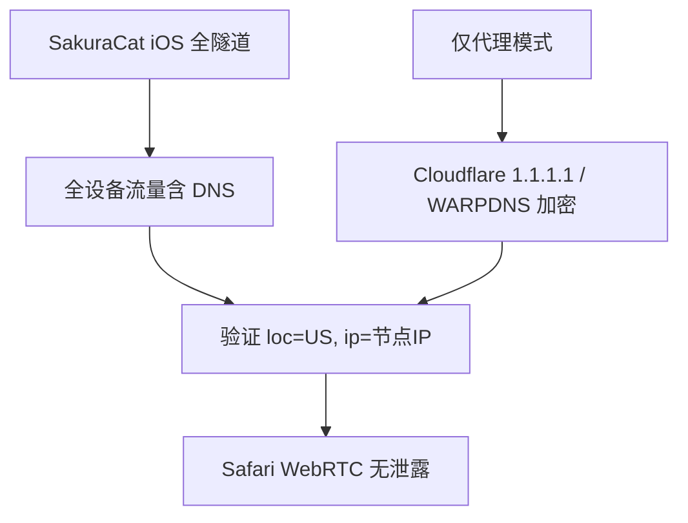
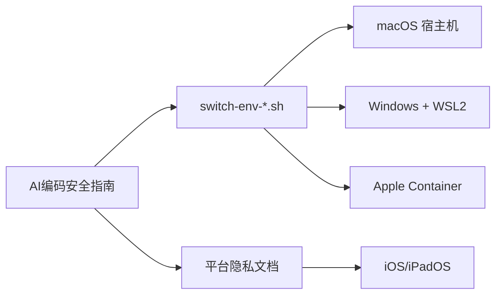

# AI编码工具安全

<cite>
**本文引用的文件**   
- [notes/qoderclicn/ai-coding-security-privacy-guide.md](file://notes/qoderclicn/ai-coding-security-privacy-guide.md)
- [notes/qoderclicn/switch-env-container.sh](file://notes/qoderclicn/switch-env-container.sh)
- [notes/qoderclicn/switch-env-macos.sh](file://notes/qoderclicn/switch-env-macos.sh)
- [notes/qoderclicn/switch-env-wsl2.sh](file://notes/qoderclicn/switch-env-wsl2.sh)
- [notes/macos-host-privacy-setup.md](file://notes/macos-host-privacy-setup.md)
- [notes/macos-privacy.sh](file://notes/macos-privacy.sh)
- [notes/wsl2-sakuracat-privacy-setup.md](file://notes/wsl2-sakuracat-privacy-setup.md)
- [notes/wsl2-setup-plan.md](file://notes/wsl2-setup-plan.md)
- [notes/ios-privacy-setup.md](file://notes/ios-privacy-setup.md)
- [notes/privacy-overview.md](file://notes/privacy-overview.md)
</cite>

## 目录
1. [引言](#引言)
2. [项目结构](#项目结构)
3. [核心组件](#核心组件)
4. [架构总览](#架构总览)
5. [详细组件分析](#详细组件分析)
6. [依赖关系分析](#依赖关系分析)
7. [性能与可用性考量](#性能与可用性考量)
8. [故障排除指南](#故障排除指南)
9. [结论](#结论)
10. [附录](#附录)

## 引言
本指南聚焦于 Claude Code 与 OpenAI Codex CLI 的安全配置与防封策略，围绕权限模型、沙箱隔离、账号安全最佳实践展开，并强调“环境一致性”对账号风控的重要性：注册信息、IP出口、时区、DNS、语言区域、支付区域需指向同一地理区域。文档同时提供企业级部署建议、监控告警思路，以及浏览器指纹伪装、网络请求头定制、会话管理等高级技巧的落地方法，并给出完整实施案例与排障清单。

## 项目结构
仓库以“隐私与安全”为核心主题，包含跨平台（macOS / Windows / WSL2 / iOS）隐私方案与 AI 编码工具（Claude Code / Codex CLI）防封指南，并提供多套一键脚本辅助环境切换与容器化隔离。

图示来源
- [notes/qoderclicn/ai-coding-security-privacy-guide.md:1-120](file://notes/qoderclicn/ai-coding-security-privacy-guide.md#L1-L120)
- [notes/macos-host-privacy-setup.md:10-35](file://notes/macos-host-privacy-setup.md#L10-L35)
- [notes/wsl2-sakuracat-privacy-setup.md:10-25](file://notes/wsl2-sakuracat-privacy-setup.md#L10-L25)
- [notes/ios-privacy-setup.md:10-30](file://notes/ios-privacy-setup.md#L10-L30)
- [notes/privacy-overview.md:10-26](file://notes/privacy-overview.md#L10-L26)

章节来源
- [notes/privacy-overview.md:10-26](file://notes/privacy-overview.md#L10-L26)

## 核心组件
- 权限与沙箱
  - Claude Code：默认只读；通过 settings.json 的 permissions.deny 硬拦截敏感路径；配合 .claudeignore 软过滤；macOS 使用 Seatbelt 沙箱，Linux/WSL2 可安装 bubblewrap + socat，或使用 Docker/VM/Web 版增强隔离。
  - Codex CLI：三种运行模式（suggest/auto-edit/full-auto），full-auto 默认强制沙箱，支持 read-only/workspace-write 级别，默认禁用外网访问；可通过 CLI 参数 > Profile > 项目配置 > 用户配置 > 默认 五层优先级覆盖。
- 环境一致性
  - 统一原则：注册信息 ≈ IP 出口 ≈ 时区 ≈ DNS ≈ 系统语言/Locale ≈ 支付区域。任何不一致都可能触发风控。
  - 关键检测项：系统时区、日期分隔符隐写、代理环境变量、IP 地址、DNS 服务器地理位置、系统语言/Locale、WebRTC 泄漏、使用模式等。
- 平台差异化网络架构
  - macOS：SakuraCat 代理模式（端口 7897）负责流量出口 + Cloudflare WARP（仅 DNS 模式）负责 DNS 加密；终端/CLI 需显式设置 http_proxy/https_proxy/all_proxy。
  - Windows/WSL2：SakuraCat TUN 模式接管全局流量（含 UDP），无需额外代理变量；WSL2 内锁定 resolv.conf 防止自动覆盖。
  - Apple Container：容器内 127.0.0.1 不等于宿主机，必须通过 host.container.internal:7897 注入代理；显式 --dns 指定 1.1.1.1。
  - iOS：优先 SakuraCat iOS 全隧道（抓全流量），否则仅代理时需搭配 Cloudflare 1.1.1.1 App/WARP 做 DNS 加密；关闭 iCloud 私有中继。

章节来源
- [notes/qoderclicn/ai-coding-security-privacy-guide.md:24-98](file://notes/qoderclicn/ai-coding-security-privacy-guide.md#L24-L98)
- [notes/qoderclicn/ai-coding-security-privacy-guide.md:100-168](file://notes/qoderclicn/ai-coding-security-privacy-guide.md#L100-L168)
- [notes/macos-host-privacy-setup.md:10-35](file://notes/macos-host-privacy-setup.md#L10-L35)
- [notes/wsl2-sakuracat-privacy-setup.md:10-25](file://notes/wsl2-sakuracat-privacy-setup.md#L10-L25)
- [notes/ios-privacy-setup.md:10-30](file://notes/ios-privacy-setup.md#L10-L30)
- [notes/privacy-overview.md:10-26](file://notes/privacy-overview.md#L10-L26)

## 架构总览
下图展示四端一致性与不同平台的网络架构差异，以及与 AI 编码工具的集成点。

图示来源
- [notes/macos-host-privacy-setup.md:10-35](file://notes/macos-host-privacy-setup.md#L10-L35)
- [notes/wsl2-sakuracat-privacy-setup.md:10-25](file://notes/wsl2-sakuracat-privacy-setup.md#L10-L25)
- [notes/ios-privacy-setup.md:10-30](file://notes/ios-privacy-setup.md#L10-L30)
- [notes/privacy-overview.md:10-26](file://notes/privacy-overview.md#L10-L26)

## 详细组件分析

### 组件A：Claude Code 安全与防封
- 权限模型
  - 默认只读；写操作或 bash 命令需确认。
  - 在 settings.json 中配置 permissions.deny 硬拦截敏感路径（如 .env、credentials*、*.pem）。
  - 项目根目录创建 .claudeignore 软过滤（语法同 .gitignore），与 permissions.deny 配合使用。
- 沙箱机制
  - macOS：内置 Seatbelt（sandbox-exec），自动隔离 bash 工具的文件系统与网络访问。
  - Linux/WSL2：需安装 bubblewrap + socat；更强隔离可用 Docker/VM/Claude Code Web 版。
- 其他要点
  - 升级至 v2.1.91+ 避免“静默数据返回”漏洞。
  - 处理敏感代码考虑本地离线模式（搭配本地模型）。
  - 自动化脱敏：API key、PII 数据 mask 后再交给 AI。
  - 在 VM 或容器中运行不信任的代码。

图示来源
- [notes/qoderclicn/ai-coding-security-privacy-guide.md:24-67](file://notes/qoderclicn/ai-coding-security-privacy-guide.md#L24-L67)

章节来源
- [notes/qoderclicn/ai-coding-security-privacy-guide.md:24-67](file://notes/qoderclicn/ai-coding-security-privacy-guide.md#L24-L67)

### 组件B：OpenAI Codex CLI 安全与防封
- 运行模式（安全递减）
  - suggest：只建议，不执行（最高安全）。
  - auto-edit：自动编辑文件，命令需确认（中等安全）。
  - full-auto：全自动执行（最低安全，需沙箱）。
- 沙箱机制（默认强制）
  - full-auto 默认启用沙箱，隔离 Agent 与宿主系统。
  - 支持 read-only 与 workspace-write 两种沙箱级别。
  - 网络默认禁用：沙箱内无法访问外网，防止数据外泄。
  - macOS 使用 Seatbelt，Linux 使用容器化隔离。
- 配置优先级（五层）
  - CLI 参数 > Profile > 项目配置 > 用户配置 > 默认。
  - 可在项目级 .codex/ 目录或用户级 ~/.codex/ 配置安全策略。
- Docker 容器化部署（推荐高安全场景）
  - 将 Codex 运行在独立容器中，限制文件系统挂载和网络。
  - 适合企业环境或处理敏感代码。

图示来源
- [notes/qoderclicn/ai-coding-security-privacy-guide.md:68-98](file://notes/qoderclicn/ai-coding-security-privacy-guide.md#L68-L98)

章节来源
- [notes/qoderclicn/ai-coding-security-privacy-guide.md:68-98](file://notes/qoderclicn/ai-coding-security-privacy-guide.md#L68-L98)

### 组件C：环境一致性（跨平台）
- 核心原则
  - 注册信息 ≈ IP 出口 ≈ 时区 ≈ DNS ≈ 系统语言/Locale ≈ 支付区域。
- 通用检查清单
  - 正规渠道订阅、本人支付；固定干净的网络环境；一人一号；不逆向破解；控制频率；遵守政策；监控用量；遇到限流等待而非暴力重试；保持客户端版本更新。
- 绝对避免的高危行为
  - 共享/免费代理节点；频繁切换节点；使用不合规中转 API；多人共享订阅；7×24 不间断自动化；注册信息与实际环境不符。

图示来源
- [notes/qoderclicn/ai-coding-security-privacy-guide.md:138-168](file://notes/qoderclicn/ai-coding-security-privacy-guide.md#L138-L168)

章节来源
- [notes/qoderclicn/ai-coding-security-privacy-guide.md:138-168](file://notes/qoderclicn/ai-coding-security-privacy-guide.md#L138-L168)

### 组件D：macOS 宿主机隐私与代理
- 架构说明
  - SakuraCat 代理模式（端口 7897）负责流量出口；Cloudflare WARP 运行于“仅 DNS”模式负责 DNS 加密。
  - 终端/CLI 需显式设置 http_proxy/https_proxy/all_proxy。
  - Safari mDNS 保留为隐藏真实 IP 的机制，不要禁用。
- 快速命令速查
  - 查看/设置时区、系统代理、IPv6、DNS 解析链、验证出口 IP 等。
- 验证与恢复
  - verify/check/restore 子命令；注意 WARP 模式必须为 DNS-only，不可全隧道。

图示来源
- [notes/macos-privacy.sh:1-262](file://notes/macos-privacy.sh#L1-L262)
- [notes/macos-host-privacy-setup.md:10-35](file://notes/macos-host-privacy-setup.md#L10-L35)

章节来源
- [notes/macos-host-privacy-setup.md:10-35](file://notes/macos-host-privacy-setup.md#L10-L35)
- [notes/macos-privacy.sh:1-262](file://notes/macos-privacy.sh#L1-L262)

### 组件E：Windows + WSL2 隐私与代理
- 架构说明
  - SakuraCat TUN 模式接管全局流量（含 UDP），无需额外代理变量；WSL2 继承 Windows TUN。
  - 锁定 /etc/resolv.conf 防止自动覆盖；必要时手动配置 DNS。
- 一键脚本能力
  - switch-env-wsl2.sh：切换时区、Locale、DNS、代理，并同步 Windows 宿主机时区与 DNS。
- 注意事项
  - 不要在 .wslconfig 中启用 dnsTunneling=true，会绕过 Linux 侧 DNS 隔离。
  - 代理软件需开启 TUN 或允许局域网连接。

图示来源
- [notes/wsl2-sakuracat-privacy-setup.md:10-25](file://notes/wsl2-sakuracat-privacy-setup.md#L10-L25)
- [notes/qoderclicn/switch-env-wsl2.sh:1-318](file://notes/qoderclicn/switch-env-wsl2.sh#L1-L318)

章节来源
- [notes/wsl2-sakuracat-privacy-setup.md:10-25](file://notes/wsl2-sakuracat-privacy-setup.md#L10-L25)
- [notes/qoderclicn/switch-env-wsl2.sh:1-318](file://notes/qoderclicn/switch-env-wsl2.sh#L1-L318)

### 组件F：Apple Container 隔离
- 关键点
  - 容器内 127.0.0.1 ≠ macOS 宿主机，必须通过 host.container.internal:7897 注入代理。
  - 显式 --dns 指定 1.1.1.1；时区需镜像含 tzdata。
- 一键脚本能力
  - switch-env-container.sh：创建隔离容器，注入 TZ/LANG/LC_ALL/代理，预装 Claude Code/Codex CLI，生成 docker-compose.ai-env.yml。

图示来源
- [notes/qoderclicn/switch-env-container.sh:1-283](file://notes/qoderclicn/switch-env-container.sh#L1-L283)

章节来源
- [notes/qoderclicn/switch-env-container.sh:1-283](file://notes/qoderclicn/switch-env-container.sh#L1-L283)

### 组件G：iOS/iPadOS 隐私
- 架构说明
  - 优先 SakuraCat iOS 全隧道（抓全流量），否则仅代理时需搭配 Cloudflare 1.1.1.1 App/WARP 做 DNS 加密。
  - 关闭 iCloud 私有中继；Safari 保留 mDNS 隐藏真实 IP。
- 一致性要求
  - 时区 America/New_York；DNS 1.1.1.1；区域 United States；语言 English (US)。

图示来源
- [notes/ios-privacy-setup.md:10-30](file://notes/ios-privacy-setup.md#L10-L30)

章节来源
- [notes/ios-privacy-setup.md:10-30](file://notes/ios-privacy-setup.md#L10-L30)

## 依赖关系分析
- 平台差异导致网络架构不同，但一致性原则贯穿始终。
- 脚本与文档相互印证：switch-env-* 系列脚本实现多区域一键切换；macos-privacy.sh 提供 apply/verify/check/restore 能力；各平台隐私文档解释原理与注意事项。
- 容器化方案与 Apple Container 存在差异：前者基于 Docker/OrbStack/Colima，后者基于 macOS container CLI，需注意 host 解析与代理注入方式。

图示来源
- [notes/privacy-overview.md:92-111](file://notes/privacy-overview.md#L92-L111)
- [notes/qoderclicn/ai-coding-security-privacy-guide.md:1-19](file://notes/qoderclicn/ai-coding-security-privacy-guide.md#L1-L19)

章节来源
- [notes/privacy-overview.md:92-111](file://notes/privacy-overview.md#L92-L111)

## 性能与可用性考量
- 沙箱与容器化会增加一定开销，但在高安全场景下值得权衡。
- 代理与 DNS 加密可能引入延迟，建议使用就近节点与稳定链路。
- 批量自动化需谨慎控制并发与频率，避免触发限流或封禁。
- 定期审计配置与用量，结合预算上限与告警阈值降低风险。

[本节为通用指导，不涉及具体文件分析]

## 故障排除指南
- 被限流 vs 被封禁
  - 429 Usage limit reached：临时限流，等待重置。
  - account_banned：账号封禁，联系支持申诉。
  - API Key 返回 401：Key 被撤销，检查是否违规并重新生成。
  - 响应变慢/降级：可能是软限制，减少并发或切换模型。
- 常见排查步骤
  - 验证出口 IP 与时区一致性（使用 https://1.1.1.1/cdn-cgi/trace）。
  - 检查代理环境变量与系统代理设置。
  - 确认 WARP 模式为 DNS-only（macOS）。
  - 锁定 /etc/resolv.conf（WSL2）。
  - 容器内使用 host.container.internal:7897 注入代理。
  - iOS 关闭 iCloud 私有中继，保留 Safari mDNS。

章节来源
- [notes/qoderclicn/ai-coding-security-privacy-guide.md:127-135](file://notes/qoderclicn/ai-coding-security-privacy-guide.md#L127-L135)
- [notes/macos-host-privacy-setup.md:258-285](file://notes/macos-host-privacy-setup.md#L258-L285)
- [notes/wsl2-sakuracat-privacy-setup.md:371-452](file://notes/wsl2-sakuracat-privacy-setup.md#L371-L452)
- [notes/ios-privacy-setup.md:125-143](file://notes/ios-privacy-setup.md#L125-L143)

## 结论
通过严格的权限与沙箱配置、跨平台环境一致性管理、以及合理的代理与 DNS 加密策略，可有效降低 Claude Code 与 Codex CLI 的账号风控风险。企业级部署应优先考虑容器化与零数据保留选项，并结合监控告警与预算上限进行持续治理。

[本节为总结性内容，不涉及具体文件分析]

## 附录
- 参考资源
  - 官方文档与社区分析链接见原指南文档末尾。
- 实施案例
  - 使用 switch-env-container.sh 创建美国区域隔离容器，预装 Claude Code/Codex CLI，并通过 host.container.internal:7897 注入代理，验证出口 IP 与时区一致性。
- 高级技巧
  - 浏览器指纹伪装：保留 Safari mDNS，禁用不必要的媒体权限，使用内容拦截器过滤追踪脚本。
  - 网络请求头定制：在代理层定制 User-Agent、Accept-Language、Referer 等，使其与目标区域一致。
  - 会话管理：避免多设备/多人共享订阅；控制会话时长与并发；使用独立 Cookie 容器隔离登录态。

章节来源
- [notes/qoderclicn/ai-coding-security-privacy-guide.md:422-459](file://notes/qoderclicn/ai-coding-security-privacy-guide.md#L422-L459)
- [notes/macos-host-privacy-setup.md:169-214](file://notes/macos-host-privacy-setup.md#L169-L214)
- [notes/ios-privacy-setup.md:102-122](file://notes/ios-privacy-setup.md#L102-L122)