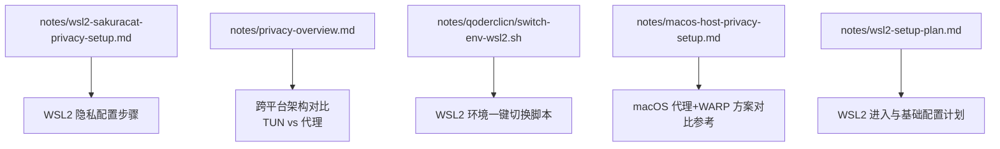
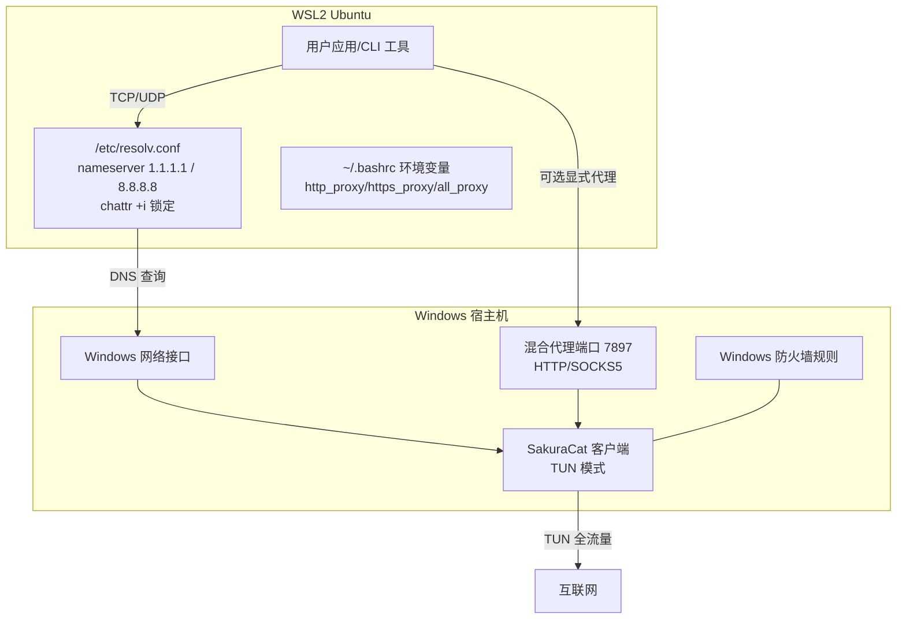
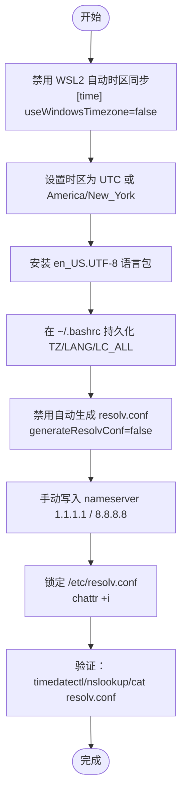
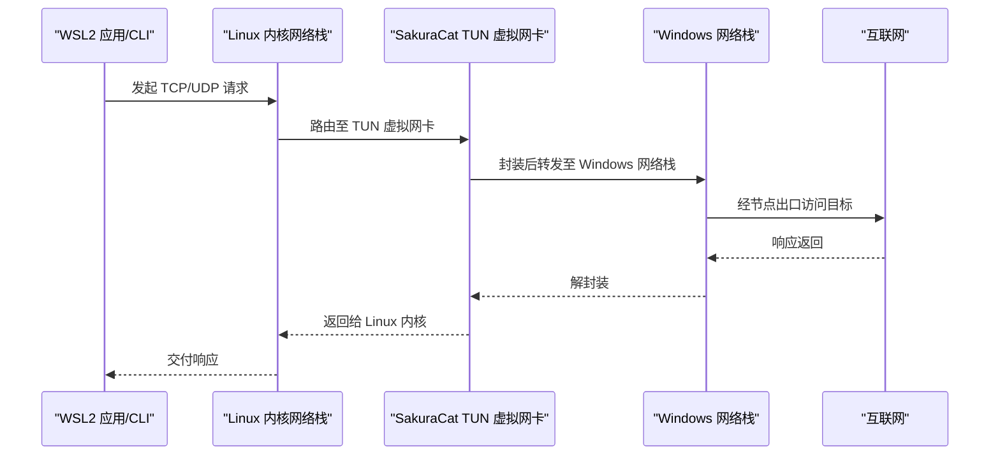
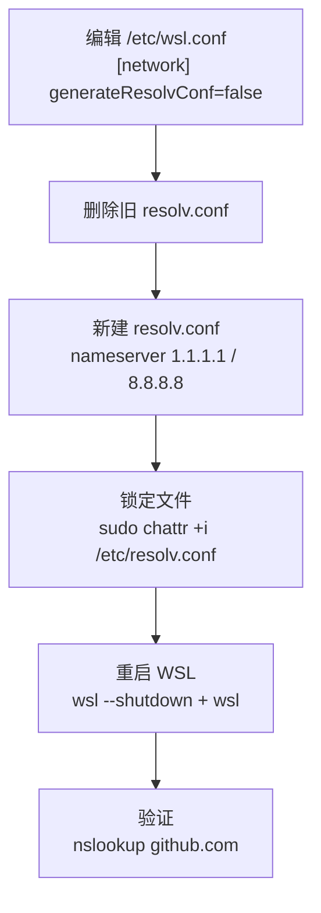
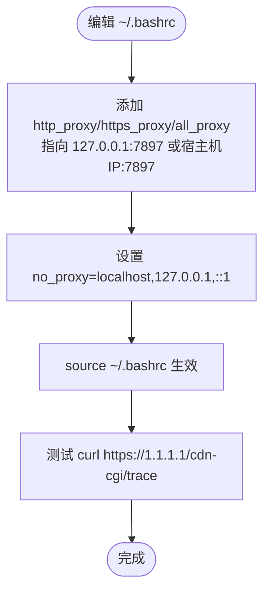
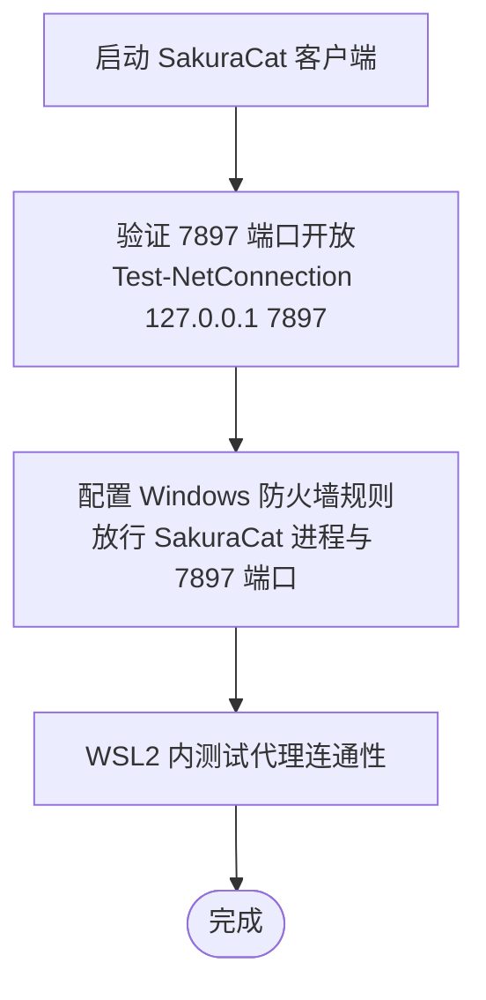
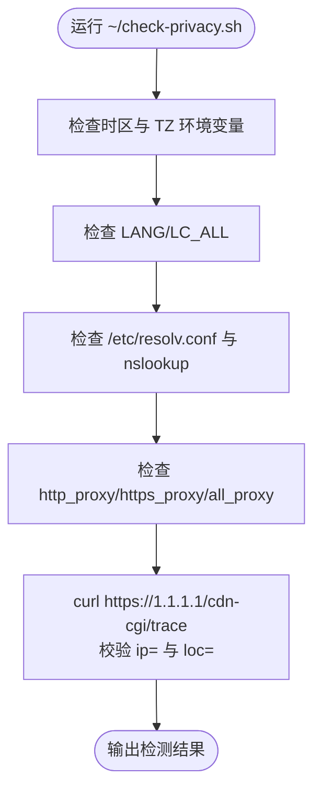
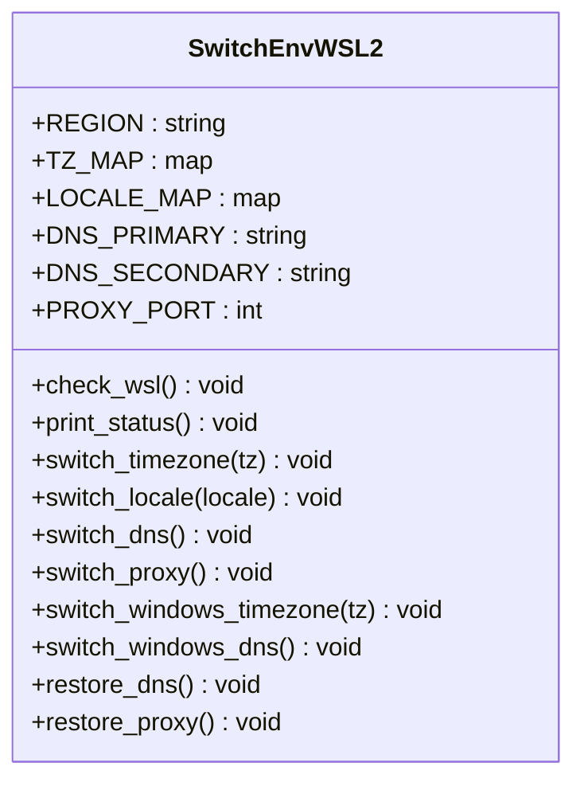
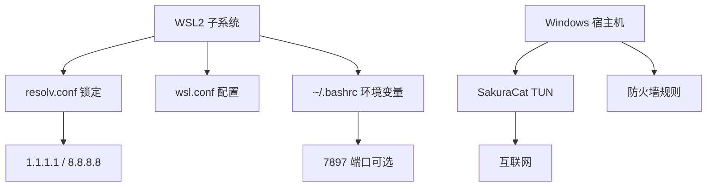

# Windows/WSL2 隐私配置

<cite>
**本文引用的文件**   
- [wsl2-sakuracat-privacy-setup.md](file://notes/wsl2-sakuracat-privacy-setup.md)
- [privacy-overview.md](file://notes/privacy-overview.md)
- [switch-env-wsl2.sh](file://notes/qoderclicn/switch-env-wsl2.sh)
- [macos-host-privacy-setup.md](file://notes/macos-host-privacy-setup.md)
- [wsl2-setup-plan.md](file://notes/wsl2-setup-plan.md)
</cite>

## 目录
1. [引言](#引言)
2. [项目结构](#项目结构)
3. [核心组件](#核心组件)
4. [架构总览](#架构总览)
5. [详细组件分析](#详细组件分析)
6. [依赖关系分析](#依赖关系分析)
7. [性能与稳定性建议](#性能与稳定性建议)
8. [故障排查指南](#故障排查指南)
9. [结论](#结论)
10. [附录](#附录)

## 引言
本指南聚焦于在 Windows 宿主机与 WSL2（Ubuntu）环境中，基于 SakuraCat 的 TUN 全流量捕获模式构建一致的隐私保护方案。文档重点说明：
- TUN 全流量捕获模式的架构优势与工作原理
- 与 macOS 代理模式的关键差异
- WSL2 基础环境设置、DNS 隔离与锁定、代理环境变量配置
- Windows 主机与 WSL2 子系统的完整配置流程、网络接口管理、防火墙规则设置
- 时区统一（America/New_York）、DNS 加密（1.1.1.1）、语言区域（en_US）的一致性方案
- 验证脚本、常见问题排查与性能优化建议

## 项目结构
仓库中与本主题相关的资料主要位于 notes 目录，包含：
- WSL2 + SakuraCat 专项配置指南
- 跨平台隐私方案总览（含架构对比与一致性规则）
- WSL2 环境切换脚本（多区域一键切换）
- macOS 宿主机隐私方案（用于对比差异）
- WSL2 进入方法与基础计划

图表来源
- [wsl2-sakuracat-privacy-setup.md:1-580](file://notes/wsl2-sakuracat-privacy-setup.md#L1-L580)
- [privacy-overview.md:1-115](file://notes/privacy-overview.md#L1-L115)
- [switch-env-wsl2.sh:1-318](file://notes/qoderclicn/switch-env-wsl2.sh#L1-L318)
- [macos-host-privacy-setup.md:1-476](file://notes/macos-host-privacy-setup.md#L1-L476)
- [wsl2-setup-plan.md:1-433](file://notes/wsl2-setup-plan.md#L1-L433)

章节来源
- [wsl2-sakuracat-privacy-setup.md:1-580](file://notes/wsl2-sakuracat-privacy-setup.md#L1-L580)
- [privacy-overview.md:1-115](file://notes/privacy-overview.md#L1-L115)
- [switch-env-wsl2.sh:1-318](file://notes/qoderclicn/switch-env-wsl2.sh#L1-L318)
- [macos-host-privacy-setup.md:1-476](file://notes/macos-host-privacy-setup.md#L1-L476)
- [wsl2-setup-plan.md:1-433](file://notes/wsl2-setup-plan.md#L1-L433)

## 核心组件
- SakuraCat TUN 模式（Windows 宿主）：通过虚拟网卡接管系统级流量，实现“全流量”捕获，无需应用层代理变量即可覆盖命令行、UDP/TCP 等全部流量。
- WSL2 子系统：继承 Windows 的 TUN 隧道出口；可独立配置 DNS、时区、语言环境，并通过 chattr 锁定 resolv.conf 防止被自动覆盖。
- 代理端口 7897：SakuraCat 同时提供 HTTP/SOCKS5 混合端口，供终端/Docker 容器显式使用（当需要显式代理时）。
- DNS 加密与隔离：WSL2 侧禁用自动生成 resolv.conf，手动指定 1.1.1.1/8.8.8.8 并锁定文件，避免泄露到本地路由器或运营商 DNS。
- 一致性三要素：时区 America/New_York、DNS 1.1.1.1、语言 en_US.UTF-8，确保指纹一致。

章节来源
- [wsl2-sakuracat-privacy-setup.md:1-580](file://notes/wsl2-sakuracat-privacy-setup.md#L1-L580)
- [privacy-overview.md:1-115](file://notes/privacy-overview.md#L1-L115)

## 架构总览
下图展示 Windows 宿主机与 WSL2 在 TUN 模式下的数据流与关键组件交互。

图表来源
- [wsl2-sakuracat-privacy-setup.md:1-580](file://notes/wsl2-sakuracat-privacy-setup.md#L1-L580)
- [switch-env-wsl2.sh:1-318](file://notes/qoderclicn/switch-env-wsl2.sh#L1-L318)

章节来源
- [wsl2-sakuracat-privacy-setup.md:1-580](file://notes/wsl2-sakuracat-privacy-setup.md#L1-L580)
- [switch-env-wsl2.sh:1-318](file://notes/qoderclicn/switch-env-wsl2.sh#L1-L318)

## 详细组件分析

### 组件一：WSL2 基础环境与一致性配置
- 时区隔离：禁用 WSL2 自动同步 Windows 时区，设置为 UTC 或 America/New_York，并在 ~/.bashrc 中持久化 TZ。
- 语言环境：安装 en_US.UTF-8 locale，设置 LANG/LC_ALL/LANGUAGE，保证输出与行为一致。
- DNS 隔离：在 wsl.conf 中关闭 generateResolvConf，手动写入 1.1.1.1/8.8.8.8，并使用 chattr +i 锁定文件，防止重启后被覆盖。
- 验证：通过 timedatectl、nslookup、cat /etc/resolv.conf 检查生效情况。

图表来源
- [wsl2-sakuracat-privacy-setup.md:68-176](file://notes/wsl2-sakuracat-privacy-setup.md#L68-L176)
- [wsl2-setup-plan.md:140-256](file://notes/wsl2-setup-plan.md#L140-L256)

章节来源
- [wsl2-sakuracat-privacy-setup.md:68-176](file://notes/wsl2-sakuracat-privacy-setup.md#L68-L176)
- [wsl2-setup-plan.md:140-256](file://notes/wsl2-setup-plan.md#L140-L256)

### 组件二：SakuraCat TUN 全流量捕获模式
- 架构优势：
  - 全流量抓取：TUN 虚拟网卡在系统层拦截 TCP/UDP，包括命令行工具、后台服务、浏览器 WebRTC 等，无需逐个应用配置代理。
  - 简化配置：WSL2 直接继承 Windows 的 TUN 隧道出口，减少代理环境变量管理的复杂度。
  - 降低泄露风险：相比代理模式，更少出现“未走代理”的旁路流量。
- 与 macOS 代理模式的区别：
  - macOS 采用 SakuraCat 代理 7897 + Cloudflare WARP（仅 DNS），需显式设置 http_proxy/https_proxy/all_proxy，且 WebRTC 需浏览器层防护。
  - Windows/WSL2 以 TUN 为主，默认不需要应用层代理变量（除非显式使用 7897 端口）。

图表来源
- [wsl2-sakuracat-privacy-setup.md:1-580](file://notes/wsl2-sakuracat-privacy-setup.md#L1-L580)
- [privacy-overview.md:10-26](file://notes/privacy-overview.md#L10-L26)

章节来源
- [wsl2-sakuracat-privacy-setup.md:1-580](file://notes/wsl2-sakuracat-privacy-setup.md#L1-L580)
- [privacy-overview.md:10-26](file://notes/privacy-overview.md#L10-L26)

### 组件三：DNS 隔离与锁定
- 禁止 WSL2 自动生成 resolv.conf，避免被系统覆盖。
- 手动写入 1.1.1.1/8.8.8.8，并锁定文件（chattr +i），防止意外修改。
- 重启 WSL 使配置生效，并通过 nslookup 验证解析链。

图表来源
- [wsl2-sakuracat-privacy-setup.md:137-176](file://notes/wsl2-sakuracat-privacy-setup.md#L137-L176)
- [wsl2-setup-plan.md:216-256](file://notes/wsl2-setup-plan.md#L216-L256)

章节来源
- [wsl2-sakuracat-privacy-setup.md:137-176](file://notes/wsl2-sakuracat-privacy-setup.md#L137-L176)
- [wsl2-setup-plan.md:216-256](file://notes/wsl2-setup-plan.md#L216-L256)

### 组件四：代理环境变量配置（可选）
- 在 ~/.bashrc 中设置 http_proxy/https_proxy/all_proxy，指向 Windows 宿主机的 127.0.0.1:7897 或通过动态获取的宿主机 IP。
- 适用于需要显式代理的场景（如 Docker 容器、特定 CLI 工具）。
- 注意 no_proxy 排除本地地址，避免回环冲突。

图表来源
- [wsl2-sakuracat-privacy-setup.md:179-212](file://notes/wsl2-sakuracat-privacy-setup.md#L179-L212)
- [switch-env-wsl2.sh:172-196](file://notes/qoderclicn/switch-env-wsl2.sh#L172-L196)

章节来源
- [wsl2-sakuracat-privacy-setup.md:179-212](file://notes/wsl2-sakuracat-privacy-setup.md#L179-L212)
- [switch-env-wsl2.sh:172-196](file://notes/qoderclicn/switch-env-wsl2.sh#L172-L196)

### 组件五：Windows 主机与防火墙规则
- 确保 SakuraCat 已启动并连接任意节点，监听 7897 端口。
- 在 Windows 防火墙中放行 SakuraCat 进程及 7897 端口的入站/出站规则，避免被系统策略阻断。
- 不建议启用 .wslconfig 中的 dnsTunneling=true，以免绕过 Linux 侧 DNS 隔离。

图表来源
- [wsl2-sakuracat-privacy-setup.md:27-48](file://notes/wsl2-sakuracat-privacy-setup.md#L27-L48)
- [wsl2-sakuracat-privacy-setup.md:546-573](file://notes/wsl2-sakuracat-privacy-setup.md#L546-L573)

章节来源
- [wsl2-sakuracat-privacy-setup.md:27-48](file://notes/wsl2-sakuracat-privacy-setup.md#L27-L48)
- [wsl2-sakuracat-privacy-setup.md:546-573](file://notes/wsl2-sakuracat-privacy-setup.md#L546-L573)

### 组件六：验证脚本与一致性检查
- 创建 ~/check-privacy.sh 脚本，集中检查时区、语言、DNS、代理环境变量与出口 IP。
- 推荐使用 1.1.1.1/cdn-cgi/trace 进行出口 IP 与地理位置校验，避免 ipinfo.io 限流问题。

图表来源
- [wsl2-sakuracat-privacy-setup.md:214-276](file://notes/wsl2-sakuracat-privacy-setup.md#L214-L276)
- [privacy-overview.md:73-81](file://notes/privacy-overview.md#L73-L81)

章节来源
- [wsl2-sakuracat-privacy-setup.md:214-276](file://notes/wsl2-sakuracat-privacy-setup.md#L214-L276)
- [privacy-overview.md:73-81](file://notes/privacy-overview.md#L73-L81)

### 组件七：WSL2 环境一键切换脚本
- switch-env-wsl2.sh 支持多区域切换（us/jp/uk/sg/cn），自动处理时区、语言、DNS、代理，并可同步 Windows 宿主机时区与 DNS。
- 脚本内置状态打印、恢复逻辑与错误提示，适合日常维护与快速回滚。

图表来源
- [switch-env-wsl2.sh:1-318](file://notes/qoderclicn/switch-env-wsl2.sh#L1-L318)

章节来源
- [switch-env-wsl2.sh:1-318](file://notes/qoderclicn/switch-env-wsl2.sh#L1-L318)

## 依赖关系分析
- 组件耦合：
  - WSL2 的 DNS 与 resolv.conf 强依赖 wsl.conf 配置与 chattr 锁定机制。
  - SakuraCat TUN 模式对 Windows 防火墙规则与网络接口有依赖。
  - 代理环境变量仅在显式代理场景下生效，不影响 TUN 的全流量捕获。
- 外部依赖：
  - SakuraCat 客户端必须保持运行，端口 7897 需开放。
  - DNS 服务器 1.1.1.1/8.8.8.8 需可达。
- 潜在循环依赖：
  - 若启用 .wslconfig 的 dnsTunneling=true，会与 Linux 侧 DNS 隔离产生冲突，应避免。

图表来源
- [wsl2-sakuracat-privacy-setup.md:1-580](file://notes/wsl2-sakuracat-privacy-setup.md#L1-L580)
- [switch-env-wsl2.sh:1-318](file://notes/qoderclicn/switch-env-wsl2.sh#L1-L318)

章节来源
- [wsl2-sakuracat-privacy-setup.md:1-580](file://notes/wsl2-sakuracat-privacy-setup.md#L1-L580)
- [switch-env-wsl2.sh:1-318](file://notes/qoderclicn/switch-env-wsl2.sh#L1-L318)

## 性能与稳定性建议
- 优先使用 TUN 模式，减少应用层代理配置带来的额外开销与不一致风险。
- 固定一个美国住宅 IP 节点，避免频繁切换导致风控与性能抖动。
- 定期更新 WSL2 与 Ubuntu 系统，修复已知网络栈问题。
- 使用 1.1.1.1/cdn-cgi/trace 替代 ipinfo.io，避免限流影响验证效率。
- 在 Windows 侧开启最小必要权限的防火墙规则，避免过度放行造成安全风险。

## 故障排查指南
- DNS 不生效：
  - 检查 /etc/resolv.conf 是否被锁定（lsattr），确认内容为 1.1.1.1/8.8.8.8。
  - 确认 wsl.conf 中 generateResolvConf=false，重启 WSL 后重试。
- 代理不工作：
  - 确认 SakuraCat 在 Windows 侧运行，端口 7897 开放。
  - 检查环境变量是否正确设置，必要时 source ~/.bashrc。
- WSL 无法启动：
  - 执行 wsl --shutdown，列出实例 wsl -l -v，必要时重新安装 WSL。
- 时区不生效：
  - 检查 wsl.conf 的 [time] 部分，确认 useWindowsTimezone=false。
  - 重新设置时区并重启 WSL。

章节来源
- [wsl2-sakuracat-privacy-setup.md:371-452](file://notes/wsl2-sakuracat-privacy-setup.md#L371-L452)

## 结论
通过在 Windows 宿主机启用 SakuraCat TUN 模式，并结合 WSL2 的 DNS 隔离与一致性配置，可实现稳定、低泄露风险的隐私保护方案。与 macOS 代理模式相比，TUN 模式在系统层接管流量，显著降低应用层代理遗漏的风险。遵循时区、DNS、语言区域的一致性原则，配合验证脚本与故障排查流程，可有效保障长期使用的稳定性与安全性。

## 附录
- 快速命令速查：
  - 启动/关闭 WSL2：wsl / wsl --shutdown
  - 设置时区：sudo timedatectl set-timezone America/New_York
  - 查看语言环境：echo $LANG
  - 验证 DNS：cat /etc/resolv.conf / nslookup github.com
  - 测试出口 IP：curl -s https://1.1.1.1/cdn-cgi/trace
  - 运行检测脚本：~/check-privacy.sh

章节来源
- [wsl2-sakuracat-privacy-setup.md:475-492](file://notes/wsl2-sakuracat-privacy-setup.md#L475-L492)