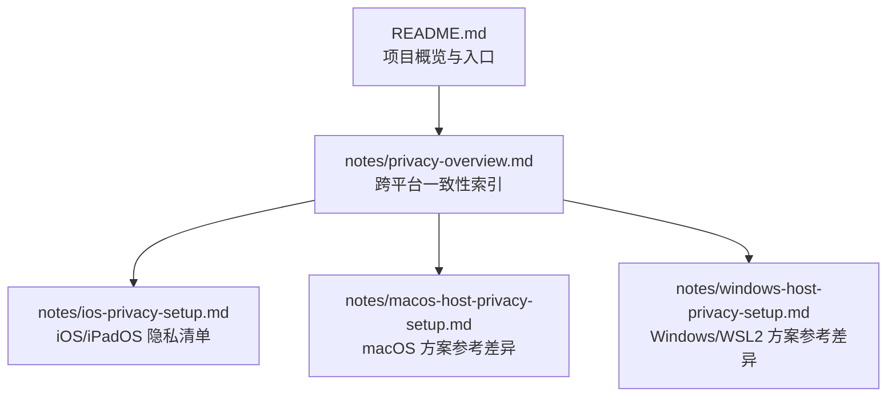
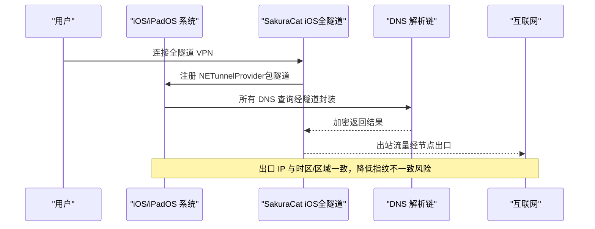
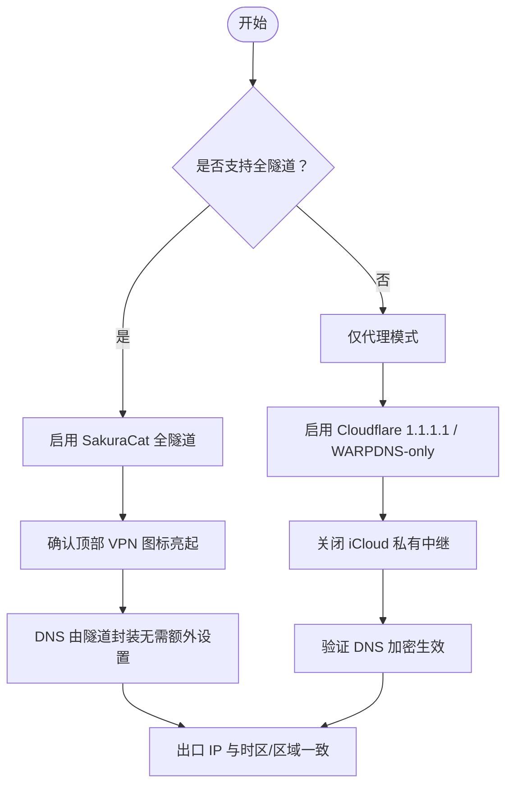
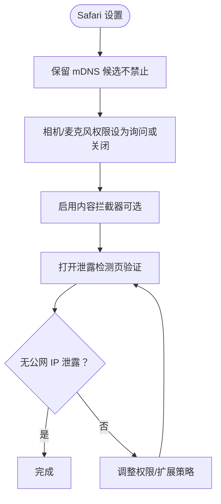
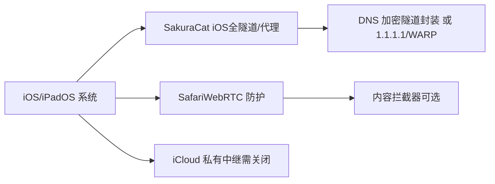

# iOS/iPadOS 隐私配置

<cite>
**本文引用的文件**
- [notes/ios-privacy-setup.md](file://notes/ios-privacy-setup.md)
- [notes/privacy-overview.md](file://notes/privacy-overview.md)
- [README.md](file://README.md)
</cite>

## 目录
1. [简介](#简介)
2. [项目结构](#项目结构)
3. [核心组件](#核心组件)
4. [架构总览](#架构总览)
5. [详细组件分析](#详细组件分析)
6. [依赖关系分析](#依赖关系分析)
7. [性能与稳定性考量](#性能与稳定性考量)
8. [故障排查指南](#故障排查指南)
9. [结论](#结论)
10. [附录：常见问题与最佳实践](#附录：常见问题与最佳实践)

## 简介
本指南聚焦于在 iPhone 与 iPad 上实现一致的隐私指纹与网络出口，覆盖以下要点：
- 全隧道 VPN 模式（SakuraCat iOS）的配置方法与验证
- 移动设备特有的隐私保护需求（时区、区域、语言、DNS、WebRTC、iCloud 私有中继等）
- Safari WebRTC 防护与内容拦截器使用建议
- Apple ID 相关隐私选项（如 iCloud 私有中继）
- 定位服务与诊断数据控制（系统级隐私）
- 网络检测工具使用方法
- 与桌面端（macOS/Windows/WSL2）的差异与注意事项

## 项目结构
本仓库的隐私文档以“跨平台一致性”为主线，iOS/iPadOS 文档位于 notes 目录下，并与 macOS、Windows/WSL2 文档相互呼应。

图表来源
- [README.md:17-36](file://README.md#L17-L36)
- [notes/privacy-overview.md:41-55](file://notes/privacy-overview.md#L41-L55)

章节来源
- [README.md:17-36](file://README.md#L17-L36)
- [notes/privacy-overview.md:41-55](file://notes/privacy-overview.md#L41-L55)

## 核心组件
- SakuraCat iOS 客户端：优先采用全隧道（NETunnelProvider）模式，使设备全部流量（含 DNS）经隧道出口；若仅代理模式，则需配合 Cloudflare 1.1.1.1 / WARP 做 DNS 加密。
- 系统级 DNS 加密：在全隧道模式下由隧道封装；仅在代理模式下需要额外启用 1.1.1.1 App 或 WARP（DNS-only）。
- Safari WebRTC 防护：保留 mDNS 候选机制，避免暴露真实本地 IP；必要时安装内容拦截器过滤追踪脚本。
- 系统级隐私项：关闭 iCloud 私有中继；统一时区为 America/New_York；区域与语言设为 en_US；按需管理定位服务与诊断数据上报。

章节来源
- [notes/ios-privacy-setup.md:11-21](file://notes/ios-privacy-setup.md#L11-L21)
- [notes/ios-privacy-setup.md:65-86](file://notes/ios-privacy-setup.md#L65-L86)
- [notes/ios-privacy-setup.md:101-122](file://notes/ios-privacy-setup.md#L101-L122)
- [notes/privacy-overview.md:29-38](file://notes/privacy-overview.md#L29-L38)

## 架构总览
iOS 与桌面端的差异在于“DNS 加密机制”和“流量接管方式”。iOS 推荐全隧道模式，无需额外 DNS 加密应用；macOS 采用代理 + WARP DNS-only 的组合。

图表来源
- [notes/ios-privacy-setup.md:11-21](file://notes/ios-privacy-setup.md#L11-L21)
- [notes/privacy-overview.md:10-26](file://notes/privacy-overview.md#L10-L26)

## 详细组件分析

### 全隧道 VPN 模式（SakuraCat iOS）
- 原理：通过系统 NETunnelProvider 将设备全部流量（含 DNS）接入隧道，出口由节点决定。
- 优势：无需额外代理端口或 DNS 加密应用；行为与 Windows TUN 模式一致。
- 备选：若仅提供代理模式，需另开 Cloudflare 1.1.1.1 App 或 WARP（保持 DNS-only），并关闭 iCloud 私有中继。

图表来源
- [notes/ios-privacy-setup.md:65-86](file://notes/ios-privacy-setup.md#L65-L86)
- [notes/ios-privacy-setup.md:77-86](file://notes/ios-privacy-setup.md#L77-L86)

章节来源
- [notes/ios-privacy-setup.md:11-21](file://notes/ios-privacy-setup.md#L11-L21)
- [notes/ios-privacy-setup.md:65-86](file://notes/ios-privacy-setup.md#L65-L86)

### 系统级 DNS 加密与 IPv6
- 主方案：全隧道下 DNS 被隧道封装加密，无需手动设置。
- 备选：仅代理模式时，启用 Cloudflare 1.1.1.1 App 或 WARP（DNS-only），或手动设置系统 DNS（明文，安全性较弱）。
- IPv6：默认双栈，如需规避 IPv6 绕过，可在应用内开启 IPv6 支持或依赖全隧道同时处理 IPv4/IPv6。

章节来源
- [notes/ios-privacy-setup.md:65-86](file://notes/ios-privacy-setup.md#L65-L86)
- [notes/ios-privacy-setup.md:82-86](file://notes/ios-privacy-setup.md#L82-L86)

### Safari WebRTC 防护
- 关键原则：保留 mDNS 候选（.local）以隐藏真实本地 IP，不要禁用。
- 权限管理：相机/麦克风权限设置为“询问”或关闭，减少媒体权限触发。
- 扩展加固：安装内容拦截器（如 1Blocker / AdGuard）并在 Safari 中启用，过滤部分追踪与探测脚本。
- 验证方法：访问浏览器泄露检测页面，确认无公网 IP 泄露且国家显示为美国。

图表来源
- [notes/ios-privacy-setup.md:101-122](file://notes/ios-privacy-setup.md#L101-L122)

章节来源
- [notes/ios-privacy-setup.md:101-122](file://notes/ios-privacy-setup.md#L101-L122)

### Apple ID 与 iCloud 私有中继
- 必须关闭 iCloud 私有中继，否则它会覆盖系统 DNS 与 VPN，导致加密失效。
- 路径：设置 → Apple ID → iCloud → 私有中继 → 关闭。

章节来源
- [notes/ios-privacy-setup.md:77-81](file://notes/ios-privacy-setup.md#L77-L81)

### 时区、区域与语言一致性
- 时区：America/New_York（纽约），与桌面端保持一致。
- 区域与语言：United States 与 English (US)。
- 变更语言后可能需要重启 SpringBoard（系统会提示）。

章节来源
- [notes/ios-privacy-setup.md:22-31](file://notes/ios-privacy-setup.md#L22-L31)
- [notes/ios-privacy-setup.md:89-99](file://notes/ios-privacy-setup.md#L89-L99)

### 定位服务与诊断数据控制（系统级隐私）
- 定位服务：可关闭“设置时区”驱动，防止自动时区被位置更改；也可整体关闭定位服务（影响地图/天气等功能）。
- 诊断数据：可关闭向 Apple 发送诊断与分析数据（影响反馈能力）。
- 个性化广告：可关闭 Apple 广告个性化（低风险）。

章节来源
- [notes/macos-host-privacy-setup.md:229-247](file://notes/macos-host-privacy-setup.md#L229-L247)

### 网络检测工具与验证流程
- 出口验证：Safari 打开 https://1.1.1.1/cdn-cgi/trace，检查 loc=US 与 ip 为节点 IP。
- WebRTC 验证：访问浏览器泄露检测页面，确认无公网 IP 泄露。
- 综合自查：https://browserleaks.com（IP/时区/WebRTC/DNS）。

章节来源
- [notes/ios-privacy-setup.md:125-144](file://notes/ios-privacy-setup.md#L125-L144)

### 与桌面端的差异与注意事项
- macOS：SakuraCat 代理 7897 + Cloudflare WARP（DNS-only），不启用 TUN。
- Windows/WSL2：SakuraCat TUN 模式，隧道封装 DNS，无需 WARP。
- iOS：优先全隧道（NETunnelProvider），无需额外代理端口；若仅代理，则需 1.1.1.1/WARP（DNS-only）。

章节来源
- [notes/privacy-overview.md:10-26](file://notes/privacy-overview.md#L10-L26)
- [notes/privacy-overview.md:29-38](file://notes/privacy-overview.md#L29-L38)

## 依赖关系分析
- iOS 隐私配置依赖：
  - SakuraCat iOS（全隧道或代理）
  - Cloudflare 1.1.1.1 / WARP（仅在代理模式下用于 DNS 加密）
  - Safari（WebRTC 防护与内容拦截器）
  - 系统设置（时区、区域、语言、iCloud 私有中继、定位服务、诊断数据）

图表来源
- [notes/ios-privacy-setup.md:11-21](file://notes/ios-privacy-setup.md#L11-L21)
- [notes/ios-privacy-setup.md:65-86](file://notes/ios-privacy-setup.md#L65-L86)
- [notes/ios-privacy-setup.md:101-122](file://notes/ios-privacy-setup.md#L101-L122)

章节来源
- [notes/ios-privacy-setup.md:11-21](file://notes/ios-privacy-setup.md#L11-L21)
- [notes/privacy-overview.md:10-26](file://notes/privacy-overview.md#L10-L26)

## 性能与稳定性考量
- 全隧道模式对系统资源占用较高，但能确保 DNS 与应用流量一致出口，降低指纹不一致风险。
- 仅代理模式需额外 DNS 加密应用，可能引入路由冲突（如与 iCloud 私有中继），需谨慎配置。
- IPv6 双栈环境下，若未正确处理，可能导致 DNS 或 WebRTC 绕过，建议使用全隧道或明确加密 IPv6 DNS。

[本节为通用指导，不直接分析具体文件]

## 故障排查指南
- 无法连接或出口异常：
  - 确认 SakuraCat 已连接且顶部 VPN 图标亮起。
  - 检查 iCloud 私有中继是否关闭。
  - 验证 https://1.1.1.1/cdn-cgi/trace 的 loc 与 ip。
- WebRTC 泄露：
  - 确认保留 mDNS 候选，未禁用。
  - 检查相机/麦克风权限设置。
  - 启用内容拦截器并刷新缓存后再次测试。
- DNS 未加密：
  - 全隧道模式下应自动加密；若仅代理模式，请启用 1.1.1.1/WARP（DNS-only）。
  - 刷新系统 DNS 缓存（iOS 可通过切换飞行模式或重启设备）。

章节来源
- [notes/ios-privacy-setup.md:125-144](file://notes/ios-privacy-setup.md#L125-L144)
- [notes/ios-privacy-setup.md:77-86](file://notes/ios-privacy-setup.md#L77-L86)

## 结论
在 iOS/iPadOS 上实现稳定的隐私保护，关键在于：
- 优先使用 SakuraCat 全隧道模式，确保 DNS 与应用流量一致出口。
- 关闭 iCloud 私有中继，避免覆盖 DNS/VPN。
- 统一时区、区域与语言，保持与桌面端一致。
- 针对 Safari WebRTC 进行防护，保留 mDNS 并合理使用内容拦截器。
- 定期使用网络检测工具验证出口与泄露情况。

[本节为总结性内容，不直接分析具体文件]

## 附录：常见问题与最佳实践
- 为什么不建议禁用 Safari mDNS？
  - mDNS .local 候选用于隐藏真实本地 IP，禁用后会回退暴露网卡地址。
- 为什么 macOS 不用 TUN？
  - macOS 同时运行 WARP（DNS-only），TUN 会与 WARP 抢网卡/路由，造成冲突。
- 如何快速恢复默认设置？
  - 按文档第六部分的步骤逐项恢复（时区、区域/语言、代理、WARP、私有中继等）。

章节来源
- [notes/ios-privacy-setup.md:101-122](file://notes/ios-privacy-setup.md#L101-L122)
- [notes/privacy-overview.md:10-26](file://notes/privacy-overview.md#L10-L26)
- [notes/ios-privacy-setup.md:147-156](file://notes/ios-privacy-setup.md#L147-L156)