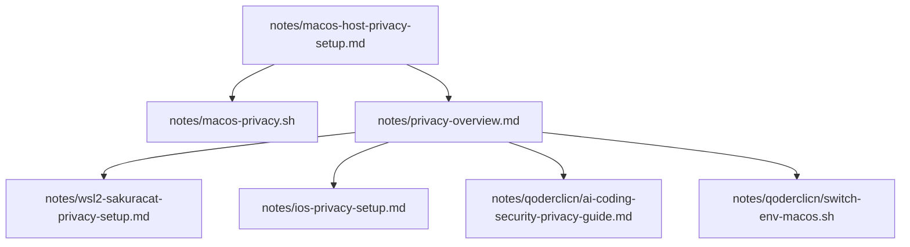
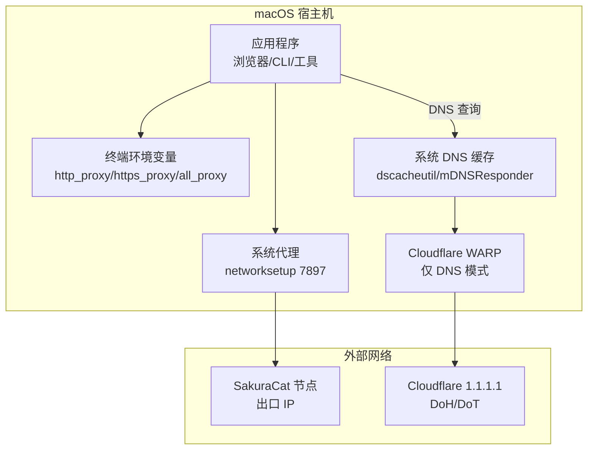
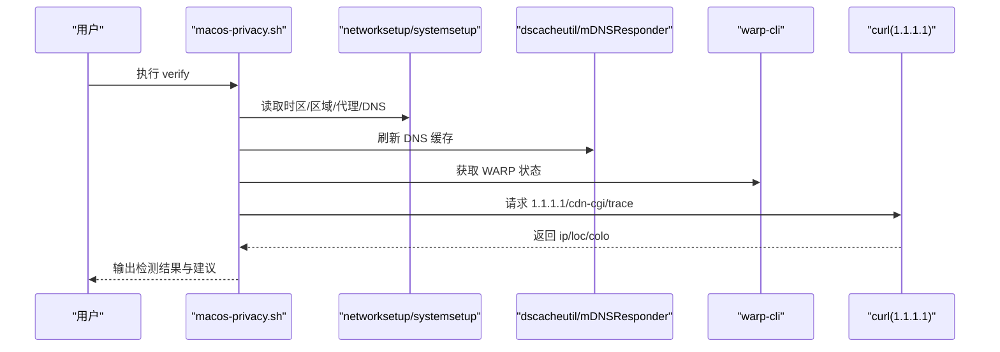
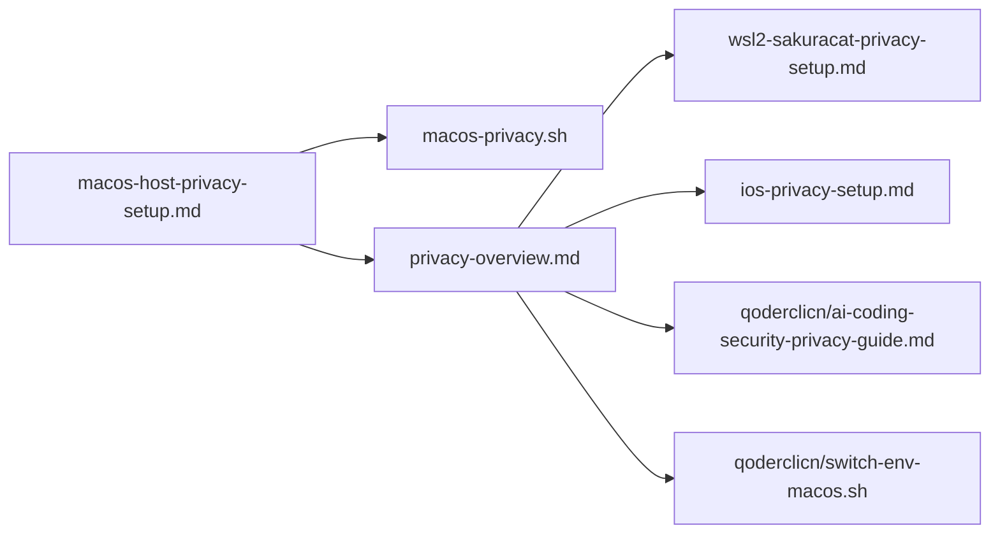

# macOS 隐私配置

<cite>
**本文引用的文件列表**
- [macos-host-privacy-setup.md](file://notes/macos-host-privacy-setup.md)
- [macos-privacy.sh](file://notes/macos-privacy.sh)
- [privacy-overview.md](file://notes/privacy-overview.md)
- [wsl2-sakuracat-privacy-setup.md](file://notes/wsl2-sakuracat-privacy-setup.md)
- [ios-privacy-setup.md](file://notes/ios-privacy-setup.md)
- [ai-coding-security-privacy-guide.md](file://notes/qoderclicn/ai-coding-security-privacy-guide.md)
- [switch-env-macos.sh](file://notes/qoderclicn/switch-env-macos.sh)
</cite>

## 目录
1. [简介](#简介)
2. [项目结构](#项目结构)
3. [核心组件](#核心组件)
4. [架构总览](#架构总览)
5. [详细组件分析](#详细组件分析)
6. [依赖关系分析](#依赖关系分析)
7. [性能与稳定性考量](#性能与稳定性考量)
8. [故障排除指南](#故障排除指南)
9. [结论](#结论)
10. [附录](#附录)

## 简介
本指南面向 macOS 平台，聚焦“SakuraCat 代理模式（端口 7897）+ Cloudflare WARP DNS-only”的隐私架构设计，解释与 Windows/WSL2 TUN 模式的核心差异，并给出时区、DNS 加密、WebRTC 防护、语言区域设置、命令行与 GUI 操作步骤、验证脚本与故障排除。特别强调：macOS 代理模式下 WebRTC 泄露风险更高，必须通过浏览器设置防护；同时提供 Apple Container CLI 的容器化隐私配置方案。

## 项目结构
仓库中与 macOS 隐私相关的文档与脚本集中在 notes 目录下，包含宿主机配置、一键脚本、跨平台一致性说明以及对比参考（Windows/WSL2/iOS）。

图表来源
- [macos-host-privacy-setup.md:1-476](file://notes/macos-host-privacy-setup.md#L1-L476)
- [macos-privacy.sh:1-262](file://notes/macos-privacy.sh#L1-L262)
- [privacy-overview.md:1-115](file://notes/privacy-overview.md#L1-L115)
- [wsl2-sakuracat-privacy-setup.md:1-580](file://notes/wsl2-sakuracat-privacy-setup.md#L1-L580)
- [ios-privacy-setup.md:1-183](file://notes/ios-privacy-setup.md#L1-L183)
- [ai-coding-security-privacy-guide.md:1-459](file://notes/qoderclicn/ai-coding-security-privacy-guide.md#L1-L459)
- [switch-env-macos.sh:1-217](file://notes/qoderclicn/switch-env-macos.sh#L1-L217)

章节来源
- [macos-host-privacy-setup.md:1-476](file://notes/macos-host-privacy-setup.md#L1-L476)
- [privacy-overview.md:1-115](file://notes/privacy-overview.md#L1-L115)

## 核心组件
- SakuraCat 代理模式（本地混合端口 7897，HTTP/SOCKS5）：负责应用层流量出口，不启用 TUN。
- Cloudflare WARP（仅 DNS 模式）：接管系统 DNS，以 DoH/DoT 加密发往 1.1.1.1，不接管全部流量。
- 系统与时区：统一为 America/New_York，关闭自动时区但保留网络时间。
- 语言区域：统一 en_US（含终端 LANG/LC_ALL）。
- WebRTC 防护：Safari/Firefox/Chrome 需显式配置，避免 UDP 绕过代理导致真实 IP 泄露。
- Apple Container CLI：容器内通过 host.container.internal:7897 走宿主代理，DNS 显式指定 1.1.1.1。

章节来源
- [macos-host-privacy-setup.md:11-32](file://notes/macos-host-privacy-setup.md#L11-L32)
- [macos-privacy.sh:1-262](file://notes/macos-privacy.sh#L1-L262)
- [privacy-overview.md:10-26](file://notes/privacy-overview.md#L10-L26)

## 架构总览
macOS 采用“代理 + DNS 加密”的职责分离架构：SakuraCat 代理 7897 负责 HTTP/HTTPS/SOCKS 流量出口；WARP 仅做 DNS 加密，避免与代理抢路由或覆盖出口。

图表来源
- [macos-host-privacy-setup.md:11-32](file://notes/macos-host-privacy-setup.md#L11-L32)
- [macos-privacy.sh:70-150](file://notes/macos-privacy.sh#L70-L150)

章节来源
- [macos-host-privacy-setup.md:11-32](file://notes/macos-host-privacy-setup.md#L11-L32)
- [macos-privacy.sh:70-150](file://notes/macos-privacy.sh#L70-L150)

## 详细组件分析

### 与 Windows/WSL2 TUN 模式的核心差异
- 流量出口形态：Windows/WSL2 使用 SakuraCat TUN（Meta Tunnel），可捕获全流量（含 UDP/命令行）；macOS 使用代理 7897，不抓 UDP，需浏览器显式防护 WebRTC。
- DNS 加密方式：Windows/WSL2 由隧道封装 DNS；macOS 由 WARP 仅 DNS 模式加密。
- 应用层代理变量：Windows/WSL2 通常不需要；macOS 需要 http_proxy/https_proxy/all_proxy。
- 冲突风险：macOS 若误开 WARP 全隧道会覆盖 SakuraCat 出口，使出口 IP 变为 Cloudflare。

章节来源
- [macos-host-privacy-setup.md:22-31](file://notes/macos-host-privacy-setup.md#L22-L31)
- [privacy-overview.md:10-26](file://notes/privacy-overview.md#L10-L26)

### 时区设置（America/New_York）
- 目标：关闭“根据位置自动设时区”，保留网络时间防漂移，统一为美东。
- 命令要点：systemsetup -setusingnetworktime off（仅关自动时区）、-settimezone America/New_York、-gettimezone 验证。
- GUI 同步：系统设置 → 定位服务 → 系统服务 → 关闭“设置时区”。

章节来源
- [macos-host-privacy-setup.md:58-82](file://notes/macos-host-privacy-setup.md#L58-L82)
- [macos-privacy.sh:79-87](file://notes/macos-privacy.sh#L79-L87)

### DNS 加密配置（Cloudflare WARP DNS-only）
- 主方案：安装并运行 WARP，设置为“仅 DNS（HTTPS/TLS）”，刷新 DNS 缓存，确认 scutil --dns 中出现 1.1.1.1。
- 关键约束：绝不能开启“流量和 DNS（全隧道）”，否则覆盖 SakuraCat 出口。
- iCloud 私有中继：必须关闭，否则会覆盖系统 DNS。
- IPv6 处理：建议关闭 Wi-Fi 的 IPv6，或确保 IPv6 DNS 也经加密通道。

章节来源
- [macos-host-privacy-setup.md:86-141](file://notes/macos-host-privacy-setup.md#L86-L141)
- [macos-privacy.sh:134-143](file://notes/macos-privacy.sh#L134-L143)

### WebRTC 防护（Safari/Firefox/Chrome）
- 风险背景：macOS 代理模式不自动抓取 UDP，WebRTC STUN/UDP 可能绕过代理暴露真实网卡 IP。
- Safari：保持 mDNS ICE candidates 开启（不要禁用），必要时收紧候选范围或彻底关闭 WebRTC。
- Firefox：about:config 调整三项（default_address_only/no_host/enabled），推荐 uBlock Origin 扩展勾选“Block WebRTC IP leak”。
- Chrome/Edge：推荐扩展“WebRTC Leak Prevent”，或 flags 中限制 WebRTC IP 处理策略。
- 验证：ipleak.net / browserleaks.com/webrtc。

章节来源
- [macos-host-privacy-setup.md:169-214](file://notes/macos-host-privacy-setup.md#L169-L214)

### 语言区域设置（en_US）
- 系统语言优先英文，区域设为美国，度量单位可选美式。
- 更改后需注销或重启生效。

章节来源
- [macos-host-privacy-setup.md:144-161](file://notes/macos-host-privacy-setup.md#L144-L161)
- [macos-privacy.sh:84-87](file://notes/macos-privacy.sh#L84-L87)

### 终端/CLI 代理（非浏览器流量）
- 导出 http_proxy/https_proxy/all_proxy 指向 127.0.0.1:7897。
- 写入 ~/.zshrc 带标记块，支持幂等增删。
- 验证：curl https://1.1.1.1/cdn-cgi/trace 查看 ip/loc。

章节来源
- [macos-host-privacy-setup.md:215-228](file://notes/macos-host-privacy-setup.md#L215-L228)
- [macos-privacy.sh:109-132](file://notes/macos-privacy.sh#L109-L132)

### Apple Container CLI 隐私配置
- 核心机制：容器接宿主机 vmnet 虚拟网络；DNS 通过 --dns 指定；环境变量注入 TZ/LANG/代理；全局配置在 ~/.config/container/config.toml。
- 出口陷阱：macOS 是代理模式，容器内 127.0.0.1 不是宿主机，须用 host.container.internal:7897。
- 示例：--env-file privacy.env 注入 TZ=America/New_York、LANG=en_US.UTF-8、LC_ALL=en_US.UTF-8 及代理变量；--dns 1.1.1.1 保证 DNS 加密。
- 验证：容器内 date/LANG 与 curl 出口检测 loc=US、ip= 节点 IP。

章节来源
- [macos-host-privacy-setup.md:337-463](file://notes/macos-host-privacy-setup.md#L337-L463)

### 一键脚本（apply/verify/check/restore）
- apply：设置时区、区域、IPv6、系统代理、终端代理/locale、刷新 DNS、提示 WARP 状态。
- verify：检查时区、区域、IPv6、系统代理、DNS 解析链、出口 IP/地理位置。
- check：打印当前环境状态。
- restore：恢复默认（自动时区、zh_CN、关闭代理、恢复 IPv6、断开 WARP）。

章节来源
- [macos-privacy.sh:70-150](file://notes/macos-privacy.sh#L70-L150)
- [macos-privacy.sh:152-212](file://notes/macos-privacy.sh#L152-L212)
- [macos-privacy.sh:214-246](file://notes/macos-privacy.sh#L214-L246)

### 验证流程（序列图）

图表来源
- [macos-privacy.sh:152-196](file://notes/macos-privacy.sh#L152-L196)

## 依赖关系分析
- macOS 宿主机文档依赖一键脚本与跨平台一致性说明。
- 一键脚本实现系统级变更（时区/区域/代理/IPv6/DNS）与终端环境变量管理。
- 跨平台总览明确 macOS 与 Windows/WSL2 的差异点，指导正确选择架构。
- iOS 文档作为对照，帮助理解不同平台的 VPN/代理行为差异。
- qoderclicn 脚本与指南提供技术借鉴（带标记 .zshrc 块、多区域映射），但 DNS/TUN 假设不适用于本方案。

图表来源
- [macos-host-privacy-setup.md:1-476](file://notes/macos-host-privacy-setup.md#L1-L476)
- [privacy-overview.md:1-115](file://notes/privacy-overview.md#L1-L115)

章节来源
- [privacy-overview.md:10-26](file://notes/privacy-overview.md#L10-L26)
- [switch-env-macos.sh:10-12](file://notes/qoderclicn/switch-env-macos.sh#L10-L12)

## 性能与稳定性考量
- 代理模式对 UDP/WebRTC 不透明，需浏览器侧防护，避免泄露。
- WARP 仅 DNS 模式不影响应用流量吞吐，但需确保未误开全隧道。
- 关闭 IPv6 可降低绕过风险；如确需 IPv6，应确保其 DNS 也经加密通道。
- 终端代理环境变量需持久化到 .zshrc，避免每次手动设置。

[本节为通用指导，无需特定文件引用]

## 故障排除指南
- 无法解析域名（容器）：显式指定 --dns 1.1.1.1 或使用公网 DNS。
- 容器出口连不上：检查代理变量与 host.container.internal 解析。
- 宿主机侧确认代理可达：curl 1.1.1.1/cdn-cgi/trace 查看 ip/loc。
- WARP 状态异常：确认处于“仅 DNS”模式，关闭 iCloud 私有中继。
- IPv6 泄漏：检查 networksetup -getinfo Wi-Fi 的 IPv6 状态，必要时关闭。
- 语言/区域未生效：注销或重启系统。

章节来源
- [macos-host-privacy-setup.md:442-463](file://notes/macos-host-privacy-setup.md#L442-L463)
- [macos-privacy.sh:187-196](file://notes/macos-privacy.sh#L187-L196)

## 结论
macOS 隐私配置应以“SakuraCat 代理 7897 + WARP 仅 DNS”为核心，严格区分与 Windows/WSL2 TUN 模式的差异，确保时区、DNS、区域一致，并通过浏览器设置防护 WebRTC。Apple Container CLI 环境下需显式注入代理与 DNS，避免 127.0.0.1 陷阱。配合一键脚本与验证流程，可实现稳定一致的隐私保护。

[本节为总结性内容，无需特定文件引用]

## 附录

### 快速命令速查（节选）
- 时区：sudo systemsetup -gettimezone / -settimezone America/New_York
- 系统代理：networksetup -setwebproxy Wi-Fi 127.0.0.1 7897（on/off）
- DNS 缓存：sudo dscacheutil -flushcache; sudo killall -HUP mDNSResponder
- WARP 状态：warp-cli status / settings
- 出口验证：curl -s https://1.1.1.1/cdn-cgi/trace | grep -E 'ip=|loc='

章节来源
- [macos-host-privacy-setup.md:35-53](file://notes/macos-host-privacy-setup.md#L35-L53)
- [macos-privacy.sh:152-196](file://notes/macos-privacy.sh#L152-L196)

### 容器化隐私配置模板（路径指引）
- 创建 ~/.config/container/privacy.env，注入 TZ/LANG/LC_ALL 与代理变量。
- 运行 container run --env-file privacy.env --dns 1.1.1.1 ... 进行验证。

章节来源
- [macos-host-privacy-setup.md:394-426](file://notes/macos-host-privacy-setup.md#L394-L426)