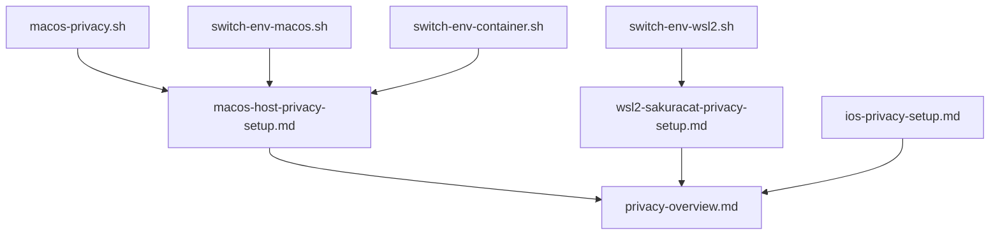
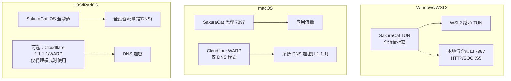
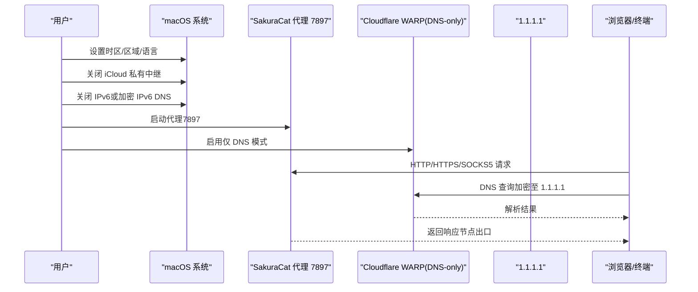
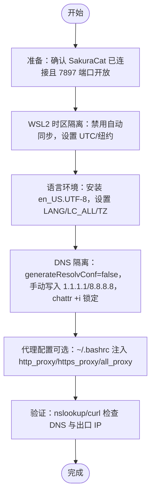
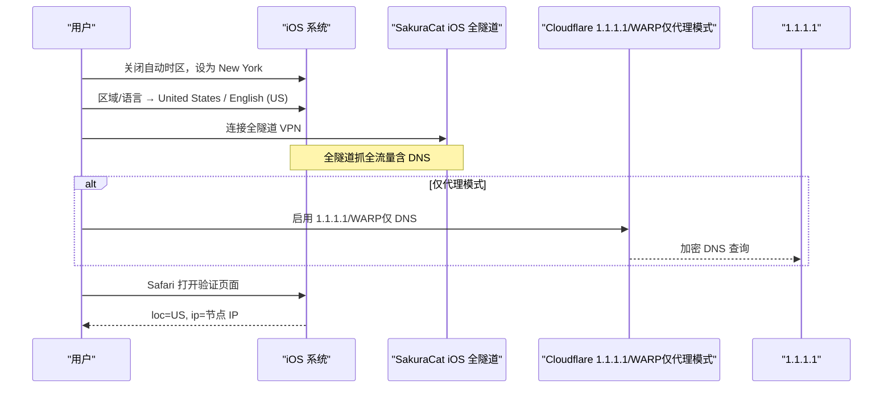
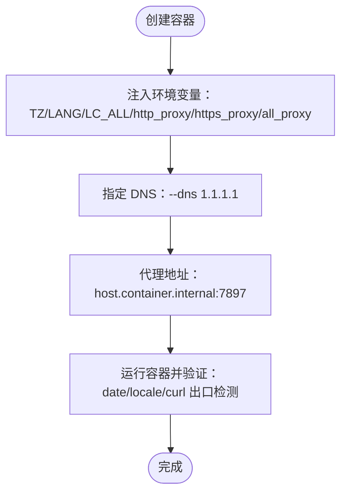
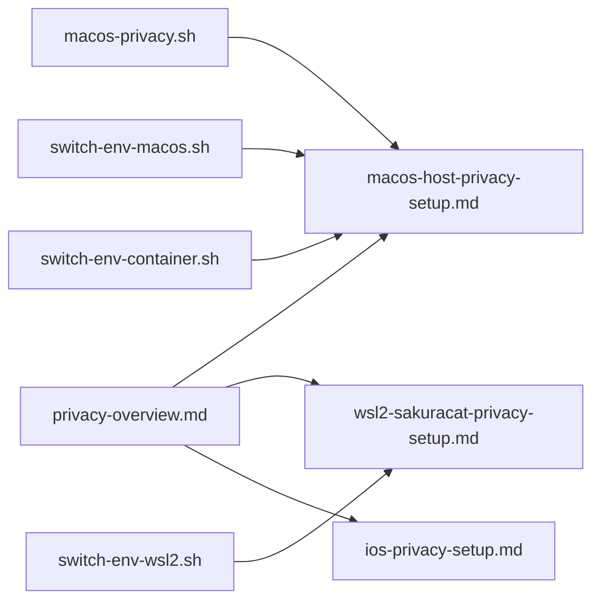

# 平台配置指南

<cite>
**本文引用的文件列表**
- [macos-host-privacy-setup.md](file://notes/macos-host-privacy-setup.md)
- [wsl2-sakuracat-privacy-setup.md](file://notes/wsl2-sakuracat-privacy-setup.md)
- [ios-privacy-setup.md](file://notes/ios-privacy-setup.md)
- [privacy-overview.md](file://notes/privacy-overview.md)
- [macos-privacy.sh](file://notes/macos-privacy.sh)
- [switch-env-macos.sh](file://notes/qoderclicn/switch-env-macos.sh)
- [switch-env-wsl2.sh](file://notes/qoderclicn/switch-env-wsl2.sh)
- [switch-env-container.sh](file://notes/qoderclicn/switch-env-container.sh)
</cite>

## 目录
1. [引言](#引言)
2. [项目结构](#项目结构)
3. [核心组件](#核心组件)
4. [架构总览](#架构总览)
5. [详细组件分析](#详细组件分析)
6. [依赖关系分析](#依赖关系分析)
7. [性能与一致性考量](#性能与一致性考量)
8. [故障排除指南](#故障排除指南)
9. [结论](#结论)
10. [附录：快速命令速查](#附录快速命令速查)

## 引言
本指南面向 macOS、Windows/WSL2、iOS/iPadOS 三大平台，提供一致的隐私保护方案。目标包括：
- 统一时区（美东）、DNS（1.1.1.1）、区域/语言（美国英语）
- 防止 IP 泄露与指纹识别（WebRTC、IPv6、iCloud 私有中继等）
- 明确不同平台的架构差异：macOS 使用代理 7897 + WARP DNS-only；Windows/WSL2 使用 TUN 全流量捕获；iOS 使用全隧道模式

## 项目结构
仓库包含跨平台隐私文档与脚本，覆盖主机与容器环境：
- 平台文档：macOS、WSL2、iOS
- 总览与一致性规则：两套架构说明、四端一致性规则、关键坑点
- 自动化脚本：macOS 一键应用/验证/恢复；多区域切换脚本（含容器）

图示来源
- [macos-host-privacy-setup.md:1-120](file://notes/macos-host-privacy-setup.md#L1-L120)
- [wsl2-sakuracat-privacy-setup.md:1-120](file://notes/wsl2-sakuracat-privacy-setup.md#L1-L120)
- [ios-privacy-setup.md:1-120](file://notes/ios-privacy-setup.md#L1-L120)
- [privacy-overview.md:1-115](file://notes/privacy-overview.md#L1-L115)
- [macos-privacy.sh:1-120](file://notes/macos-privacy.sh#L1-L120)
- [switch-env-macos.sh:1-120](file://notes/qoderclicn/switch-env-macos.sh#L1-L120)
- [switch-env-wsl2.sh:1-120](file://notes/qoderclicn/switch-env-wsl2.sh#L1-L120)
- [switch-env-container.sh:1-120](file://notes/qoderclicn/switch-env-container.sh#L1-L120)

章节来源
- [privacy-overview.md:1-115](file://notes/privacy-overview.md#L1-L115)

## 核心组件
- SakuraCat 客户端
  - Windows/WSL2：TUN 全流量捕获（Meta Tunnel），同时暴露本地混合端口 7897（HTTP/SOCKS5）供终端/容器显式使用
  - macOS：代理模式（端口 7897），不启用 TUN，避免与 WARP 冲突
  - iOS：优先全隧道 VPN 模式（NETunnelProvider），抓全设备流量（含 DNS）
- Cloudflare WARP（仅 macOS）
  - 运行于“仅 DNS”模式（HTTPS/TLS），负责系统 DNS 加密，不接管应用流量
- DNS 策略
  - macOS：WARP 接管系统 DNS，指向 1.1.1.1
  - Windows/WSL2：TUN 封装 DNS，无需 WARP；WSL2 可锁定 /etc/resolv.conf 为 1.1.1.1/8.8.8.8
  - iOS：全隧道封装 DNS；若仅代理模式则需另配 Cloudflare 1.1.1.1 App/WARP
- 浏览器 WebRTC 防护
  - macOS/Windows：按浏览器设置或扩展处理；macOS 代理模式更关键
  - iOS：Safari 保留 mDNS 候选，必要时安装内容拦截器
- 区域/语言与时区
  - 统一为 America/New_York、en_US、English (US)，确保出口 IP 与时区一致

章节来源
- [macos-host-privacy-setup.md:1-120](file://notes/macos-host-privacy-setup.md#L1-L120)
- [wsl2-sakuracat-privacy-setup.md:1-120](file://notes/wsl2-sakuracat-privacy-setup.md#L1-L120)
- [ios-privacy-setup.md:1-120](file://notes/ios-privacy-setup.md#L1-L120)
- [privacy-overview.md:10-40](file://notes/privacy-overview.md#L10-L40)

## 架构总览
两套架构并行存在，关键在于 DNS 加密机制与应用层代理变量：
- Windows/WSL2：TUN 全流量捕获，DNS 由隧道封装；终端/容器可通过 7897 显式走代理
- macOS：代理 7897 + WARP DNS-only；终端必须手设 http_proxy/https_proxy/all_proxy
- iOS：全隧道优先；仅代理时需搭配 Cloudflare 1.1.1.1/WARP

图示来源
- [privacy-overview.md:10-40](file://notes/privacy-overview.md#L10-L40)
- [macos-host-privacy-setup.md:1-120](file://notes/macos-host-privacy-setup.md#L1-L120)
- [wsl2-sakuracat-privacy-setup.md:1-120](file://notes/wsl2-sakuracat-privacy-setup.md#L1-L120)
- [ios-privacy-setup.md:1-120](file://notes/ios-privacy-setup.md#L1-L120)

## 详细组件分析

### macOS 宿主机隐私配置（代理 7897 + WARP DNS-only）
- 架构要点
  - SakuraCat 以代理模式监听 7897（HTTP/SOCKS5），不开启 TUN
  - Cloudflare WARP 设置为“仅 DNS”模式，接管系统 DNS 并以 DoH/DoT 发往 1.1.1.1
  - 终端/CLI 必须设置 http_proxy/https_proxy/all_proxy 环境变量
- 关键步骤
  - 关闭自动时区并设为 America/New_York，保留网络时间防漂移
  - 关闭 iCloud 私有中继，避免覆盖 DNS/VPN
  - 关闭 IPv6 或确保 IPv6 DNS 也经加密通道
  - 浏览器 WebRTC 防护：Safari/Firefox/Chrome 分别配置，保持 mDNS 候选开启
  - 验证出口 IP 与时区一致（loc=US，ip=节点 IP）
- 自动化脚本
  - macos-privacy.sh：apply/verify/check/restore，支持多区域映射与 .zshrc 块管理
  - switch-env-macos.sh：多区域切换（注意与 WARP DNS-only 的冲突提示）

图示来源
- [macos-host-privacy-setup.md:80-140](file://notes/macos-host-privacy-setup.md#L80-L140)
- [macos-privacy.sh:70-150](file://notes/macos-privacy.sh#L70-L150)
- [switch-env-macos.sh:109-151](file://notes/qoderclicn/switch-env-macos.sh#L109-L151)

章节来源
- [macos-host-privacy-setup.md:1-200](file://notes/macos-host-privacy-setup.md#L1-L200)
- [macos-privacy.sh:1-120](file://notes/macos-privacy.sh#L1-L120)
- [switch-env-macos.sh:1-120](file://notes/qoderclicn/switch-env-macos.sh#L1-L120)

### Windows/WSL2 隐私配置（TUN 全流量捕获）
- 架构要点
  - SakuraCat 在 Windows 宿主启用 TUN，抓取全部流量（含 UDP/DNS）
  - WSL2 继承 Windows TUN，无需额外代理变量；但可通过 7897 显式走代理
  - DNS 由隧道封装，无需 WARP；WSL2 可锁定 /etc/resolv.conf 为 1.1.1.1/8.8.8.8
- 关键步骤
  - 禁用 WSL2 自动时区同步，设置 UTC 或 America/New_York
  - 安装英文语言包，设置 LANG/LC_ALL/TZ
  - 禁用自动生成 resolv.conf，手动写入 DNS 并锁定
  - 配置终端代理环境变量（可选）：http_proxy/https_proxy/all_proxy 指向 127.0.0.1:7897 或动态获取宿主机 IP
  - 验证出口 IP 与时区一致
- 自动化脚本
  - switch-env-wsl2.sh：切换时区/语言/DNS/代理，并同步 Windows 宿主机时区与 DNS

图示来源
- [wsl2-sakuracat-privacy-setup.md:68-220](file://notes/wsl2-sakuracat-privacy-setup.md#L68-L220)
- [switch-env-wsl2.sh:144-196](file://notes/qoderclicn/switch-env-wsl2.sh#L144-L196)

章节来源
- [wsl2-sakuracat-privacy-setup.md:1-220](file://notes/wsl2-sakuracat-privacy-setup.md#L1-L220)
- [switch-env-wsl2.sh:1-200](file://notes/qoderclicn/switch-env-wsl2.sh#L1-L200)

### iOS/iPadOS 隐私配置（全隧道优先）
- 架构要点
  - SakuraCat iOS 优先全隧道（NETunnelProvider），抓全设备流量（含 DNS）
  - 若仅代理模式，需搭配 Cloudflare 1.1.1.1 App/WARP 做 DNS 加密
  - 关闭 iCloud 私有中继，避免覆盖 DNS/VPN
- 关键步骤
  - 关闭自动时区，设为 New York
  - 区域/语言设为 United States / English (US)
  - Safari WebRTC 防护：保留 mDNS 候选，必要时安装内容拦截器
  - 验证出口 IP 与时区一致
- 注意事项
  - 全隧道下无需额外代理端口；仅代理模式才需 DNS 加密工具

图示来源
- [ios-privacy-setup.md:1-120](file://notes/ios-privacy-setup.md#L1-L120)

章节来源
- [ios-privacy-setup.md:1-183](file://notes/ios-privacy-setup.md#L1-L183)

### Apple Container 隐私（macOS 代理模式下的容器）
- 关键陷阱
  - 容器内 127.0.0.1 ≠ macOS 宿主机，须用 host.container.internal
  - macOS 是代理模式，容器必须注入代理变量，否则断网
- 配置要点
  - 显式 --dns 1.1.1.1（容器内不走 WARP）
  - 注入 TZ/LANG/LC_ALL 与代理环境变量
  - 验证时区/语言/出口 IP 一致

图示来源
- [macos-host-privacy-setup.md:337-463](file://notes/macos-host-privacy-setup.md#L337-L463)
- [switch-env-container.sh:111-205](file://notes/qoderclicn/switch-env-container.sh#L111-L205)

章节来源
- [macos-host-privacy-setup.md:337-463](file://notes/macos-host-privacy-setup.md#L337-L463)
- [switch-env-container.sh:1-205](file://notes/qoderclicn/switch-env-container.sh#L1-L205)

## 依赖关系分析
- 平台间一致性依赖
  - 时区：America/New_York（IANA）= Eastern Standard Time（Windows）= New York（iOS）
  - DNS：1.1.1.1（macOS 经 WARP；Windows/WSL2/iOS 经隧道封装）
  - 区域/语言：en_US / en_US.UTF-8 / English (US)
- 脚本与文档依赖
  - macos-privacy.sh 借鉴 switch-env-macos.sh 的 .zshrc 块管理与多区域映射技术
  - switch-env-wsl2.sh 与 wsl2-sakuracat-privacy-setup.md 保持一致的 DNS/代理逻辑
  - switch-env-container.sh 适配 Apple Container 的 host.container.internal 与代理注入

图示来源
- [privacy-overview.md:41-115](file://notes/privacy-overview.md#L41-L115)
- [macos-privacy.sh:1-60](file://notes/macos-privacy.sh#L1-L60)
- [switch-env-macos.sh:1-60](file://notes/qoderclicn/switch-env-macos.sh#L1-L60)
- [switch-env-wsl2.sh:1-60](file://notes/qoderclicn/switch-env-wsl2.sh#L1-L60)
- [switch-env-container.sh:1-60](file://notes/qoderclicn/switch-env-container.sh#L1-L60)

章节来源
- [privacy-overview.md:29-80](file://notes/privacy-overview.md#L29-L80)

## 性能与一致性考量
- 性能
  - TUN 全流量捕获对 CPU/内存有轻微开销，但提供更强的隐私保障
  - 代理模式需应用层显式配置，可能遗漏部分流量（如 CLI/容器）
- 一致性
  - 出口 IP、时区、区域/语言三者一致，避免指纹识别
  - 定期验证（每周一次）与备份关键配置
- 安全建议
  - 不要禁用 Safari mDNS（隐藏真实本地 IP）
  - 不要误开 WARP 全隧道（会覆盖 SakuraCat 出口）
  - 关闭 iCloud 私有中继（覆盖 DNS/VPN）
  - 容器内 127.0.0.1 陷阱（macOS 用 host.container.internal）

[本节为通用指导，不直接分析具体文件]

## 故障排除指南
- macOS
  - WARP 模式错误：确保“仅 DNS”，非全隧道
  - IPv6 泄露：关闭 IPv6 或确保 IPv6 DNS 加密
  - WebRTC 泄露：Safari/Firefox/Chrome 分别配置，保持 mDNS 候选开启
  - 终端未走代理：检查 http_proxy/https_proxy/all_proxy 环境变量
- Windows/WSL2
  - DNS 不生效：检查 /etc/resolv.conf 内容与 chattr 锁定状态
  - 代理不工作：确认 SakuraCat 运行、端口 7897 开放、环境变量正确
  - WSL 无法启动：执行 wsl --shutdown 后重启
- iOS
  - 私有中继覆盖：关闭 iCloud 私有中继
  - 仅代理模式无 DNS 加密：启用 Cloudflare 1.1.1.1/WARP
  - WebRTC 泄露：Safari 保留 mDNS，必要时安装内容拦截器

章节来源
- [macos-host-privacy-setup.md:160-285](file://notes/macos-host-privacy-setup.md#L160-L285)
- [wsl2-sakuracat-privacy-setup.md:371-452](file://notes/wsl2-sakuracat-privacy-setup.md#L371-L452)
- [ios-privacy-setup.md:102-173](file://notes/ios-privacy-setup.md#L102-L173)

## 结论
通过统一的时区、DNS、区域/语言与平台特定的网络架构（macOS 代理+DNS-only、Windows/WSL2 TUN、iOS 全隧道），可有效防止 IP 泄露与指纹识别。配合自动化脚本与定期验证，确保配置的一致性与安全性。

[本节为总结，不直接分析具体文件]

## 附录：快速命令速查
- macOS
  - 查看/设置时区、区域/语言、系统代理、DNS、刷新缓存、验证出口 IP
- Windows/WSL2
  - 进入/关闭 WSL、设置时区/语言、DNS 锁定、代理环境变量、验证出口 IP
- iOS
  - 设置时区/区域/语言、关闭私有中继、Safari WebRTC 验证

章节来源
- [macos-host-privacy-setup.md:35-53](file://notes/macos-host-privacy-setup.md#L35-L53)
- [wsl2-sakuracat-privacy-setup.md:475-492](file://notes/wsl2-sakuracat-privacy-setup.md#L475-L492)
- [ios-privacy-setup.md:33-45](file://notes/ios-privacy-setup.md#L33-L45)