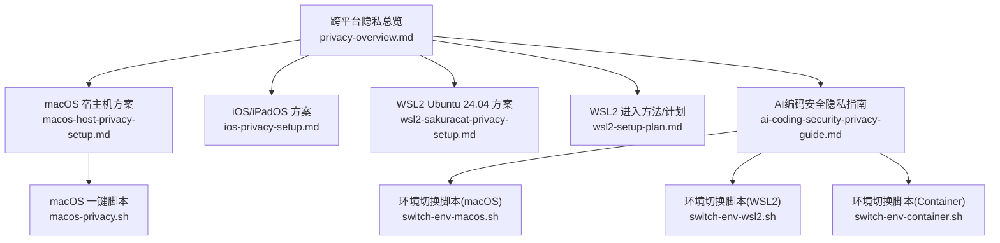
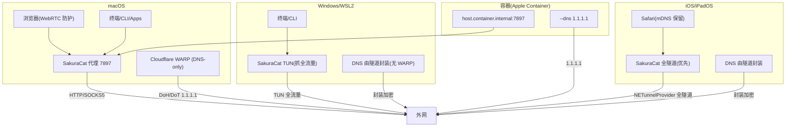
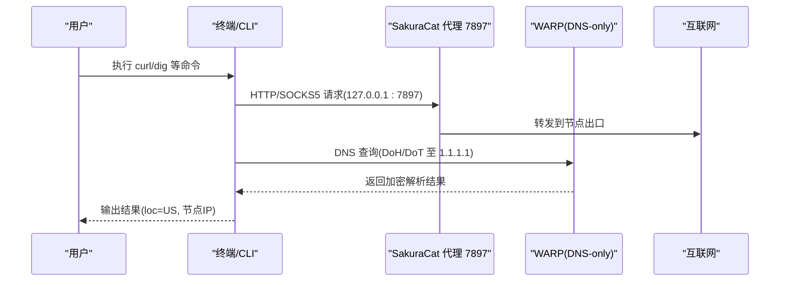
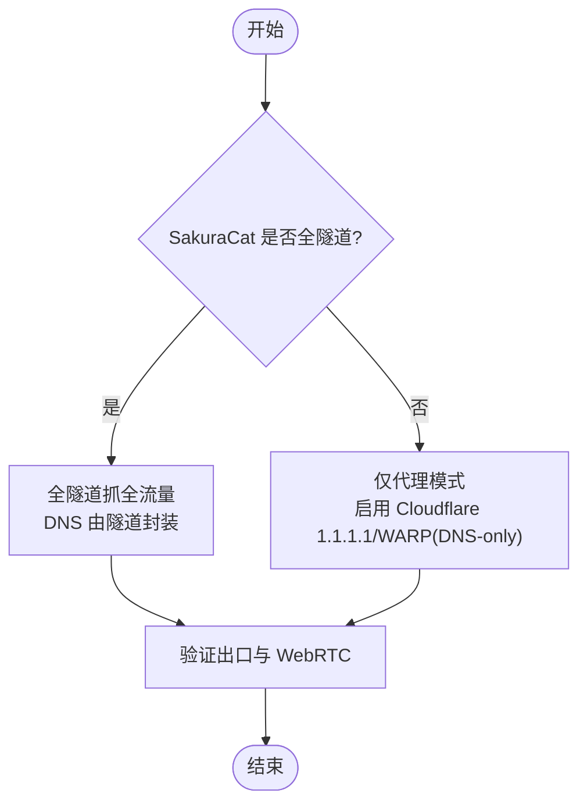
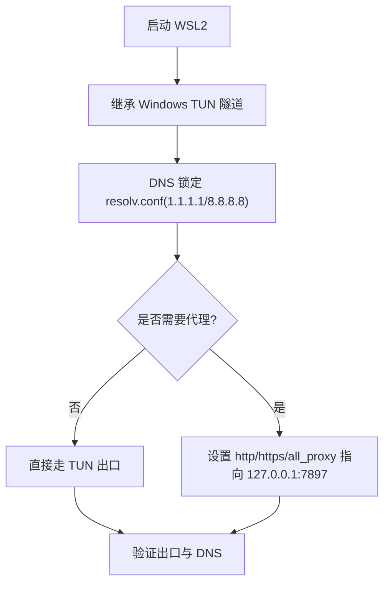
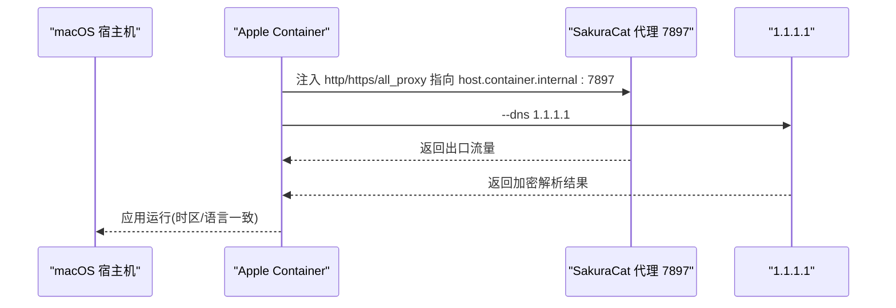
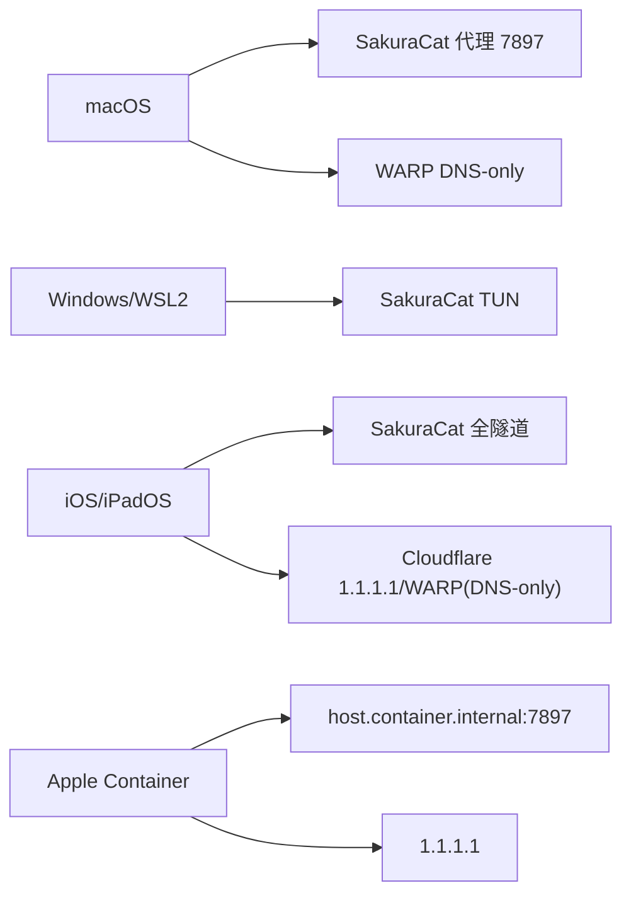
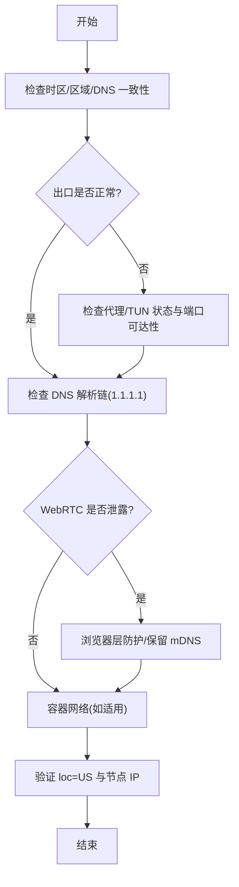

# 故障排除与最佳实践

<cite>
**本文引用的文件**   
- [privacy-overview.md](file://notes/privacy-overview.md)
- [macos-host-privacy-setup.md](file://notes/macos-host-privacy-setup.md)
- [ios-privacy-setup.md](file://notes/ios-privacy-setup.md)
- [wsl2-sakuracat-privacy-setup.md](file://notes/wsl2-sakuracat-privacy-setup.md)
- [wsl2-setup-plan.md](file://notes/wsl2-setup-plan.md)
- [macos-privacy.sh](file://notes/macos-privacy.sh)
- [ai-coding-security-privacy-guide.md](file://notes/qoderclicn/ai-coding-security-privacy-guide.md)
- [switch-env-macos.sh](file://notes/qoderclicn/switch-env-macos.sh)
- [switch-env-wsl2.sh](file://notes/qoderclicn/switch-env-wsl2.sh)
- [switch-env-container.sh](file://notes/qoderclicn/switch-env-container.sh)
</cite>

## 目录
1. [引言](#引言)
2. [项目结构](#项目结构)
3. [核心组件](#核心组件)
4. [架构总览](#架构总览)
5. [详细组件分析](#详细组件分析)
6. [依赖关系分析](#依赖关系分析)
7. [性能考虑](#性能考虑)
8. [故障排除指南](#故障排除指南)
9. [结论](#结论)
10. [附录](#附录)

## 引言
本指南面向跨平台隐私配置（macOS、Windows/WSL2、iOS）的运维与开发者，聚焦常见问题诊断与解决方案。内容覆盖网络连接问题、配置冲突解决、性能调优建议与安全审计清单；提供系统性排查流程（DNS解析失败、代理连接异常、WebRTC泄露检测、容器网络隔离等）；记录关键坑点速记（Safari mDNS处理、代理 vs TUN模式差异、WARP模式配置、iCloud私有中继冲突等）；并包含定期维护检查项、监控告警设置和应急响应流程，以及容量规划指导，确保系统稳定性与安全性。

## 项目结构
仓库以“文档 + 脚本”的形式组织，围绕四端一致性（时区、DNS、区域/语言）与两套不同架构（TUN全隧道 vs 代理+DNS加密）展开：
- 总览与一致性规则：privacy-overview.md
- macOS 宿主机方案（代理 7897 + WARP DNS-only）：macos-host-privacy-setup.md
- iOS/iPadOS 方案（优先全隧道，或代理 + Cloudflare 1.1.1.1/WARP）：ios-privacy-setup.md
- WSL2 Ubuntu 24.04 方案（继承 Windows TUN 隧道，DNS 锁定）：wsl2-sakuracat-privacy-setup.md
- WSL2 进入方法与计划：wsl2-setup-plan.md
- 一键脚本（macOS apply/verify/check/restore）：macos-privacy.sh
- AI编码工具安全隐私与防封指南（同源原理）：ai-coding-security-privacy-guide.md
- 环境切换脚本（macOS/WSL2/Container）：switch-env-macos.sh、switch-env-wsl2.sh、switch-env-container.sh

图表来源
- [privacy-overview.md:1-115](file://notes/privacy-overview.md#L1-L115)
- [macos-host-privacy-setup.md:1-476](file://notes/macos-host-privacy-setup.md#L1-L476)
- [ios-privacy-setup.md:1-183](file://notes/ios-privacy-setup.md#L1-L183)
- [wsl2-sakuracat-privacy-setup.md:1-580](file://notes/wsl2-sakuracat-privacy-setup.md#L1-L580)
- [wsl2-setup-plan.md:1-433](file://notes/wsl2-setup-plan.md#L1-L433)
- [macos-privacy.sh:1-262](file://notes/macos-privacy.sh#L1-L262)
- [ai-coding-security-privacy-guide.md:1-459](file://notes/qoderclicn/ai-coding-security-privacy-guide.md#L1-L459)
- [switch-env-macos.sh:1-217](file://notes/qoderclicn/switch-env-macos.sh#L1-L217)
- [switch-env-wsl2.sh:1-318](file://notes/qoderclicn/switch-env-wsl2.sh#L1-L318)
- [switch-env-container.sh:1-283](file://notes/qoderclicn/switch-env-container.sh#L1-L283)

章节来源
- [privacy-overview.md:1-115](file://notes/privacy-overview.md#L1-L115)

## 核心组件
- 两套架构与一致性规则
  - 两套架构：Windows/WSL2/iOS 倾向 TUN/全隧道封装；macOS 采用代理 7897 + WARP DNS-only，避免与 WARP 抢网卡/路由。
  - 一致性三要素：时区 America/New_York、DNS 1.1.1.1、区域 en_US。
- 关键组件职责
  - SakuraCat：Windows/WSL2 使用 TUN；macOS 使用代理 7897；iOS 优先全隧道。
  - Cloudflare WARP：macOS 仅用于 DNS-only（HTTPS/TLS），不接管流量。
  - 浏览器 WebRTC：macOS 代理模式下需浏览器层防护；iOS Safari 保留 mDNS 隐藏本地 IP。
  - 容器网络：Apple Container 在 macOS 下必须显式注入代理变量，且通过 host.container.internal 访问宿主机服务。
- 验证入口
  - 统一出口验证：https://1.1.1.1/cdn-cgi/trace（避免 ipinfo.io 限流）。
  - 综合自查：browserleaks.com（IP/时区/WebRTC/DNS）。

章节来源
- [privacy-overview.md:10-81](file://notes/privacy-overview.md#L10-L81)
- [macos-host-privacy-setup.md:11-32](file://notes/macos-host-privacy-setup.md#L11-L32)
- [ios-privacy-setup.md:11-31](file://notes/ios-privacy-setup.md#L11-L31)
- [wsl2-sakuracat-privacy-setup.md:1-22](file://notes/wsl2-sakuracat-privacy-setup.md#L1-L22)

## 架构总览
下图展示四端在网络与 DNS 层面的交互关系，突出 macOS 的“代理 + DNS-only”与其余平台的“TUN/全隧道”差异。

图表来源
- [privacy-overview.md:10-26](file://notes/privacy-overview.md#L10-L26)
- [macos-host-privacy-setup.md:11-32](file://notes/macos-host-privacy-setup.md#L11-L32)
- [ios-privacy-setup.md:11-21](file://notes/ios-privacy-setup.md#L11-L21)
- [wsl2-sakuracat-privacy-setup.md:1-22](file://notes/wsl2-sakuracat-privacy-setup.md#L1-L22)
- [macos-host-privacy-setup.md:337-463](file://notes/macos-host-privacy-setup.md#L337-L463)

## 详细组件分析

### macOS 宿主机（代理 7897 + WARP DNS-only）
- 关键点
  - 不开启 TUN，避免与 WARP 抢网卡/路由。
  - WARP 必须为“仅 DNS（HTTPS/TLS）”，不可开全隧道。
  - IPv6 可能绕过 WARP，建议关闭接口 IPv6 或将 IPv6 DNS 指向加密通道。
  - 终端/CLI 必须设置 http_proxy/https_proxy/all_proxy。
  - Apple Container 必须注入代理变量，并使用 host.container.internal:7897。
- 验证要点
  - scutil --dns 应出现 1.1.1.1；curl https://1.1.1.1/cdn-cgi/trace 显示 loc=US 与节点 IP。
- 恢复步骤
  - 恢复自动时区、关闭系统代理、恢复 IPv6、断开 WARP、恢复语言/区域。

图表来源
- [macos-host-privacy-setup.md:84-142](file://notes/macos-host-privacy-setup.md#L84-L142)
- [macos-host-privacy-setup.md:258-285](file://notes/macos-host-privacy-setup.md#L258-L285)
- [macos-host-privacy-setup.md:337-463](file://notes/macos-host-privacy-setup.md#L337-L463)

章节来源
- [macos-host-privacy-setup.md:11-32](file://notes/macos-host-privacy-setup.md#L11-L32)
- [macos-host-privacy-setup.md:84-142](file://notes/macos-host-privacy-setup.md#L84-L142)
- [macos-host-privacy-setup.md:258-285](file://notes/macos-host-privacy-setup.md#L258-L285)
- [macos-host-privacy-setup.md:337-463](file://notes/macos-host-privacy-setup.md#L337-L463)

### iOS / iPadOS（优先全隧道）
- 关键点
  - 优先使用 SakuraCat iOS 全隧道（NETunnelProvider），DNS 由隧道封装加密。
  - 若仅代理模式，需配合 Cloudflare 1.1.1.1 App/WARP（保持 DNS-only）。
  - 关闭 iCloud 私有中继，避免覆盖 DNS/VPN。
  - Safari WebRTC：保留 mDNS 候选，减少权限触发。
- 验证要点
  - Safari 打开 https://1.1.1.1/cdn-cgi/trace 确认 loc=US 与节点 IP；browserleaks.com/webrtc 无公网 IP 泄露。

图表来源
- [ios-privacy-setup.md:11-21](file://notes/ios-privacy-setup.md#L11-L21)
- [ios-privacy-setup.md:66-86](file://notes/ios-privacy-setup.md#L66-L86)
- [ios-privacy-setup.md:102-122](file://notes/ios-privacy-setup.md#L102-L122)
- [ios-privacy-setup.md:125-143](file://notes/ios-privacy-setup.md#L125-L143)

章节来源
- [ios-privacy-setup.md:11-31](file://notes/ios-privacy-setup.md#L11-L31)
- [ios-privacy-setup.md:66-86](file://notes/ios-privacy-setup.md#L66-L86)
- [ios-privacy-setup.md:102-122](file://notes/ios-privacy-setup.md#L102-L122)
- [ios-privacy-setup.md:125-143](file://notes/ios-privacy-setup.md#L125-L143)

### WSL2 Ubuntu 24.04（继承 Windows TUN）
- 关键点
  - 继承 Windows TUN 隧道，默认无需代理变量；DNS 锁定为 1.1.1.1/8.8.8.8，防止被覆盖。
  - 不要启用 Windows .wslconfig 的 dnsTunneling=true，以免绕过 Linux 侧 DNS 隔离。
  - 如需代理，环境变量指向 Windows 宿主机的 7897（或使用 TUN 模式更稳妥）。
- 验证要点
  - nslookup 返回 8.8.8.8/1.1.1.1；curl 出口显示美国节点与 loc=US。

图表来源
- [wsl2-sakuracat-privacy-setup.md:137-176](file://notes/wsl2-sakuracat-privacy-setup.md#L137-L176)
- [wsl2-sakuracat-privacy-setup.md:179-212](file://notes/wsl2-sakuracat-privacy-setup.md#L179-L212)
- [wsl2-sakuracat-privacy-setup.md:546-573](file://notes/wsl2-sakuracat-privacy-setup.md#L546-L573)

章节来源
- [wsl2-sakuracat-privacy-setup.md:1-22](file://notes/wsl2-sakuracat-privacy-setup.md#L1-L22)
- [wsl2-sakuracat-privacy-setup.md:137-176](file://notes/wsl2-sakuracat-privacy-setup.md#L137-L176)
- [wsl2-sakuracat-privacy-setup.md:179-212](file://notes/wsl2-sakuracat-privacy-setup.md#L179-L212)
- [wsl2-sakuracat-privacy-setup.md:546-573](file://notes/wsl2-sakuracat-privacy-setup.md#L546-L573)

### Apple Container（macOS 代理模式下的容器）
- 关键点
  - macOS 非 TUN，容器必须注入代理变量，并通过 host.container.internal:7897 访问宿主机服务。
  - 容器内 DNS 不会自动走 WARP，需显式 --dns 1.1.1.1。
  - 时区需镜像含 tzdata，否则 TZ 不生效。
- 验证要点
  - 容器内 date 显示美东时间；curl 出口显示 loc=US 与节点 IP。

图表来源
- [macos-host-privacy-setup.md:337-463](file://notes/macos-host-privacy-setup.md#L337-L463)

章节来源
- [macos-host-privacy-setup.md:337-463](file://notes/macos-host-privacy-setup.md#L337-L463)

## 依赖关系分析
- 组件耦合与职责分离
  - macOS：SakuraCat 代理负责出口，WARP 仅负责 DNS 加密，二者互不冲突。
  - Windows/WSL2：SakuraCat TUN 接管全局流量，DNS 由隧道封装，无需 WARP。
  - iOS：优先全隧道，必要时用 Cloudflare 1.1.1.1/WARP 做 DNS-only。
  - 容器：依赖宿主代理与显式 DNS 参数。
- 外部依赖与集成点
  - Cloudflare WARP（macOS DNS-only）
  - SakuraCat（多端客户端）
  - 浏览器 WebRTC 策略（Safari/Firefox/Chrome）
  - Apple Container 运行时（Docker/OrbStack/Colima）

图表来源
- [privacy-overview.md:10-26](file://notes/privacy-overview.md#L10-L26)
- [macos-host-privacy-setup.md:11-32](file://notes/macos-host-privacy-setup.md#L11-L32)
- [ios-privacy-setup.md:11-21](file://notes/ios-privacy-setup.md#L11-L21)
- [wsl2-sakuracat-privacy-setup.md:1-22](file://notes/wsl2-sakuracat-privacy-setup.md#L1-L22)
- [macos-host-privacy-setup.md:337-463](file://notes/macos-host-privacy-setup.md#L337-L463)

章节来源
- [privacy-overview.md:10-26](file://notes/privacy-overview.md#L10-L26)

## 性能考虑
- 端口与协议选择
  - 7897 混合端口同时支持 HTTP 与 SOCKS5，便于终端/容器统一配置。
- DNS 优化
  - macOS 使用 WARP DNS-only（DoH/DoT），降低明文 DNS 风险；WSL2 锁定 1.1.1.1/8.8.8.8。
- 浏览器 WebRTC
  - macOS 代理模式需浏览器层防护；iOS Safari 保留 mDNS 隐藏本地 IP。
- 容器资源
  - 轻量镜像（Alpine）需安装 tzdata 以保证 TZ 生效；Node/Python 等镜像按需安装必要工具。
- 验证效率
  - 统一使用 https://1.1.1.1/cdn-cgi/trace 进行出口验证，避免第三方限流影响判断。

[本节为通用指导，不直接分析具体文件]

## 故障排除指南

### 一、系统性排查流程（从网络到应用）
- 第一步：确认基础一致性
  - 时区 America/New_York、区域 en_US、DNS 1.1.1.1。
  - 参考：隐私总览的一致性规则与快速命令速查。
- 第二步：检查网络出口
  - macOS：系统代理指向 127.0.0.1:7897；WARP 状态为 DNS-only；IPv6 已关闭或加密。
  - Windows/WSL2：TUN 已连接；resolv.conf 锁定为 1.1.1.1/8.8.8.8；必要时设置代理变量。
  - iOS：全隧道图标亮起；或 Cloudflare 1.1.1.1/WARP 已启用；私有中继关闭。
- 第三步：DNS 解析链
  - macOS：scutil --dns 查看 nameserver 链；刷新缓存后重试。
  - WSL2：cat /etc/resolv.conf 与 chattr +i 锁定状态；wsl --shutdown 重启生效。
- 第四步：WebRTC 泄露检测
  - macOS：Safari/Firefox/Chrome 按文档配置；保留 mDNS 候选。
  - iOS：Safari 保留默认 mDNS；减少媒体权限触发。
- 第五步：容器网络
  - Apple Container：注入 host.container.internal:7897 与 --dns 1.1.1.1；验证 TZ/LANG。

[此图为概念流程图，不映射具体源码文件]

### 二、常见问题与解决方案

#### 1. DNS 解析失败
- 症状
  - 无法解析域名；nslookup 返回本地或错误服务器。
- 排查
  - macOS：scutil --dns 查看 nameserver；刷新 dscacheutil 与 mDNSResponder。
  - WSL2：检查 /etc/resolv.conf 内容与 chattr +i 锁定；wsl.conf 中 generateResolvConf=false。
  - iOS：确认 Wi-Fi 手动 DNS 或 Cloudflare 1.1.1.1/WARP 已启用；关闭 iCloud 私有中继。
- 解决
  - 重新写入 DNS 并刷新缓存；必要时 wsl --shutdown 重启。

章节来源
- [macos-host-privacy-setup.md:84-142](file://notes/macos-host-privacy-setup.md#L84-L142)
- [wsl2-sakuracat-privacy-setup.md:137-176](file://notes/wsl2-sakuracat-privacy-setup.md#L137-L176)
- [ios-privacy-setup.md:66-86](file://notes/ios-privacy-setup.md#L66-L86)

#### 2. 代理连接异常（7897 端口不可达）
- 症状
  - curl 超时；终端/CLI 无法联网。
- 排查
  - macOS：networksetup 查看系统代理；确认 SakuraCat 代理进程与端口监听。
  - WSL2：Test-NetConnection 127.0.0.1:7897；检查 ~/.bashrc 代理变量。
  - iOS：确认全隧道或代理模式已启用；关闭私有中继。
- 解决
  - 重启 SakuraCat；重新设置系统代理；source ~/.bashrc；wsl --shutdown 重启。

章节来源
- [macos-host-privacy-setup.md:35-53](file://notes/macos-host-privacy-setup.md#L35-L53)
- [wsl2-sakuracat-privacy-setup.md:27-48](file://notes/wsl2-sakuracat-privacy-setup.md#L27-L48)
- [wsl2-sakuracat-privacy-setup.md:395-413](file://notes/wsl2-sakuracat-privacy-setup.md#L395-L413)

#### 3. WebRTC 泄露检测
- 症状
  - browserleaks.com/webrtc 显示公网 IP 泄露。
- 排查
  - macOS：Safari/Firefox/Chrome 配置是否正确；保留 mDNS 候选。
  - iOS：Safari 高级设置保留默认；减少相机/麦克风权限触发。
- 解决
  - 按浏览器文档逐项配置；必要时扩展拦截（uBlock Origin 等）。

章节来源
- [macos-host-privacy-setup.md:169-214](file://notes/macos-host-privacy-setup.md#L169-L214)
- [ios-privacy-setup.md:102-122](file://notes/ios-privacy-setup.md#L102-L122)

#### 4. 容器网络隔离（Apple Container）
- 症状
  - 容器无法解析域名；出口断网或直连宿主机。
- 排查
  - 检查 --dns 1.1.1.1；确认 host.container.internal 解析；验证代理变量。
- 解决
  - 创建 host.container.internal 映射；注入代理变量；安装 tzdata 保证 TZ 生效。

章节来源
- [macos-host-privacy-setup.md:337-463](file://notes/macos-host-privacy-setup.md#L337-L463)

#### 5. 配置冲突（WARP 全隧道 vs 代理出口）
- 症状
  - 出口 IP 变为 Cloudflare；节点 IP 丢失。
- 排查
  - macOS：warp-cli status/settings 确认 DNS-only 模式。
- 解决
  - 将 WARP 改为“仅 DNS（HTTPS/TLS）”；断开全隧道。

章节来源
- [macos-host-privacy-setup.md:84-112](file://notes/macos-host-privacy-setup.md#L84-L112)

#### 6. iCloud 私有中继冲突
- 症状
  - DNS 被覆盖；WARP 失效。
- 排查
  - 系统设置 → Apple ID → iCloud → 私有中继。
- 解决
  - 关闭私有中继；重新启用 WARP DNS-only。

章节来源
- [macos-host-privacy-setup.md:113-117](file://notes/macos-host-privacy-setup.md#L113-L117)
- [ios-privacy-setup.md:77-81](file://notes/ios-privacy-setup.md#L77-L81)

#### 7. IPv6 泄露
- 症状
  - IPv6 DNS/WebRTC 绕过 WARP 暴露真实网络。
- 排查
  - networksetup -getinfo Wi-Fi | grep -i 'IPv6'。
- 解决
  - 关闭接口 IPv6 或将其 DNS 指向加密通道。

章节来源
- [macos-host-privacy-setup.md:118-132](file://notes/macos-host-privacy-setup.md#L118-L132)

### 三、关键坑点速记
- Safari mDNS：不要禁用，它是隐藏真实本地 IP 的机制（macOS/iOS 同此）。
- 代理 vs TUN：TUN 自动抓全流量（含 UDP/命令行）；代理只抓配置了代理的 App，终端必须手设 http_proxy。
- WARP 模式：macOS 上 WARP 必须是 DNS-only，不是全隧道。
- iCloud 私有中继：会和 WARP/VPN 抢 DNS，macOS/iOS 必须关。
- 容器 127.0.0.1 陷阱：容器内 127.0.0.1 ≠ 宿主机，macOS 用 host.container.internal，Windows Docker 用 host.docker.internal。
- 验证别用 ipinfo.io（429 限流），统一用 https://1.1.1.1/cdn-cgi/trace。

章节来源
- [privacy-overview.md:73-81](file://notes/privacy-overview.md#L73-L81)

### 四、定期维护检查项
- 周检查
  - 运行 verify 脚本（macOS）或 ~/check-privacy.sh（WSL2）。
  - 测试 curl https://1.1.1.1/cdn-cgi/trace 确认 loc=US 与节点 IP。
- 月检查
  - 检查 DNS 文件锁定状态（chattr +i）。
  - 检查 SakuraCat 版本更新。
- 季度检查
  - 更新 WSL2 与 Ubuntu 系统。
  - 重新创建完整备份。

章节来源
- [wsl2-sakuracat-privacy-setup.md:454-472](file://notes/wsl2-sakuracat-privacy-setup.md#L454-L472)
- [macos-privacy.sh:152-197](file://notes/macos-privacy.sh#L152-L197)

### 五、监控告警设置
- 指标建议
  - DNS 解析成功率（nslookup/dig 成功率）。
  - 代理端口可达性（7897 TCP 探测）。
  - 出口 IP 与地理位置一致性（loc=US）。
  - WebRTC 泄露次数（browserleaks.com/webrtc 扫描）。
- 告警阈值
  - DNS 失败率 > 5% 持续 10 分钟。
  - 7897 端口不可达 > 5 分钟。
  - loc≠US 或出口 IP 非节点 IP。
- 自动化
  - 定时任务（cron/systemd timer）执行 check/verify 脚本并上报结果。

[本节为通用指导，不直接分析具体文件]

### 六、应急响应流程
- 事件分级
  - P1：出口 IP 异常（非节点 IP）或 loc≠US。
  - P2：DNS 解析失败或频繁超时。
  - P3：WebRTC 泄露或代理端口不可达。
- 处置步骤
  - 立即回滚最近变更（restore 脚本）。
  - 检查 WARP 模式与 iCloud 私有中继。
  - 重启相关服务（SakuraCat、WARP、mDNSResponder）。
  - 复测出口与 DNS，必要时切换到备用 DNS 或节点。
- 复盘与加固
  - 记录根因与修复措施。
  - 更新检查清单与脚本参数。

章节来源
- [macos-privacy.sh:214-246](file://notes/macos-privacy.sh#L214-L246)
- [wsl2-sakuracat-privacy-setup.md:278-368](file://notes/wsl2-sakuracat-privacy-setup.md#L278-L368)

## 结论
本指南基于跨平台隐私方案的实测与文档，总结了 macOS、Windows/WSL2、iOS 的核心差异与一致性要求，提供了从网络到应用的系统化排查流程与常见问题的解决方案。通过统一的验证入口与关键坑点速记，可有效降低误配风险；结合定期维护、监控告警与应急响应，可进一步提升系统的稳定性与安全性。

[本节为总结性内容，不直接分析具体文件]

## 附录

### A. 一键脚本用法速查
- macOS
  - sudo ./macos-privacy.sh apply [us|jp|uk|sg|cn]
  - ./macos-privacy.sh verify
  - ./macos-privacy.sh check
  - sudo ./macos-privacy.sh restore
- WSL2
  - 运行 ~/check-privacy.sh 进行自检
- 环境切换脚本
  - switch-env-macos.sh us/jp/uk/sg/cn|check
  - switch-env-wsl2.sh us/jp/uk/sg/cn|check
  - switch-env-container.sh us/jp/uk/sg/cn|stop|shell|check

章节来源
- [macos-privacy.sh:1-18](file://notes/macos-privacy.sh#L1-L18)
- [switch-env-macos.sh:1-12](file://notes/qoderclicn/switch-env-macos.sh#L1-L12)
- [switch-env-wsl2.sh:1-14](file://notes/qoderclicn/switch-env-wsl2.sh#L1-L14)
- [switch-env-container.sh:1-12](file://notes/qoderclicn/switch-env-container.sh#L1-L12)

### B. 安全审计清单（AI 编码工具场景）
- 账号与支付
  - 正规渠道订阅，本人支付；一人一号，不共享。
- 环境与网络
  - 固定、干净的网络环境（住宅 IP/专线）；时区/区域/DNS 一致。
- 沙箱与权限
  - 使用沙箱（Seatbelt/bubblewrap）；限制文件系统与网络访问。
- 频率与行为
  - 控制请求频率，避免机器人行为；遵守平台政策。
- 数据与密钥
  - 不在项目目录存放明文密钥；使用环境变量或密钥管理工具。

章节来源
- [ai-coding-security-privacy-guide.md:100-168](file://notes/qoderclicn/ai-coding-security-privacy-guide.md#L100-L168)
- [ai-coding-security-privacy-guide.md:398-418](file://notes/qoderclicn/ai-coding-security-privacy-guide.md#L398-L418)

### C. 容量规划指导
- 并发与速率
  - 合理控制并发请求，避免触发平台限流（429）。
- 节点稳定性
  - 固定单一节点，避免频繁切换导致风控。
- 资源预留
  - 容器镜像按需裁剪，预留 tzdata/locale 等基础包空间。
- 监控与扩容
  - 建立 DNS/代理/出口指标的监控看板；当失败率上升时及时扩容或切换节点。

[本节为通用指导，不直接分析具体文件]