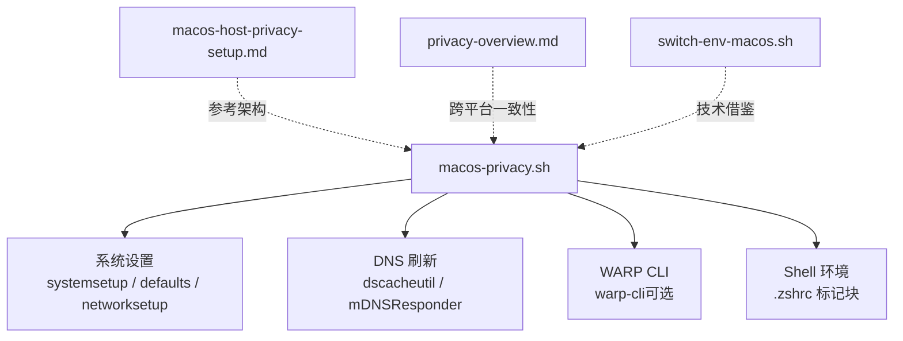
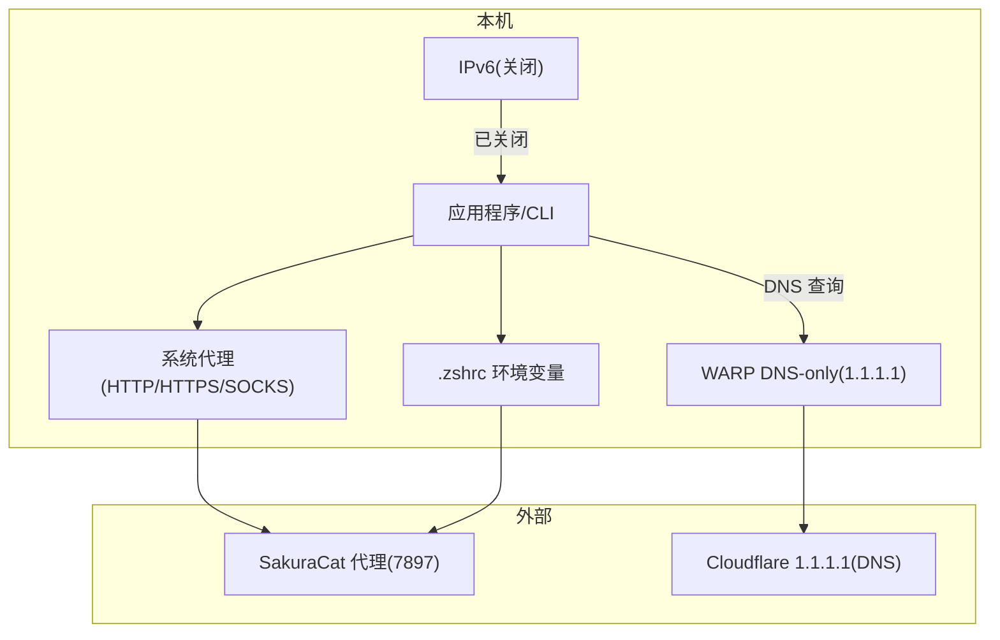
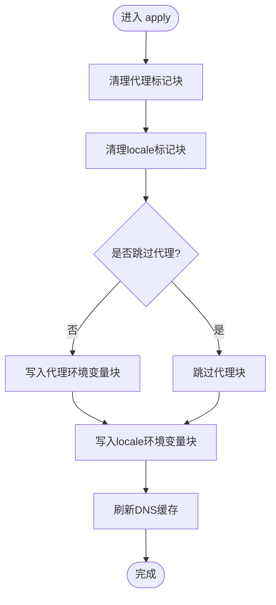
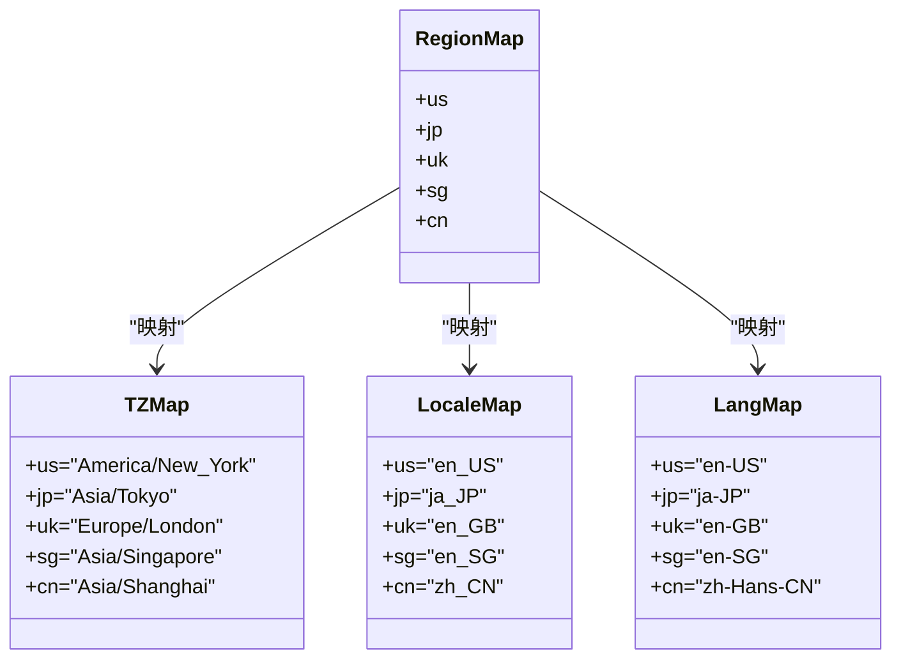
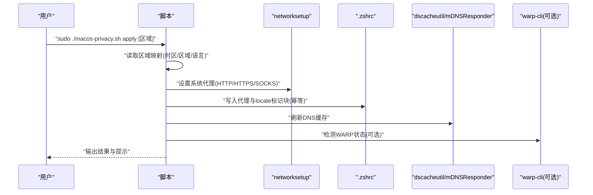
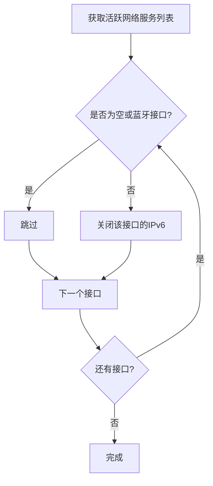
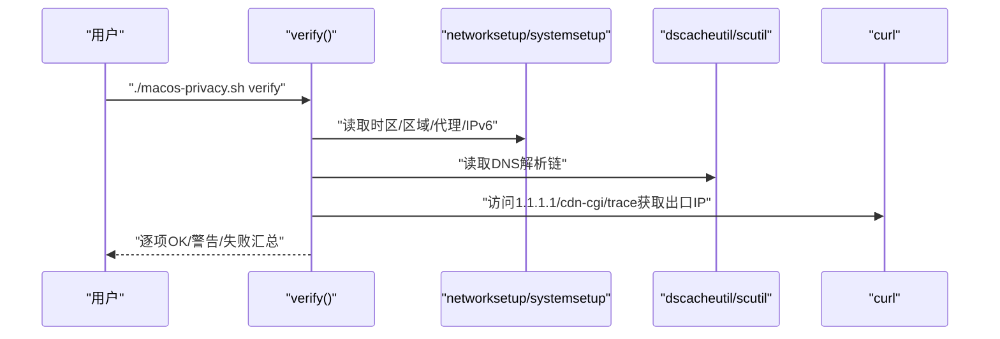
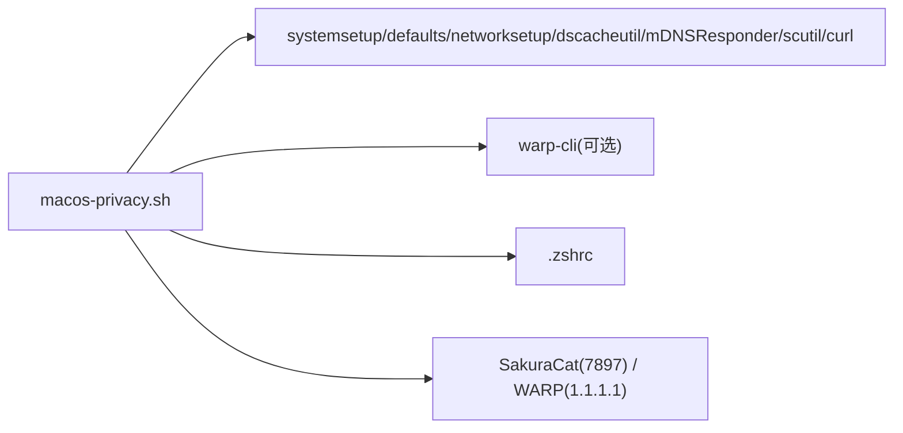

# macOS隐私管理脚本

<cite>
**本文引用的文件**   
- [macos-privacy.sh](file://notes/macos-privacy.sh)
- [macos-host-privacy-setup.md](file://notes/macos-host-privacy-setup.md)
- [privacy-overview.md](file://notes/privacy-overview.md)
- [switch-env-macos.sh](file://notes/qoderclicn/switch-env-macos.sh)
</cite>

## 目录
1. [简介](#简介)
2. [项目结构](#项目结构)
3. [核心组件](#核心组件)
4. [架构总览](#架构总览)
5. [详细组件分析](#详细组件分析)
6. [依赖关系分析](#依赖关系分析)
7. [性能与稳定性考量](#性能与稳定性考量)
8. [故障排除指南](#故障排除指南)
9. [结论](#结论)
10. [附录：命令与参数速查](#附录命令与参数速查)

## 简介
本文件为 macOS 隐私管理脚本的权威使用文档。脚本围绕“SakuraCat 代理（127.0.0.1:7897）+ Cloudflare WARP DNS-only（1.1.1.1）”的架构，提供一键应用、验证、查看状态与恢复默认的能力；支持多区域快速切换（us/jp/uk/sg/cn），并包含系统代理、终端代理、IPv6 关闭、时区与区域语言等关键项的幂等配置。

## 项目结构
- 脚本位于 notes 目录下，配套说明文档与参考脚本同仓存放，便于对照理解设计来源与差异。
- 本脚本借鉴了 qoderclicn 的多区域映射与 .zshrc 标记块幂等管理机制，但针对 macOS 实际架构（代理 + WARP DNS-only）做了适配与修正。

图示来源
- [macos-privacy.sh:1-262](file://notes/macos-privacy.sh#L1-L262)
- [macos-host-privacy-setup.md:1-120](file://notes/macos-host-privacy-setup.md#L1-L120)
- [privacy-overview.md:1-115](file://notes/privacy-overview.md#L1-L115)
- [switch-env-macos.sh:1-217](file://notes/qoderclicn/switch-env-macos.sh#L1-L217)

章节来源
- [macos-privacy.sh:1-262](file://notes/macos-privacy.sh#L1-L262)
- [macos-host-privacy-setup.md:1-120](file://notes/macos-host-privacy-setup.md#L1-L120)
- [privacy-overview.md:1-115](file://notes/privacy-overview.md#L1-L115)
- [switch-env-macos.sh:1-217](file://notes/qoderclicn/switch-env-macos.sh#L1-L217)

## 核心组件
- 区域映射与时区/语言/区域联动：通过 us/jp/uk/sg/cn 五个区域，自动选择对应 IANA 时区、AppleLocale、AppleLanguages/LANG。
- 系统代理与终端代理：将 HTTP/HTTPS/SOCKS 指向 SakuraCat 本地混合端口（默认 127.0.0.1:7897），并在 .zshrc 写入环境变量块。
- IPv6 处理：遍历所有活跃网络服务，关闭 IPv6，避免绕过 WARP DNS。
- DNS 加密：由 WARP 的 1.1.1.1 DNS-only 模式负责，不手动设置系统 DNS。
- 幂等性：通过 .zshrc 中的标记块实现“先删后写”，重复执行不会重复追加。
- 校验与诊断：verify/check 输出当前时区、区域、代理、IPv6、DNS 解析链与出口 IP。

章节来源
- [macos-privacy.sh:31-41](file://notes/macos-privacy.sh#L31-L41)
- [macos-privacy.sh:89-107](file://notes/macos-privacy.sh#L89-L107)
- [macos-privacy.sh:109-132](file://notes/macos-privacy.sh#L109-L132)
- [macos-privacy.sh:134-143](file://notes/macos-privacy.sh#L134-L143)
- [macos-privacy.sh:64-68](file://notes/macos-privacy.sh#L64-L68)
- [macos-privacy.sh:152-212](file://notes/macos-privacy.sh#L152-L212)

## 架构总览
macOS 端采用“代理 + DNS-only”的双通道方案：
- 流量出口：SakuraCat 代理（127.0.0.1:7897），HTTP/HTTPS/SOCKS 均指向该地址。
- DNS 加密：Cloudflare WARP 以 1.1.1.1 的 DNS-only 模式接管系统 DNS，确保查询加密且不覆盖应用流量出口。
- IPv6：统一关闭，防止 IPv6 路径绕过 WARP 或代理。
- 终端环境：在 .zshrc 中写入 http_proxy/https_proxy/all_proxy/no_proxy 及 LANG/LC_ALL 等变量，保证 CLI 工具走代理且语言一致。

图示来源
- [macos-host-privacy-setup.md:11-31](file://notes/macos-host-privacy-setup.md#L11-L31)
- [macos-privacy.sh:21-28](file://notes/macos-privacy.sh#L21-L28)
- [macos-privacy.sh:96-107](file://notes/macos-privacy.sh#L96-L107)
- [macos-privacy.sh:134-143](file://notes/macos-privacy.sh#L134-L143)

## 详细组件分析

### 子命令与用法
- apply [区域]
  - 作用：应用时区/区域/语言、系统代理、终端代理、关闭 IPv6、刷新 DNS、提示 WARP 状态。
  - 权限：需要 sudo。
  - 区域：us（默认）、jp、uk、sg、cn。
- verify
  - 作用：验证关键项（时区、区域、IPv6、系统代理、WARP 状态、DNS 解析链、出口 IP）。
  - 权限：无需 sudo。
- check
  - 作用：打印当前环境状态（时区、时间、区域、Locale、DNS、系统代理、终端代理、IPv6、出口 IP）。
  - 权限：无需 sudo。
- restore
  - 作用：恢复默认（开启自动时区、恢复 Asia/Shanghai、关闭系统代理、恢复 IPv6 自动、恢复 zh_CN 区域语言、移除 .zshrc 标记块、刷新 DNS、断开 WARP）。
  - 权限：需要 sudo。

章节来源
- [macos-privacy.sh:7-14](file://notes/macos-privacy.sh#L7-L14)
- [macos-privacy.sh:248-261](file://notes/macos-privacy.sh#L248-L261)

### 环境变量选项
- INTERFACE
  - 用途：指定要配置的系统代理接口名称（如 Wi-Fi、Ethernet）。
  - 默认值：Wi-Fi。
- PROXY_PORT
  - 用途：指定 SakuraCat 本地代理端口。
  - 默认值：7897。
- SKIP_PROXY
  - 用途：跳过系统代理与终端代理块写入（仅保留 locale 相关配置）。
  - 默认值：未设置（即不跳过）。

章节来源
- [macos-privacy.sh:21-24](file://notes/macos-privacy.sh#L21-L24)
- [macos-privacy.sh:97-107](file://notes/macos-privacy.sh#L97-L107)
- [macos-privacy.sh:113-132](file://notes/macos-privacy.sh#L113-L132)

### 幂等性与配置标记块管理
- 机制：在 .zshrc 中使用“标记块”包裹代理与 locale 配置，apply/restore 前先删除旧块再写入新块，确保多次执行不会产生重复配置。
- 标记块标识：
  - 代理块：以特定注释开始/结束。
  - locale 块：以另一组注释开始/结束。
- 实现要点：
  - 使用 sed 按起止标记删除区间内容。
  - 写入时按顺序追加新块。

图示来源
- [macos-privacy.sh:64-68](file://notes/macos-privacy.sh#L64-L68)
- [macos-privacy.sh:109-132](file://notes/macos-privacy.sh#L109-L132)
- [macos-privacy.sh:134-137](file://notes/macos-privacy.sh#L134-L137)

章节来源
- [macos-privacy.sh:64-68](file://notes/macos-privacy.sh#L64-L68)
- [macos-privacy.sh:109-132](file://notes/macos-privacy.sh#L109-L132)

### 多区域快速切换逻辑
- 区域集合：us、jp、uk、sg、cn。
- 映射维度：
  - 时区（IANA）：America/New_York、Asia/Tokyo、Europe/London、Asia/Singapore、Asia/Shanghai。
  - AppleLocale：en_US、ja_JP、en_GB、en_SG、zh_CN。
  - AppleLanguages/LANG：en-US、ja-JP、en-GB、en-SG、zh-Hans-CN。
- 行为：
  - apply 根据区域批量设置系统时区、区域与语言。
  - verify 基于期望值进行对比检查。
  - restore 回退到 zh_CN 与 Asia/Shanghai。

图示来源
- [macos-privacy.sh:31-41](file://notes/macos-privacy.sh#L31-L41)

章节来源
- [macos-privacy.sh:31-41](file://notes/macos-privacy.sh#L31-L41)
- [macos-privacy.sh:71-87](file://notes/macos-privacy.sh#L71-L87)
- [macos-privacy.sh:152-164](file://notes/macos-privacy.sh#L152-L164)
- [macos-privacy.sh:214-235](file://notes/macos-privacy.sh#L214-L235)

### 系统代理与终端代理配置流程
- 系统代理：对指定接口设置 HTTP/HTTPS/SOCKS 服务器与端口，并开启相应开关。
- 终端代理：在 .zshrc 中写入 http_proxy/https_proxy/all_proxy/no_proxy 环境变量块。
- 可跳过：当 SKIP_PROXY=1 时，不修改系统代理与终端代理块，仅更新 locale。

图示来源
- [macos-privacy.sh:96-107](file://notes/macos-privacy.sh#L96-L107)
- [macos-privacy.sh:109-132](file://notes/macos-privacy.sh#L109-L132)
- [macos-privacy.sh:134-143](file://notes/macos-privacy.sh#L134-L143)

章节来源
- [macos-privacy.sh:96-107](file://notes/macos-privacy.sh#L96-L107)
- [macos-privacy.sh:109-132](file://notes/macos-privacy.sh#L109-L132)
- [macos-privacy.sh:134-143](file://notes/macos-privacy.sh#L134-L143)

### IPv6 关闭与验证流程
- 关闭策略：遍历所有活跃网络服务，跳过空行与蓝牙接口，逐一关闭 IPv6。
- 验证策略：逐接口检查是否显示 IPv6: Off，若仍有启用则发出警告。

图示来源
- [macos-privacy.sh:60-62](file://notes/macos-privacy.sh#L60-L62)
- [macos-privacy.sh:89-94](file://notes/macos-privacy.sh#L89-L94)
- [macos-privacy.sh:166-176](file://notes/macos-privacy.sh#L166-L176)

章节来源
- [macos-privacy.sh:60-62](file://notes/macos-privacy.sh#L60-L62)
- [macos-privacy.sh:89-94](file://notes/macos-privacy.sh#L89-L94)
- [macos-privacy.sh:166-176](file://notes/macos-privacy.sh#L166-L176)

### 验证与状态检查
- verify
  - 检查时区、区域、IPv6、系统代理、WARP 状态、DNS 解析链、出口 IP。
  - 失败计数用于汇总提示。
- check
  - 打印当前时区、时间、区域、Locale、DNS、系统代理、终端代理、IPv6、出口 IP。

图示来源
- [macos-privacy.sh:152-197](file://notes/macos-privacy.sh#L152-L197)
- [macos-privacy.sh:199-212](file://notes/macos-privacy.sh#L199-L212)

章节来源
- [macos-privacy.sh:152-197](file://notes/macos-privacy.sh#L152-L197)
- [macos-privacy.sh:199-212](file://notes/macos-privacy.sh#L199-L212)

### 恢复默认设置
- 恢复自动时区与 Asia/Shanghai。
- 关闭系统代理（HTTP/HTTPS/SOCKS）。
- 恢复 IPv6 为自动。
- 恢复 zh_CN 区域与语言。
- 移除 .zshrc 中的代理与 locale 标记块。
- 刷新 DNS 缓存，尝试断开 WARP。

章节来源
- [macos-privacy.sh:214-246](file://notes/macos-privacy.sh#L214-L246)

## 依赖关系分析
- 系统命令依赖：
  - systemsetup：时区与网络时间控制。
  - defaults：系统偏好设置（语言/区域）。
  - networksetup：系统代理与 IPv6 控制。
  - dscacheutil / mDNSResponder：DNS 缓存刷新。
  - scutil：DNS 解析链查看。
  - curl：出口 IP 探测。
  - warp-cli：可选，用于 WARP 状态检测与断开。
- Shell 依赖：
  - zsh：默认 shell，.zshrc 作为持久化配置位置。
- 外部服务：
  - SakuraCat 代理（127.0.0.1:7897）。
  - Cloudflare WARP（1.1.1.1 DNS-only）。

图示来源
- [macos-privacy.sh:21-28](file://notes/macos-privacy.sh#L21-L28)
- [macos-privacy.sh:134-143](file://notes/macos-privacy.sh#L134-L143)
- [macos-privacy.sh:187-193](file://notes/macos-privacy.sh#L187-L193)

章节来源
- [macos-privacy.sh:21-28](file://notes/macos-privacy.sh#L21-L28)
- [macos-privacy.sh:134-143](file://notes/macos-privacy.sh#L134-L143)
- [macos-privacy.sh:187-193](file://notes/macos-privacy.sh#L187-L193)

## 性能与稳定性考量
- 幂等写入：通过标记块“先删后写”，避免重复追加导致 .zshrc 膨胀。
- 最小变更：仅在必要时修改系统代理与 IPv6，其他保持默认。
- 错误容忍：多处命令使用 || true 避免单点失败中断整体流程。
- 网络探测超时：curl 使用 --max-time 限制等待时间，避免长时间阻塞。

章节来源
- [macos-privacy.sh:64-68](file://notes/macos-privacy.sh#L64-L68)
- [macos-privacy.sh:80-82](file://notes/macos-privacy.sh#L80-L82)
- [macos-privacy.sh:209-210](file://notes/macos-privacy.sh#L209-L210)

## 故障排除指南
- 无法获取出口 IP
  - 现象：curl 返回失败或无输出。
  - 排查：确认 SakuraCat 代理运行正常、系统代理已开启、终端代理变量已生效。
  - 建议：使用 https://1.1.1.1/cdn-cgi/trace 替代 ipinfo.io（后者可能限流）。
- WARP 未安装或未处于 DNS-only 模式
  - 现象：verify 提示未检测到 warp-cli 或状态异常。
  - 排查：安装 WARP 并确保为“仅 DNS（HTTPS/TLS）”模式，不要开启全隧道。
  - 注意：iCloud 私有中继会覆盖 DNS，需关闭。
- IPv6 仍启用
  - 现象：verify 报告某些接口 IPv6 未关闭。
  - 排查：确认接口名称正确（INTERFACE），重新执行 apply；必要时手动 networksetup -setv6off <接口>。
- 系统代理未生效
  - 现象：check 显示代理为空或不匹配。
  - 排查：确认 INTERFACE 与实际接口一致；检查网络服务列表；重新执行 apply。
- 终端代理未生效
  - 现象：CLI 工具不走代理。
  - 排查：source ~/.zshrc；确认 http_proxy/https_proxy/all_proxy/no_proxy 已写入；SKIP_PROXY 未误设为 1。

章节来源
- [macos-privacy.sh:187-193](file://notes/macos-privacy.sh#L187-L193)
- [macos-privacy.sh:139-143](file://notes/macos-privacy.sh#L139-L143)
- [macos-privacy.sh:166-176](file://notes/macos-privacy.sh#L166-L176)
- [macos-privacy.sh:178-179](file://notes/macos-privacy.sh#L178-L179)
- [macos-privacy.sh:113-132](file://notes/macos-privacy.sh#L113-L132)

## 结论
本脚本以“代理 + DNS-only”为核心，结合多区域映射与幂等配置，提供了一键式、可验证、可恢复的 macOS 隐私管理能力。配合配套文档与参考脚本，可在多平台间保持一致的指纹特征（时区、DNS、区域/语言），有效降低被识别的风险。

## 附录：命令与参数速查
- 基本用法
  - sudo ./macos-privacy.sh apply [区域]
  - ./macos-privacy.sh verify
  - ./macos-privacy.sh check
  - sudo ./macos-privacy.sh restore
- 区域选项
  - us（默认）、jp、uk、sg、cn
- 环境变量
  - INTERFACE：网络接口名（默认 Wi-Fi）
  - PROXY_PORT：代理端口（默认 7897）
  - SKIP_PROXY：跳过代理配置（值为 1 时生效）
- 使用示例
  - 应用美国区域并启用代理：sudo ./macos-privacy.sh apply us
  - 切换到日本区域：sudo ./macos-privacy.sh apply jp
  - 仅查看当前状态：./macos-privacy.sh check
  - 验证关键项：./macos-privacy.sh verify
  - 恢复默认：sudo ./macos-privacy.sh restore
  - 自定义代理端口：PROXY_PORT=7890 sudo ./macos-privacy.sh apply uk
  - 跳过代理配置：SKIP_PROXY=1 sudo ./macos-privacy.sh apply cn

章节来源
- [macos-privacy.sh:7-14](file://notes/macos-privacy.sh#L7-L14)
- [macos-privacy.sh:21-24](file://notes/macos-privacy.sh#L21-L24)
- [macos-privacy.sh:248-261](file://notes/macos-privacy.sh#L248-L261)