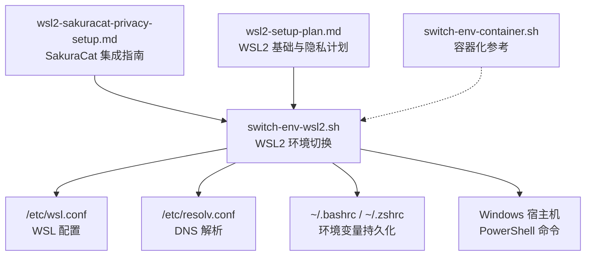
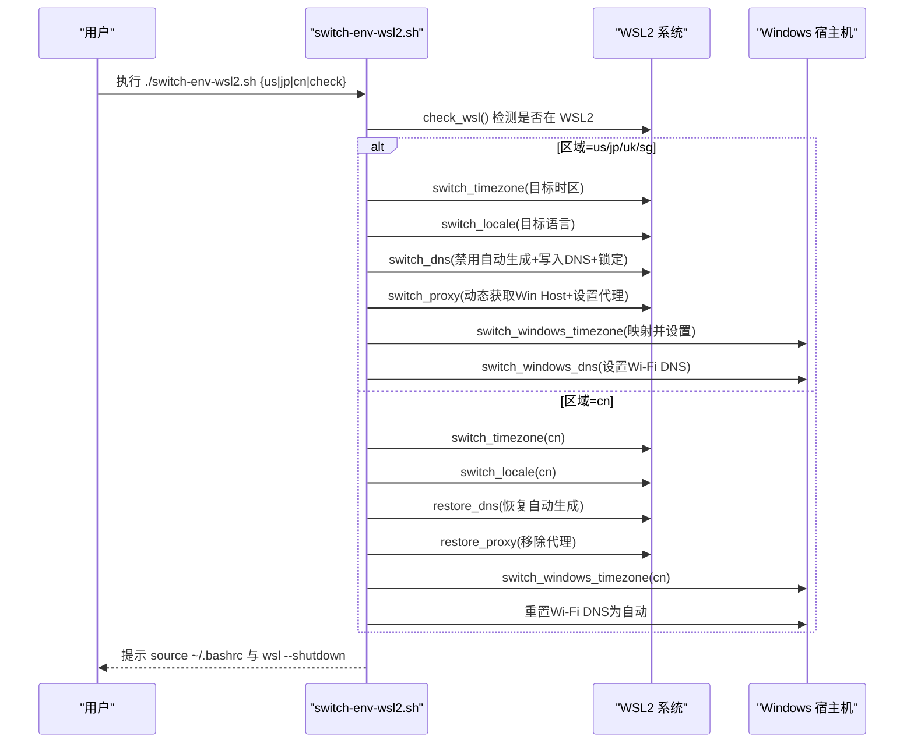
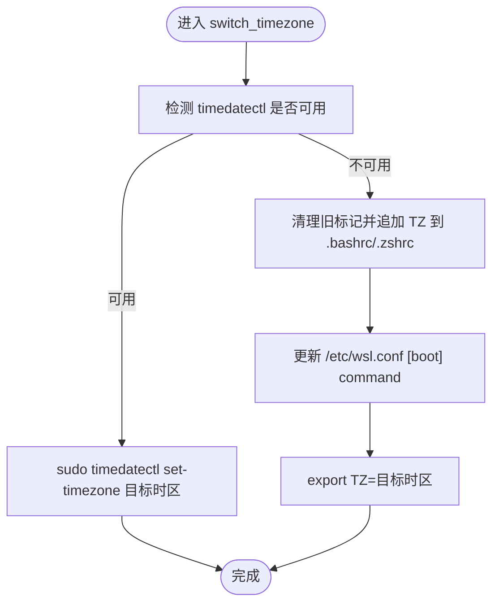
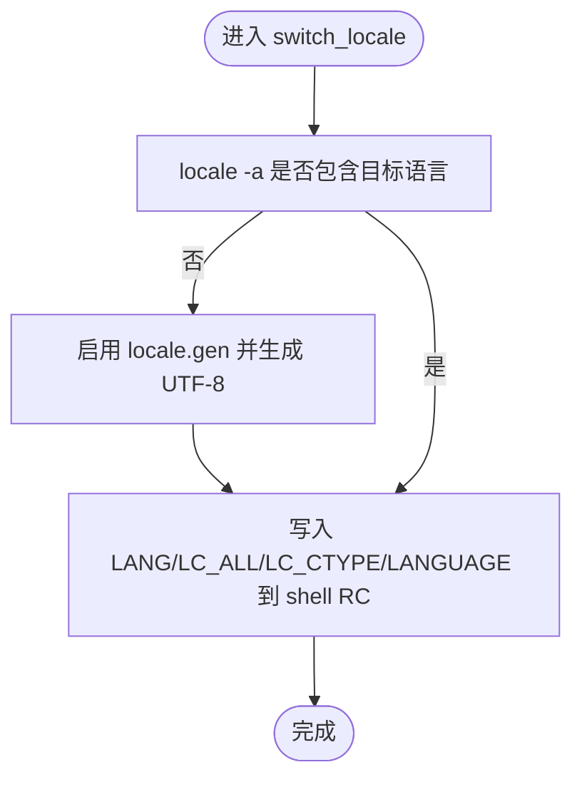
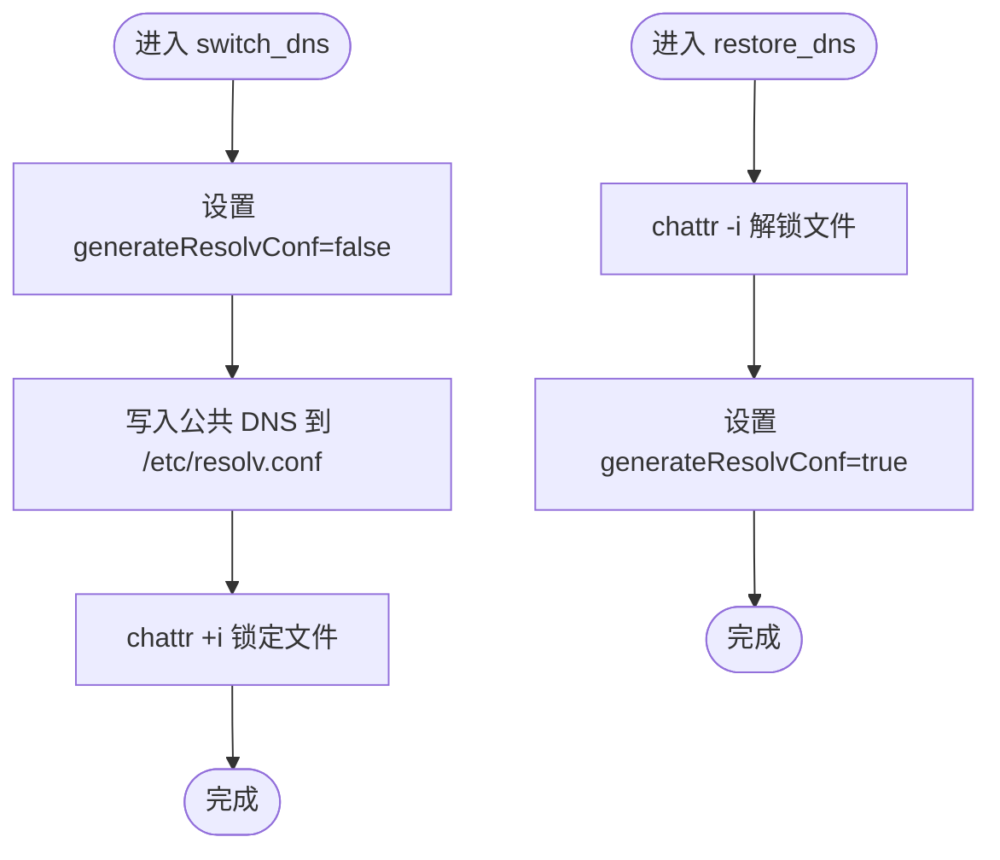
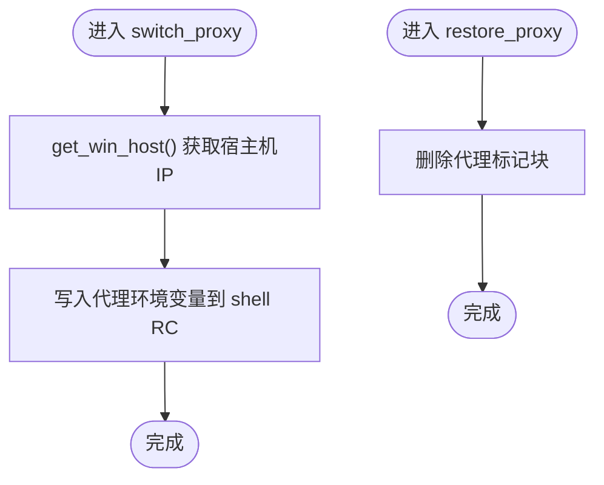
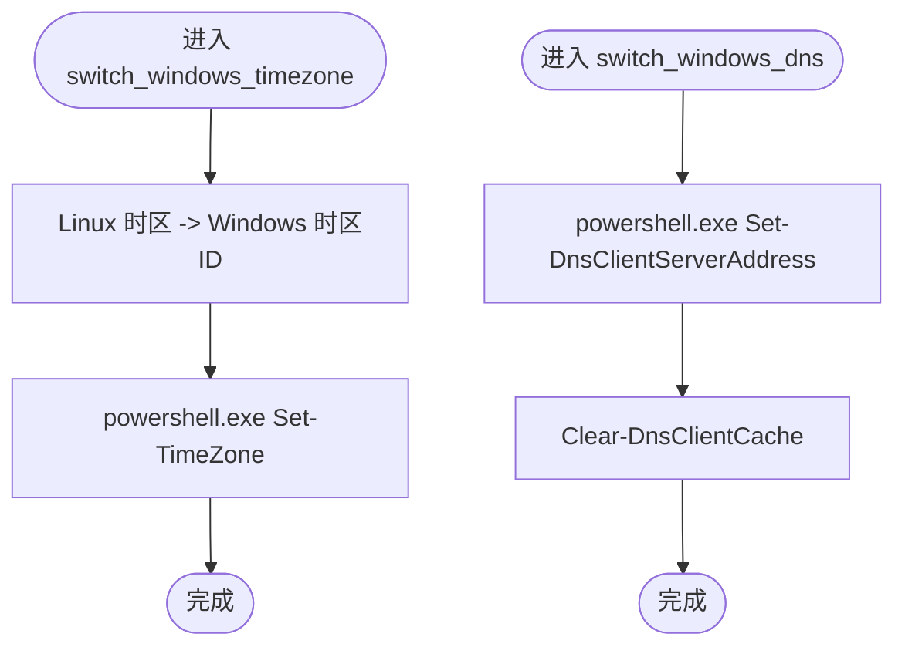
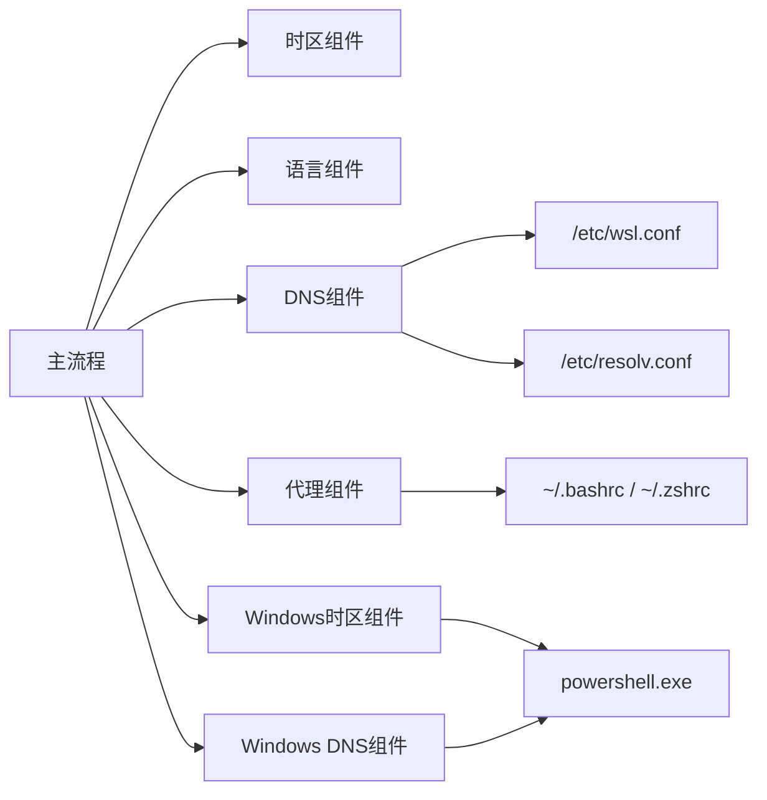

# WSL2环境切换脚本

<cite>
**本文引用的文件**   
- [switch-env-wsl2.sh](file://notes/qoderclicn/switch-env-wsl2.sh)
- [wsl2-sakuracat-privacy-setup.md](file://notes/wsl2-sakuracat-privacy-setup.md)
- [wsl2-setup-plan.md](file://notes/wsl2-setup-plan.md)
- [switch-env-container.sh](file://notes/qoderclicn/switch-env-container.sh)
</cite>

## 目录
1. [简介](#简介)
2. [项目结构](#项目结构)
3. [核心组件](#核心组件)
4. [架构总览](#架构总览)
5. [详细组件分析](#详细组件分析)
6. [依赖关系分析](#依赖关系分析)
7. [性能与最佳实践](#性能与最佳实践)
8. [故障排除指南](#故障排除指南)
9. [结论](#结论)
10. [附录](#附录)

## 简介
本文件为“WSL2环境切换脚本”的完整使用文档，聚焦于 switch-env-wsl2.sh 在 Windows 子系统 Linux（WSL2）中的功能实现。内容涵盖：
- WSL2 特有的时区同步、语言环境配置和网络隔离设置
- 与 Windows 宿主机的交互机制（时间同步、DNS、网络访问控制）
- WSL2 代理配置方法，包括 SakuraCat TUN 模式集成要点
- 容器化开发环境的最佳实践与性能优化建议
- 常见问题的排查与恢复步骤

## 项目结构
仓库中与本主题相关的核心文件如下：
- notes/qoderclicn/switch-env-wsl2.sh：WSL2 环境一键切换脚本
- notes/wsl2-sakuracat-privacy-setup.md：WSL2 + SakuraCat VPN 隐私保护完整设置指南
- notes/wsl2-setup-plan.md：WSL2 进入方法与隐私隔离执行计划
- notes/qoderclicn/switch-env-container.sh：macOS 容器环境一致性切换脚本（用于对比参考）



图示来源
- [switch-env-wsl2.sh:1-318](file://notes/qoderclicn/switch-env-wsl2.sh#L1-L318)
- [wsl2-sakuracat-privacy-setup.md:1-580](file://notes/wsl2-sakuracat-privacy-setup.md#L1-L580)
- [wsl2-setup-plan.md:1-433](file://notes/wsl2-setup-plan.md#L1-L433)
- [switch-env-container.sh:1-283](file://notes/qoderclicn/switch-env-container.sh#L1-L283)

章节来源
- [switch-env-wsl2.sh:1-318](file://notes/qoderclicn/switch-env-wsl2.sh#L1-L318)
- [wsl2-sakuracat-privacy-setup.md:1-580](file://notes/wsl2-sakuracat-privacy-setup.md#L1-L580)
- [wsl2-setup-plan.md:1-433](file://notes/wsl2-setup-plan.md#L1-L433)
- [switch-env-container.sh:1-283](file://notes/qoderclicn/switch-env-container.sh#L1-L283)

## 核心组件
- 区域与环境映射
  - 时区映射：支持 us/jp/cn/uk/sg 等区域到标准 IANA 时区
  - 语言环境映射：对应 en_US/ja_JP/zh_CN/en_GB/en_SG 等
- DNS 配置
  - 禁用 WSL 自动生成 resolv.conf，写入自定义 DNS，并锁定文件防止覆盖
- 代理配置
  - 动态获取 Windows 宿主机 IP，设置 http_proxy/https_proxy/all_proxy/no_proxy
  - 默认端口适配 SakuraCat 混合端口
- Windows 宿主机联动
  - 通过 PowerShell 同步 Windows 时区与 Wi-Fi DNS
- 恢复能力
  - 恢复 DNS 自动生成功能，移除代理配置，重置 Windows DNS

章节来源
- [switch-env-wsl2.sh:19-42](file://notes/qoderclicn/switch-env-wsl2.sh#L19-L42)
- [switch-env-wsl2.sh:144-170](file://notes/qoderclicn/switch-env-wsl2.sh#L144-L170)
- [switch-env-wsl2.sh:172-196](file://notes/qoderclicn/switch-env-wsl2.sh#L172-L196)
- [switch-env-wsl2.sh:198-233](file://notes/qoderclicn/switch-env-wsl2.sh#L198-L233)
- [switch-env-wsl2.sh:235-256](file://notes/qoderclicn/switch-env-wsl2.sh#L235-L256)

## 架构总览
脚本以“区域参数”驱动，按顺序完成以下工作流：
- 检查运行环境（必须在 WSL2）
- 切换时区（优先 timedatectl，否则写 wsl.conf 和 shell 环境变量）
- 切换语言环境（生成 locale，写入 shell 环境变量）
- 配置 DNS（禁止自动生成，写入公共 DNS，锁定文件）
- 配置代理（动态获取宿主机 IP，设置代理环境变量）
- 同步 Windows 时区与 DNS（通过 PowerShell）
- 提供恢复选项（恢复 DNS 自动生成、移除代理、重置 Windows DNS）



图示来源
- [switch-env-wsl2.sh:45-77](file://notes/qoderclicn/switch-env-wsl2.sh#L45-L77)
- [switch-env-wsl2.sh:79-114](file://notes/qoderclicn/switch-env-wsl2.sh#L79-L114)
- [switch-env-wsl2.sh:116-142](file://notes/qoderclicn/switch-env-wsl2.sh#L116-L142)
- [switch-env-wsl2.sh:144-170](file://notes/qoderclicn/switch-env-wsl2.sh#L144-L170)
- [switch-env-wsl2.sh:172-196](file://notes/qoderclicn/switch-env-wsl2.sh#L172-L196)
- [switch-env-wsl2.sh:198-233](file://notes/qoderclicn/switch-env-wsl2.sh#L198-L233)
- [switch-env-wsl2.sh:235-256](file://notes/qoderclicn/switch-env-wsl2.sh#L235-L256)
- [switch-env-wsl2.sh:262-317](file://notes/qoderclicn/switch-env-wsl2.sh#L262-L317)

## 详细组件分析

### 组件A：时区切换（switch_timezone）
- 行为说明
  - 若系统支持 systemd 且可用 timedatectl，则直接设置时区
  - 否则将 TZ 写入 shell 配置文件（~/.bashrc 或 ~/.zshrc），并在 /etc/wsl.conf 的 [boot] 中追加 timedatectl 启动命令
  - 当前会话立即生效 export TZ
- 复杂度与影响
  - 主要操作为文本编辑与少量进程调用，时间复杂度 O(1)
  - 对后续所有子进程生效（通过环境变量）
- 错误处理
  - 若 timedatectl 不可用，回退到 wsl.conf 与 shell 环境变量方式
- 优化建议
  - 确保 /etc/wsl.conf 的 [boot] 段存在且格式正确，避免重复插入



图示来源
- [switch-env-wsl2.sh:79-114](file://notes/qoderclicn/switch-env-wsl2.sh#L79-L114)

章节来源
- [switch-env-wsl2.sh:79-114](file://notes/qoderclicn/switch-env-wsl2.sh#L79-L114)

### 组件B：语言环境切换（switch_locale）
- 行为说明
  - 若未生成目标 locale，则启用 locale.gen 并生成 UTF-8 版本
  - 将 LANG/LC_ALL/LC_CTYPE/LANGUAGE 写入 shell 配置文件
- 复杂度与影响
  - locale-gen 可能触发包管理工具，耗时取决于系统状态
- 错误处理
  - 若 locale-gen 失败，尝试 dpkg-reconfigure locales 作为备选
- 优化建议
  - 首次生成后缓存结果，避免重复生成



图示来源
- [switch-env-wsl2.sh:116-142](file://notes/qoderclicn/switch-env-wsl2.sh#L116-L142)

章节来源
- [switch-env-wsl2.sh:116-142](file://notes/qoderclicn/switch-env-wsl2.sh#L116-L142)

### 组件C：DNS 配置（switch_dns / restore_dns）
- 行为说明
  - 在 /etc/wsl.conf 中设置 [network] generateResolvConf=false
  - 写入 /etc/resolv.conf 为公共 DNS，并使用 chattr +i 锁定文件
  - 恢复时解锁文件并改回 generateResolvConf=true
- 复杂度与影响
  - 涉及文件系统属性变更与重启生效，需 wsl --shutdown
- 错误处理
  - 若 chattr 不可用，仅写入但不锁定，需提醒用户注意被覆盖风险
- 优化建议
  - 在切换前备份 resolv.conf，便于快速恢复



图示来源
- [switch-env-wsl2.sh:144-170](file://notes/qoderclicn/switch-env-wsl2.sh#L144-L170)
- [switch-env-wsl2.sh:235-246](file://notes/qoderclicn/switch-env-wsl2.sh#L235-L246)

章节来源
- [switch-env-wsl2.sh:144-170](file://notes/qoderclicn/switch-env-wsl2.sh#L144-L170)
- [switch-env-wsl2.sh:235-246](file://notes/qoderclicn/switch-env-wsl2.sh#L235-L246)

### 组件D：代理配置（switch_proxy / restore_proxy）
- 行为说明
  - 动态获取 Windows 宿主机 IP（优先路由表，其次 resolv.conf nameserver）
  - 设置 http_proxy/https_proxy/all_proxy/no_proxy 到 shell 配置文件
  - 默认端口适配 SakuraCat 混合端口
  - 恢复时删除代理相关标记块
- 复杂度与影响
  - 读取系统路由与 resolv.conf，O(1)；写入 shell RC 一次
- 错误处理
  - 若无法获取宿主机 IP，使用默认值；no_proxy 排除本地地址
- 优化建议
  - 对于多网卡场景，建议显式指定宿主机 IP 或使用固定别名



图示来源
- [switch-env-wsl2.sh:52-59](file://notes/qoderclicn/switch-env-wsl2.sh#L52-L59)
- [switch-env-wsl2.sh:172-196](file://notes/qoderclicn/switch-env-wsl2.sh#L172-L196)
- [switch-env-wsl2.sh:248-256](file://notes/qoderclicn/switch-env-wsl2.sh#L248-L256)

章节来源
- [switch-env-wsl2.sh:52-59](file://notes/qoderclicn/switch-env-wsl2.sh#L52-L59)
- [switch-env-wsl2.sh:172-196](file://notes/qoderclicn/switch-env-wsl2.sh#L172-L196)
- [switch-env-wsl2.sh:248-256](file://notes/qoderclicn/switch-env-wsl2.sh#L248-L256)

### 组件E：Windows 宿主机联动（switch_windows_timezone / switch_windows_dns）
- 行为说明
  - 将 Linux 时区映射为 Windows 时区 ID，并通过 PowerShell 设置
  - 设置 Wi-Fi 接口 DNS 为公共 DNS，并刷新 DNS 缓存
  - 恢复中国环境时重置 Wi-Fi DNS 为自动
- 复杂度与影响
  - 调用 PowerShell 外部命令，受权限与网络适配器名称影响
- 错误处理
  - 若映射未知或命令失败，给出手动设置提示
- 优化建议
  - 建议在管理员权限下执行，避免权限不足导致失败



图示来源
- [switch-env-wsl2.sh:198-222](file://notes/qoderclicn/switch-env-wsl2.sh#L198-L222)
- [switch-env-wsl2.sh:224-233](file://notes/qoderclicn/switch-env-wsl2.sh#L224-L233)

章节来源
- [switch-env-wsl2.sh:198-222](file://notes/qoderclicn/switch-env-wsl2.sh#L198-L222)
- [switch-env-wsl2.sh:224-233](file://notes/qoderclicn/switch-env-wsl2.sh#L224-L233)

### 组件F：主流程与用法（case 分支）
- 行为说明
  - 支持 us/jp/uk/sg 切换海外环境，cn 恢复中国环境，check 查看当前状态
  - 切换完成后提示 source ~/.bashrc 与 wsl --shutdown，再重新打开终端验证
- 复杂度与影响
  - 顺序执行上述各组件，整体耗时取决于系统状态与外部命令响应
- 错误处理
  - 不支持的参数输出用法提示并退出
- 优化建议
  - 可在切换前后记录日志，便于审计与回溯

```mermaid
flowchart TD
Start(["主流程入口"]) --> CheckArg{"参数类型"}
CheckArg --> |check| PrintStatus["print_status() 输出当前状态"]
CheckArg --> |us|jp|uk|sg| DoSwitch["依次执行：时区→语言→DNS→代理→Win时区→Win DNS"]
CheckArg --> |cn| DoRestore["依次执行：时区→语言→恢复DNS→恢复代理→Win时区→重置Win DNS"]
CheckArg --> |其他| Usage["输出用法并退出"]
DoSwitch --> End(["结束"])
DoRestore --> End
PrintStatus --> End
Usage --> End
```

图示来源
- [switch-env-wsl2.sh:262-317](file://notes/qoderclicn/switch-env-wsl2.sh#L262-L317)

章节来源
- [switch-env-wsl2.sh:262-317](file://notes/qoderclicn/switch-env-wsl2.sh#L262-L317)

## 依赖关系分析
- 内部依赖
  - 函数间耦合：主流程依赖各组件函数；组件之间相对独立
  - 配置文件依赖：/etc/wsl.conf、/etc/resolv.conf、~/.bashrc/~/.zshrc
- 外部依赖
  - 系统命令：timedatectl、locale-gen、dpkg-reconfigure、chattr、ip、grep、awk、sed、tee、curl、nslookup（可选）
  - Windows 命令：powershell.exe（Set-TimeZone、Set-DnsClientServerAddress、Clear-DnsClientCache）
- 潜在循环依赖
  - 无直接循环依赖；但 DNS 与代理配置相互影响，需注意生效顺序
- 外部集成点
  - SakuraCat 代理（Windows 侧监听端口 7897）
  - Windows 网络适配器名称（示例中使用 Wi-Fi）



图示来源
- [switch-env-wsl2.sh:45-77](file://notes/qoderclicn/switch-env-wsl2.sh#L45-L77)
- [switch-env-wsl2.sh:79-114](file://notes/qoderclicn/switch-env-wsl2.sh#L79-L114)
- [switch-env-wsl2.sh:116-142](file://notes/qoderclicn/switch-env-wsl2.sh#L116-L142)
- [switch-env-wsl2.sh:144-170](file://notes/qoderclicn/switch-env-wsl2.sh#L144-L170)
- [switch-env-wsl2.sh:172-196](file://notes/qoderclicn/switch-env-wsl2.sh#L172-L196)
- [switch-env-wsl2.sh:198-233](file://notes/qoderclicn/switch-env-wsl2.sh#L198-L233)

章节来源
- [switch-env-wsl2.sh:45-77](file://notes/qoderclicn/switch-env-wsl2.sh#L45-L77)
- [switch-env-wsl2.sh:79-114](file://notes/qoderclicn/switch-env-wsl2.sh#L79-L114)
- [switch-env-wsl2.sh:116-142](file://notes/qoderclicn/switch-env-wsl2.sh#L116-L142)
- [switch-env-wsl2.sh:144-170](file://notes/qoderclicn/switch-env-wsl2.sh#L144-L170)
- [switch-env-wsl2.sh:172-196](file://notes/qoderclicn/switch-env-wsl2.sh#L172-L196)
- [switch-env-wsl2.sh:198-233](file://notes/qoderclicn/switch-env-wsl2.sh#L198-L233)

## 性能与最佳实践
- 时区与语言
  - 首次生成 locale 可能较慢，建议提前准备常用语言包
  - 使用 timedatectl 比修改 wsl.conf 更快生效
- DNS 与网络
  - 锁定 resolv.conf 可避免被系统覆盖，但需要 wsl --shutdown 后重启生效
  - 避免使用路由器内网 IP 作为 DNS，防止泄露内网信息
- 代理与隐私
  - 推荐 SakuraCat TUN 模式，接管全局流量，减少环境变量遗漏导致的泄露
  - 不要启用 Windows 的 dnsTunneling=true，以免绕过 Linux 侧 DNS 隔离
- 容器化开发
  - 使用 Docker/OrbStack/Colima 创建隔离容器，通过环境变量注入时区、语言与代理
  - 容器镜像选择轻量版（如 node:20-bookworm），减少体积与启动时间
  - 挂载工作目录到容器，保持数据持久化与跨平台一致

章节来源
- [wsl2-sakuracat-privacy-setup.md:546-573](file://notes/wsl2-sakuracat-privacy-setup.md#L546-L573)
- [wsl2-setup-plan.md:276-285](file://notes/wsl2-setup-plan.md#L276-L285)
- [switch-env-container.sh:111-205](file://notes/qoderclicn/switch-env-container.sh#L111-L205)

## 故障排除指南
- DNS 不生效
  - 检查 /etc/resolv.conf 内容与锁定标志
  - 确认 wsl.conf 中 generateResolvConf=false
  - 执行 wsl --shutdown 后重启
- 代理不工作
  - 确认 SakuraCat 在 Windows 侧运行且端口 7897 开放
  - 检查代理环境变量是否正确设置并已 source
  - 测试 curl 连接代理端口
- WSL 无法启动
  - 执行 wsl --shutdown 后重试
  - 列出实例 wsl -l -v，必要时更新或重装 WSL
- 时区不生效
  - 检查 wsl.conf [time] 配置与 /etc/timezone
  - 重新设置时区并重启 WSL
- 恢复步骤
  - 恢复 DNS 自动生成并解锁 resolv.conf
  - 移除代理配置并重置 Windows DNS 为自动
  - 从备份恢复关键配置文件

章节来源
- [wsl2-sakuracat-privacy-setup.md:371-452](file://notes/wsl2-sakuracat-privacy-setup.md#L371-L452)
- [switch-env-wsl2.sh:235-256](file://notes/qoderclicn/switch-env-wsl2.sh#L235-L256)
- [wsl2-setup-plan.md:398-419](file://notes/wsl2-setup-plan.md#L398-L419)

## 结论
switch-env-wsl2.sh 提供了在 WSL2 中快速切换时区、语言、DNS 与代理的一体化方案，并与 Windows 宿主机进行联动，满足多区域开发与隐私保护需求。结合 SakuraCat TUN 模式与容器化最佳实践，可实现更严格的网络与时空隔离。建议定期验证配置有效性，并保持系统与代理软件更新。

## 附录
- 快速命令速查（来自隐私指南）
  - 启动/关闭 WSL2、设置时区、查看语言与代理、验证 DNS 与 IP 伪装等
- SakuraCat 端口参考
  - HTTP/SOCKS5 端口 7897，管理界面端口因版本而异
- 故障排查树状图（来自隐私指南）
  - 针对时区、DNS、代理与 WSL 启动问题的决策树

章节来源
- [wsl2-sakuracat-privacy-setup.md:475-542](file://notes/wsl2-sakuracat-privacy-setup.md#L475-L542)