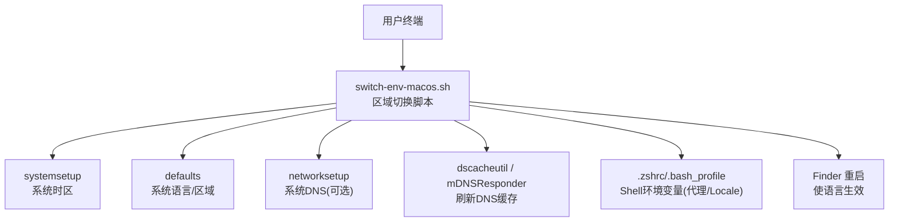
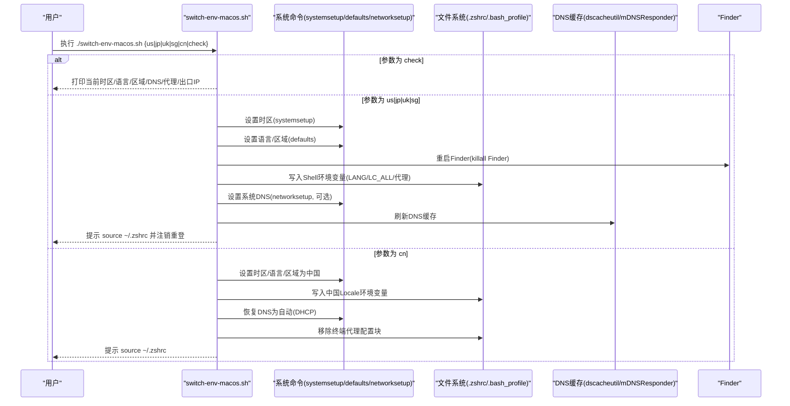
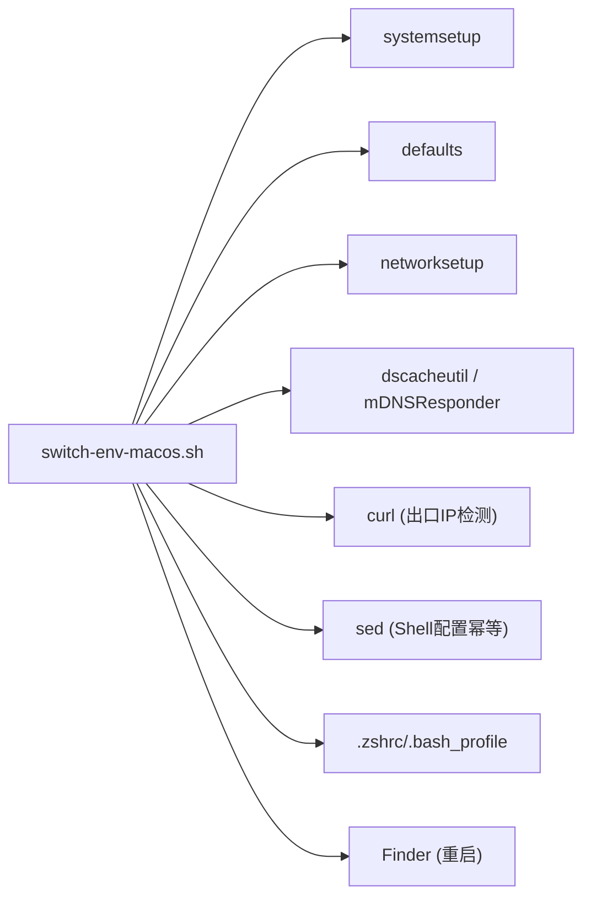

# macOS环境切换脚本

<cite>
**本文引用的文件**   
- [switch-env-macos.sh](file://notes/qoderclicn/switch-env-macos.sh)
- [macos-privacy.sh](file://notes/macos-privacy.sh)
</cite>

## 目录
1. [简介](#简介)
2. [项目结构](#项目结构)
3. [核心组件](#核心组件)
4. [架构总览](#架构总览)
5. [详细组件分析](#详细组件分析)
6. [依赖关系分析](#依赖关系分析)
7. [性能与稳定性考量](#性能与稳定性考量)
8. [故障排查指南](#故障排查指南)
9. [结论](#结论)
10. [附录：命令行用法速查](#附录命令行用法速查)

## 简介
本文件为 macOS 环境一致性切换脚本的详细使用文档，聚焦于 switch-env-macos.sh。该脚本用于在 macOS 上动态切换时区、系统语言/区域、DNS 与终端代理，以适配不同区域的 Claude Code / Codex 运行需求。脚本支持 us/jp/uk/sg/cn 等区域参数，并提供 check 模式查看当前状态；cn 模式可恢复中国环境（包括 DNS 自动获取与移除终端代理配置）。

重要兼容性说明：若你已使用 Cloudflare WARP 的“仅 DNS”模式进行 DNS 加密，请勿同时运行本脚本的 DNS 设置部分，否则手动设置的系统 DNS 会覆盖 WARP，造成冲突。二者择一即可。

## 项目结构
- 本仓库包含多平台环境切换脚本，其中 macOS 版本位于 notes/qoderclicn/switch-env-macos.sh。
- 相关参考实现与最佳实践可参见 notes/macos-privacy.sh，其展示了与 Cloudflare WARP 的协作方式及隐私加固思路。

图示来源
- [switch-env-macos.sh:67-151](file://notes/qoderclicn/switch-env-macos.sh#L67-L151)
- [switch-env-macos.sh:109-127](file://notes/qoderclicn/switch-env-macos.sh#L109-L127)
- [switch-env-macos.sh:153-167](file://notes/qoderclicn/switch-env-macos.sh#L153-L167)

章节来源
- [switch-env-macos.sh:1-217](file://notes/qoderclicn/switch-env-macos.sh#L1-L217)

## 核心组件
- 区域映射表
  - 时区映射 TZ_MAP：us/jp/uk/sg/cn → 对应 IANA 时区
  - 区域映射 LOCALE_MAP：us/jp/uk/sg/cn → 对应 locale 代码
  - 语言映射 LANG_MAP：us/jp/uk/sg/cn → 对应 AppleLanguages 语言标签
- DNS 配置
  - 默认使用 Cloudflare Anycast DNS：主 1.1.1.1，备 1.0.0.1
  - 遍历所有活跃网络服务并设置 DNS，随后刷新系统 DNS 缓存
- 代理配置
  - 终端代理端口默认 7897（SakuraCat 混合端口）
  - 通过写入 Shell 配置文件（.zshrc 或 .bash_profile）设置 http_proxy/https_proxy/all_proxy/no_proxy
- 系统级修改
  - systemsetup：设置系统时区
  - defaults：设置全局语言与区域
  - networksetup：设置系统 DNS（可选）
  - dscacheutil/killall mDNSResponder：刷新 DNS 缓存
  - killall Finder：重启 Finder 使语言/区域立即生效

章节来源
- [switch-env-macos.sh:18-48](file://notes/qoderclicn/switch-env-macos.sh#L18-L48)
- [switch-env-macos.sh:67-83](file://notes/qoderclicn/switch-env-macos.sh#L67-L83)
- [switch-env-macos.sh:109-127](file://notes/qoderclicn/switch-env-macos.sh#L109-L127)
- [switch-env-macos.sh:129-151](file://notes/qoderclicn/switch-env-macos.sh#L129-L151)
- [switch-env-macos.sh:153-167](file://notes/qoderclicn/switch-env-macos.sh#L153-L167)

## 架构总览
下图展示从调用到系统变更的完整流程，包括检查、切换与恢复路径。

图示来源
- [switch-env-macos.sh:171-216](file://notes/qoderclicn/switch-env-macos.sh#L171-L216)
- [switch-env-macos.sh:67-83](file://notes/qoderclicn/switch-env-macos.sh#L67-L83)
- [switch-env-macos.sh:109-127](file://notes/qoderclicn/switch-env-macos.sh#L109-L127)
- [switch-env-macos.sh:153-167](file://notes/qoderclicn/switch-env-macos.sh#L153-L167)

## 详细组件分析

### 区域参数与配置映射
- 支持的区域参数：us、jp、uk、sg、cn
- 映射内容：
  - 时区：America/New_York、Asia/Tokyo、Europe/London、Asia/Singapore、Asia/Shanghai
  - 区域：en_US、ja_JP、en_GB、en_SG、zh_CN
  - 语言：en-US、ja-JP、en-GB、en-SG、zh-Hans-CN
- 这些映射由脚本内部字典维护，确保在不同区域下系统语言、区域与终端 Locale 保持一致。

章节来源
- [switch-env-macos.sh:19-41](file://notes/qoderclicn/switch-env-macos.sh#L19-L41)

### 系统级配置修改过程
- 时区切换
  - 使用 systemsetup -settimezone 设置目标时区，并通过 gettimezone 回显确认
- 语言与区域
  - 使用 defaults write -g AppleLanguages 与 AppleLocale 设置全局语言与区域
  - 通过 killall Finder 重启 Finder，使语言/区域即时生效
- Shell 环境变量
  - 检测并使用 .zshrc，若不存在则回退至 .bash_profile
  - 使用标记块（ENV-CONSISTENCY-LOCALE）幂等地写入 LANG/LC_ALL/LC_CTYPE/LANGUAGE
- DNS 设置与恢复
  - 遍历所有网络服务，使用 networksetup -setdnsservers 设置主备 DNS
  - 刷新缓存：dscacheutil -flushcache 与 killall -HUP mDNSResponder
  - 恢复模式将 DNS 设为空（DHCP），并再次刷新缓存
- 终端代理
  - 使用标记块（ENV-CONSISTENCY-PROXY）幂等地写入 http_proxy/https_proxy/all_proxy/no_proxy
  - 端口默认 7897，需确保本地代理软件开启 TUN 或全局代理

章节来源
- [switch-env-macos.sh:67-83](file://notes/qoderclicn/switch-env-macos.sh#L67-L83)
- [switch-env-macos.sh:85-107](file://notes/qoderclicn/switch-env-macos.sh#L85-L107)
- [switch-env-macos.sh:109-127](file://notes/qoderclicn/switch-env-macos.sh#L109-L127)
- [switch-env-macos.sh:129-151](file://notes/qoderclicn/switch-env-macos.sh#L129-L151)
- [switch-env-macos.sh:153-167](file://notes/qoderclicn/switch-env-macos.sh#L153-L167)

### 与 Cloudflare WARP 的兼容性与冲突避免
- 冲突点
  - 本脚本的 DNS 设置会直接覆盖系统 DNS，若同时启用 WARP 的“仅 DNS”模式，可能导致 DNS 被覆盖，引发解析异常或流量绕行问题
- 建议做法
  - 二选一：要么使用本脚本的 DNS 设置，要么使用 WARP 的“仅 DNS”模式
  - 若选择 WARP，请跳过本脚本的 DNS 步骤，或改用 cn 恢复模式（自动 DNS）
  - 可参考 macos-privacy.sh 的协作方式：系统代理走本地代理（如 SakuraCat），DNS 加密由 WARP 负责，不手动设置系统 DNS

章节来源
- [switch-env-macos.sh:10-12](file://notes/qoderclicn/switch-env-macos.sh#L10-L12)
- [macos-privacy.sh:4-6](file://notes/macos-privacy.sh#L4-L6)
- [macos-privacy.sh:138-143](file://notes/macos-privacy.sh#L138-L143)

### 高级配置选项
- Shell 环境变量
  - 脚本会在 .zshrc 或 .bash_profile 中写入 LANG/LC_ALL/LC_CTYPE/LANGUAGE 以及代理变量
  - 切换后需执行 source ~/.zshrc 使其在当前终端生效
- DNS 缓存刷新
  - 使用 dscacheutil -flushcache 与 killall -HUP mDNSResponder 刷新系统 DNS 缓存
- Finder 重启
  - 切换语言/区域后，killall Finder 可使界面语言即时更新
- 代理端口
  - 默认 7897，可根据实际代理软件调整（例如 SakuraCat 混合端口）

章节来源
- [switch-env-macos.sh:85-107](file://notes/qoderclicn/switch-env-macos.sh#L85-L107)
- [switch-env-macos.sh:109-127](file://notes/qoderclicn/switch-env-macos.sh#L109-L127)
- [switch-env-macos.sh:129-151](file://notes/qoderclicn/switch-env-macos.sh#L129-L151)

## 依赖关系分析
- 外部命令依赖
  - systemsetup：系统时区管理
  - defaults：系统偏好设置读写
  - networksetup：网络服务配置（DNS、代理等）
  - dscacheutil、mDNSResponder：DNS 缓存管理
  - curl：出口 IP 检测（check 模式）
  - sed：Shell 配置文件的幂等增删
- 文件依赖
  - .zshrc 或 .bash_profile：持久化 Shell 环境变量
- 运行时依赖
  - 代理软件：需在本地开启并监听指定端口（默认 7897）
  - 网络服务：Wi-Fi 或其他活跃接口存在

图示来源
- [switch-env-macos.sh:67-83](file://notes/qoderclicn/switch-env-macos.sh#L67-L83)
- [switch-env-macos.sh:109-127](file://notes/qoderclicn/switch-env-macos.sh#L109-L127)
- [switch-env-macos.sh:129-151](file://notes/qoderclicn/switch-env-macos.sh#L129-L151)

章节来源
- [switch-env-macos.sh:1-217](file://notes/qoderclicn/switch-env-macos.sh#L1-L217)

## 性能与稳定性考量
- 幂等性
  - 通过标记块（ENV-CONSISTENCY-*）对 Shell 配置进行幂等增删，避免重复写入与配置污染
- 最小侵入
  - 仅在必要时修改系统级配置（时区、语言、DNS），其余通过环境变量控制
- 快速验证
  - check 模式提供一站式状态输出，便于快速定位问题
- 风险规避
  - 与 WARP 的 DNS 模式互斥，避免覆盖导致解析异常
  - 代理端口需与实际代理软件一致，否则终端工具无法出站

[本节为通用指导，无需具体文件引用]

## 故障排查指南
- 常见问题
  - 未生效：切换后未执行 source ~/.zshrc，或未注销重新登录
  - DNS 异常：与 WARP “仅 DNS” 模式冲突，应二选一
  - 代理不通：确认本地代理软件已开启且端口正确（默认 7897）
  - 语言未变：需重启 Finder 或注销重新登录
- 诊断步骤
  - 使用 check 模式查看当前时区、语言、区域、DNS、代理与出口 IP
  - 检查 .zshrc/.bash_profile 中的标记块是否正确写入
  - 手动刷新 DNS 缓存并重启 mDNSResponder
  - 若使用 WARP，确认其为“仅 DNS”模式，且不与本脚本的 DNS 设置同时启用

章节来源
- [switch-env-macos.sh:52-65](file://notes/qoderclicn/switch-env-macos.sh#L52-L65)
- [switch-env-macos.sh:109-127](file://notes/qoderclicn/switch-env-macos.sh#L109-L127)
- [switch-env-macos.sh:153-167](file://notes/qoderclicn/switch-env-macos.sh#L153-L167)

## 结论
switch-env-macos.sh 提供了跨区域的 macOS 环境一致性切换能力，涵盖时区、语言/区域、DNS 与终端代理。配合 check 模式与 cn 恢复模式，可实现快速验证与一键回滚。使用时需注意与 Cloudflare WARP 的 DNS 模式互斥，并确保代理软件与端口配置正确。

[本节为总结性内容，无需具体文件引用]

## 附录：命令行用法速查
- 基本用法
  - 切换到美国环境：./switch-env-macos.sh us
  - 切换到日本环境：./switch-env-macos.sh jp
  - 切换到英国环境：./switch-env-macos.sh uk
  - 切换到新加坡环境：./switch-env-macos.sh sg
  - 恢复中国环境：./switch-env-macos.sh cn
  - 仅检查当前状态：./switch-env-macos.sh check
- 切换后操作
  - 执行 source ~/.zshrc 使终端环境变量生效
  - 注销并重新登录，使系统语言完全生效
  - 再次运行 check 验证结果
- 注意事项
  - 若使用 Cloudflare WARP 的“仅 DNS”模式，请不要同时运行本脚本的 DNS 设置
  - 代理端口默认 7897，请根据实际代理软件调整

章节来源
- [switch-env-macos.sh:171-216](file://notes/qoderclicn/switch-env-macos.sh#L171-L216)