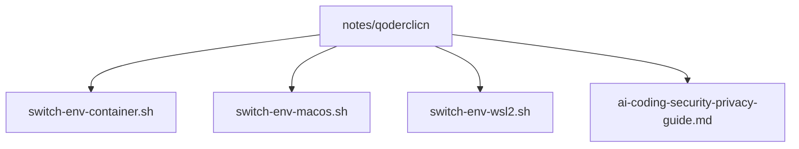
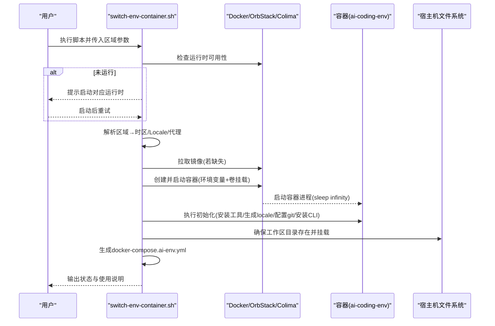
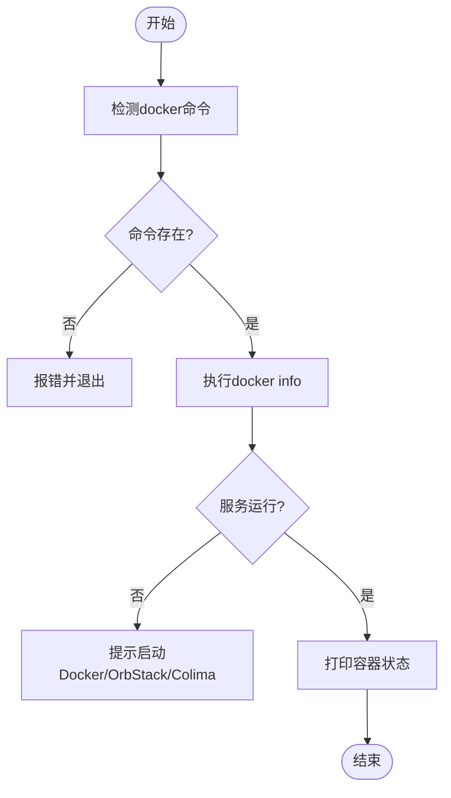
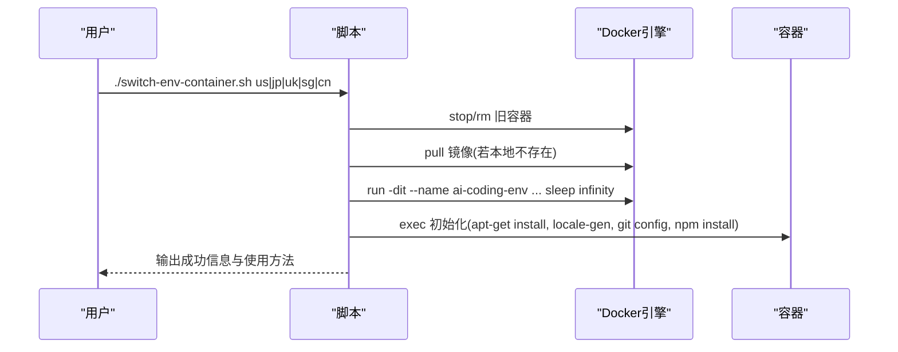
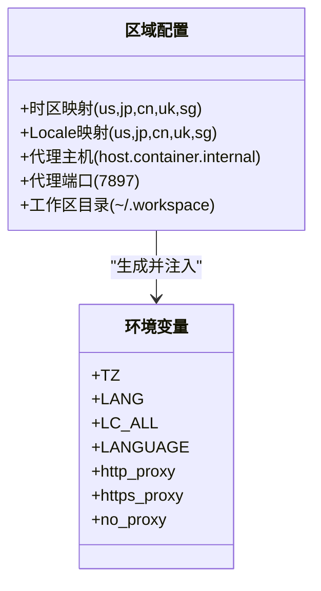
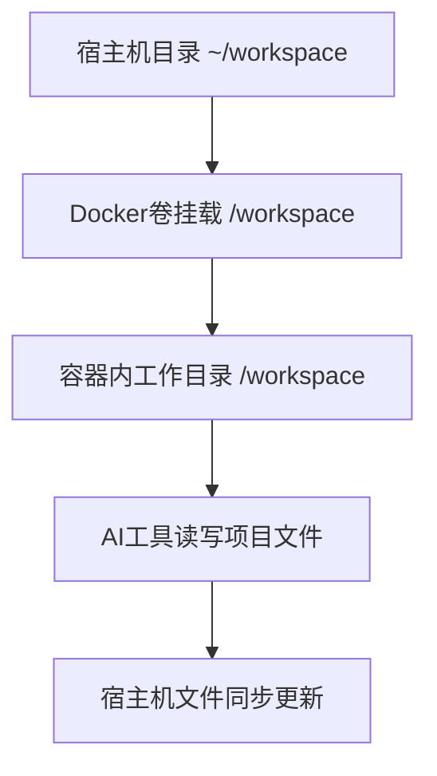
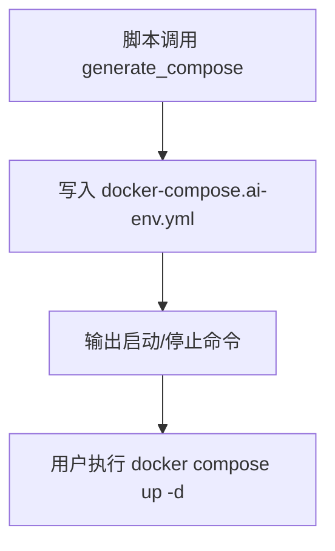
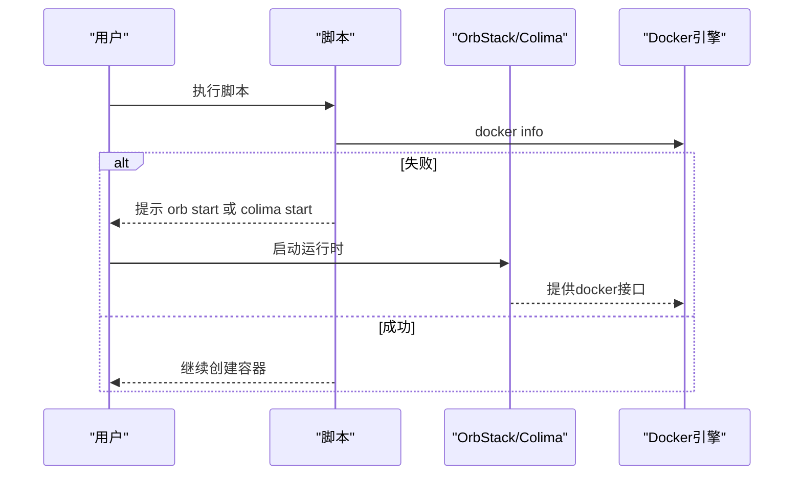
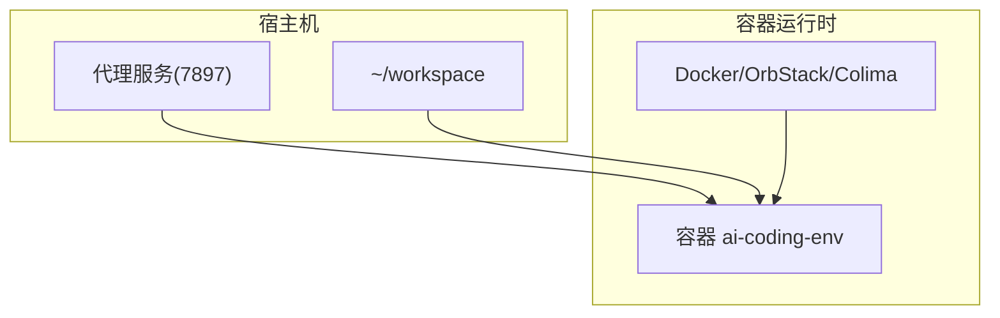

# 容器环境切换脚本

<cite>
**本文档引用的文件**   
- [switch-env-container.sh](file://notes/qoderclicn/switch-env-container.sh)
- [ai-coding-security-privacy-guide.md](file://notes/qoderclicn/ai-coding-security-privacy-guide.md)
- [switch-env-macos.sh](file://notes/qoderclicn/switch-env-macos.sh)
- [switch-env-wsl2.sh](file://notes/qoderclicn/switch-env-wsl2.sh)
</cite>

## 目录
1. [简介](#简介)
2. [项目结构](#项目结构)
3. [核心组件](#核心组件)
4. [架构总览](#架构总览)
5. [详细组件分析](#详细组件分析)
6. [依赖关系分析](#依赖关系分析)
7. [性能与资源限制](#性能与资源限制)
8. [故障排查指南](#故障排查指南)
9. [结论](#结论)
10. [附录：快速上手与最佳实践](#附录快速上手与最佳实践)

## 简介
本文件为“容器环境切换脚本”的完整使用文档，聚焦于 switch-env-container.sh 的容器化管理能力。该脚本用于在 macOS 上通过 Docker、OrbStack、Colima 等轻量级运行时创建并管理隔离的 AI 编码环境（如 Claude Code / Codex），支持多区域时区与语言配置、网络代理、工作区挂载与持久化，以及一键生成 docker-compose 编排文件，便于批量部署与自动化运维。

## 项目结构
仓库中与容器环境切换相关的核心内容集中在 notes/qoderclicn 目录下，包含：
- 容器环境切换脚本：switch-env-container.sh
- macOS 原生环境切换脚本：switch-env-macos.sh
- WSL2 环境切换脚本：switch-env-wsl2.sh
- 安全与隐私指南：ai-coding-security-privacy-guide.md

**图表来源** 
- [switch-env-container.sh:1-283](file://notes/qoderclicn/switch-env-container.sh#L1-L283)
- [switch-env-macos.sh:1-217](file://notes/qoderclicn/switch-env-macos.sh#L1-L217)
- [switch-env-wsl2.sh:1-318](file://notes/qoderclicn/switch-env-wsl2.sh#L1-L318)
- [ai-coding-security-privacy-guide.md:1-459](file://notes/qoderclicn/ai-coding-security-privacy-guide.md#L1-L459)

**章节来源**
- [switch-env-container.sh:1-283](file://notes/qoderclicn/switch-env-container.sh#L1-L283)
- [ai-coding-security-privacy-guide.md:1-459](file://notes/qoderclicn/ai-coding-security-privacy-guide.md#L1-L459)

## 核心组件
- 运行时检测与状态检查：自动识别 Docker/OrbStack/Colima 是否可用，输出当前容器运行状态、镜像、时区、Locale、代理、出口 IP、启动时间等。
- 容器生命周期管理：创建、停止、移除、进入交互式 shell。
- 区域与环境配置：按区域映射时区与 Locale，设置代理环境变量，确保网络出口与时区一致。
- 工作区挂载与持久化：将宿主机目录挂载到容器内固定路径，保证数据持久化与共享。
- Compose 编排生成：自动生成 docker-compose.ai-env.yml，便于统一管理与批量操作。
- 工具链初始化：在容器内安装基础工具与常用 CLI（git、curl、wget、locales、sudo、vim），并可选安装 Claude Code / Codex CLI。

**章节来源**
- [switch-env-container.sh:46-93](file://notes/qoderclicn/switch-env-container.sh#L46-L93)
- [switch-env-container.sh:111-205](file://notes/qoderclicn/switch-env-container.sh#L111-L205)
- [switch-env-container.sh:207-239](file://notes/qoderclicn/switch-env-container.sh#L207-L239)

## 架构总览
容器环境切换的整体流程如下：
- 用户输入区域参数（us/jp/uk/sg/cn）或命令（check/stop/shell）。
- 脚本校验运行时可用性（Docker/OrbStack/Colima）。
- 根据区域选择时区与 Locale，准备代理与工作区。
- 拉取镜像（若不存在）、创建并启动容器，设置环境变量与卷挂载。
- 执行容器内初始化（安装工具、生成 locale、配置 git、安装 CLI）。
- 生成 docker-compose 配置文件，便于后续编排管理。
- 输出验证信息（时区、Locale、出口 IP）。

**图表来源** 
- [switch-env-container.sh:46-93](file://notes/qoderclicn/switch-env-container.sh#L46-L93)
- [switch-env-container.sh:111-205](file://notes/qoderclicn/switch-env-container.sh#L111-L205)
- [switch-env-container.sh:207-239](file://notes/qoderclicn/switch-env-container.sh#L207-L239)

## 详细组件分析

### 运行时检测与状态检查
- 运行时检测：优先判断 docker 命令是否存在且服务已运行；否则给出安装与启动指引（Docker Desktop、OrbStack、Colima）。
- 状态打印：显示容器名称、镜像、时区、Locale、代理、出口 IP、运行时间；若未运行则提示可用命令。

**图表来源** 
- [switch-env-container.sh:46-64](file://notes/qoderclicn/switch-env-container.sh#L46-L64)
- [switch-env-container.sh:66-93](file://notes/qoderclicn/switch-env-container.sh#L66-L93)

**章节来源**
- [switch-env-container.sh:46-93](file://notes/qoderclicn/switch-env-container.sh#L46-L93)

### 容器生命周期管理
- 创建容器：停止并移除已有同名容器，拉取镜像，创建并启动容器，设置 hostname、环境变量（TZ、LANG、LC_ALL、LANGUAGE、http_proxy/https_proxy/no_proxy）、卷挂载与工作目录，重启策略设为 unless-stopped。
- 进入 Shell：检查容器是否运行，进入交互式 bash。
- 停止与移除：停止并移除容器，忽略不存在的情况。

**图表来源** 
- [switch-env-container.sh:111-205](file://notes/qoderclicn/switch-env-container.sh#L111-L205)

**章节来源**
- [switch-env-container.sh:95-109](file://notes/qoderclicn/switch-env-container.sh#L95-L109)
- [switch-env-container.sh:111-205](file://notes/qoderclicn/switch-env-container.sh#L111-L205)

### 区域与环境配置
- 区域映射：支持 us/jp/cn/uk/sg 五个区域，分别映射到对应的时区与 Locale。
- 代理配置：默认使用 host.container.internal 指向 macOS 宿主机的代理服务端口（7897），兼容 Docker Desktop/OrbStack/Colima 的网络访问方式。
- 环境变量：设置 TZ、LANG、LC_ALL、LANGUAGE 与 http_proxy/https_proxy/no_proxy，确保网络出口与时区一致。

**图表来源** 
- [switch-env-container.sh:19-43](file://notes/qoderclicn/switch-env-container.sh#L19-L43)
- [switch-env-container.sh:140-158](file://notes/qoderclicn/switch-env-container.sh#L140-L158)

**章节来源**
- [switch-env-container.sh:19-43](file://notes/qoderclicn/switch-env-container.sh#L19-L43)
- [switch-env-container.sh:140-158](file://notes/qoderclicn/switch-env-container.sh#L140-L158)

### 工作区挂载与共享机制
- 宿主机工作区：默认 ~/workspace，确保目录存在。
- 容器内工作目录：/workspace，作为默认工作目录。
- 卷挂载：-v "$WORKSPACE:/workspace"，实现双向同步与持久化。
- 使用建议：将项目代码、密钥与配置文件放在宿主机工作区，避免敏感信息进入镜像层。

**图表来源** 
- [switch-env-container.sh:128-130](file://notes/qoderclicn/switch-env-container.sh#L128-L130)
- [switch-env-container.sh:154-158](file://notes/qoderclicn/switch-env-container.sh#L154-L158)

**章节来源**
- [switch-env-container.sh:128-130](file://notes/qoderclicn/switch-env-container.sh#L128-L130)
- [switch-env-container.sh:154-158](file://notes/qoderclicn/switch-env-container.sh#L154-L158)

### Compose 编排生成
- 生成文件：在工作区生成 docker-compose.ai-env.yml，定义服务 ai-coding，包含镜像、容器名、hostname、环境变量、卷挂载、工作目录、重启策略与命令。
- 用法：使用 docker compose -f docker-compose.ai-env.yml up -d 启动，down 停止。

**图表来源** 
- [switch-env-container.sh:207-239](file://notes/qoderclicn/switch-env-container.sh#L207-L239)

**章节来源**
- [switch-env-container.sh:207-239](file://notes/qoderclicn/switch-env-container.sh#L207-L239)

### 与 OrbStack、Colima 集成
- 运行时检测：脚本会检测 docker 命令与 docker info 可用性，若不可用则提示启动 OrbStack/Colima。
- 网络访问：默认使用 host.container.internal 指向 macOS 宿主机的代理服务；对于 Docker Desktop/OrbStack/Colima，通常可通过 host.docker.internal 访问宿主机。
- 资源限制：Compose 中可添加 CPU/内存限制（示例见下节最佳实践）。

**图表来源** 
- [switch-env-container.sh:46-64](file://notes/qoderclicn/switch-env-container.sh#L46-L64)

**章节来源**
- [switch-env-container.sh:46-64](file://notes/qoderclicn/switch-env-container.sh#L46-L64)

## 依赖关系分析
- 外部依赖：
  - Docker/OrbStack/Colima：提供容器运行时与网络能力。
  - macOS 代理服务：监听 7897 端口，供容器通过 host.container.internal 访问。
  - 网络 DNS：建议使用全球 anycast DNS（如 Cloudflare 1.1.1.1/1.0.0.1）以减少地理位置暴露。
- 内部依赖：
  - 区域映射表与时区/Locale 映射。
  - 工作区目录与卷挂载。
  - 容器内初始化脚本（apt-get、locale-gen、npm install）。

**图表来源** 
- [switch-env-container.sh:19-43](file://notes/qoderclicn/switch-env-container.sh#L19-L43)
- [switch-env-container.sh:154-158](file://notes/qoderclicn/switch-env-container.sh#L154-L158)

**章节来源**
- [switch-env-container.sh:19-43](file://notes/qoderclicn/switch-env-container.sh#L19-L43)
- [switch-env-container.sh:154-158](file://notes/qoderclicn/switch-env-container.sh#L154-L158)

## 性能与资源限制
- 镜像选择：node:20-bookworm 作为基础镜像，体积适中且生态完善。
- 资源限制建议（Compose）：
  - 限制 CPU 与内存，避免影响宿主机性能。
  - 设置 restart=unless-stopped，提高稳定性。
- 网络优化：
  - 固定代理节点，避免频繁切换导致风控。
  - 使用稳定 DNS（Cloudflare）减少解析延迟。
- 安全加固：
  - 仅挂载必要的工作区目录，避免暴露敏感路径。
  - 在容器内最小化安装工具，减少攻击面。
  - 遵循安全指南中的权限模型与沙箱策略。

[本节为通用指导，不直接分析具体文件]

## 故障排查指南
- 常见问题：
  - Docker 未运行：提示启动 Docker Desktop/OrbStack/Colima。
  - 代理不可达：确认代理服务已开启且端口正确（7897）。
  - 出口 IP 异常：检查代理节点与 DNS 配置是否与区域一致。
  - 时区/Locale 不一致：确认容器环境变量与区域映射匹配。
- 诊断步骤：
  - 使用 check 命令查看容器状态与出口 IP。
  - 进入容器 shell 验证网络与工具安装情况。
  - 检查 docker-compose.ai-env.yml 配置是否正确。

**章节来源**
- [switch-env-container.sh:46-93](file://notes/qoderclicn/switch-env-container.sh#L46-L93)
- [switch-env-container.sh:101-109](file://notes/qoderclicn/switch-env-container.sh#L101-L109)

## 结论
switch-env-container.sh 提供了完整的容器环境管理能力，涵盖运行时检测、容器生命周期、区域与环境配置、工作区挂载与持久化、Compose 编排生成等关键功能。结合 OrbStack/Colima 等轻量级运行时，可实现跨区域的快速部署与统一管理。配合安全与隐私指南，可在保障安全的前提下高效进行 AI 编码工作。

[本节为总结性内容，不直接分析具体文件]

## 附录：快速上手与最佳实践
- 快速上手：
  - 创建美国环境容器：./switch-env-container.sh us
  - 进入容器：./switch-env-container.sh shell
  - 查看状态：./switch-env-container.sh check
  - 停止并移除：./switch-env-container.sh stop
- 最佳实践：
  - 固定代理节点与 DNS，保持区域一致性。
  - 使用 Compose 管理容器，便于批量操作与版本控制。
  - 定期清理无用镜像与容器，释放磁盘空间。
  - 遵循安全指南，避免泄露敏感信息。

**章节来源**
- [switch-env-container.sh:243-283](file://notes/qoderclicn/switch-env-container.sh#L243-L283)
- [ai-coding-security-privacy-guide.md:1-459](file://notes/qoderclicn/ai-coding-security-privacy-guide.md#L1-L459)