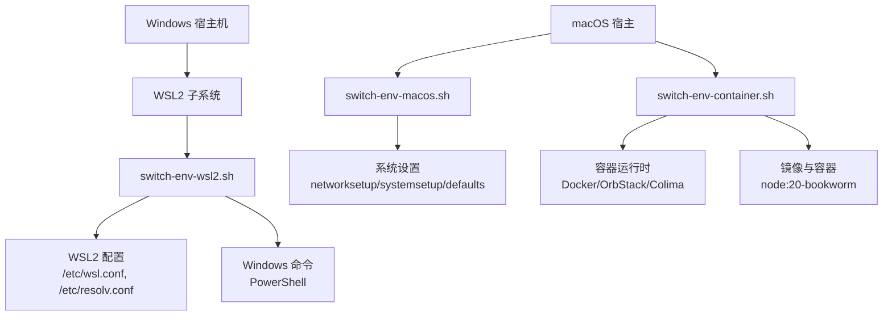
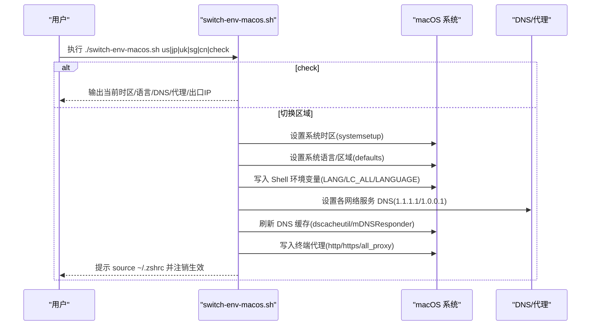
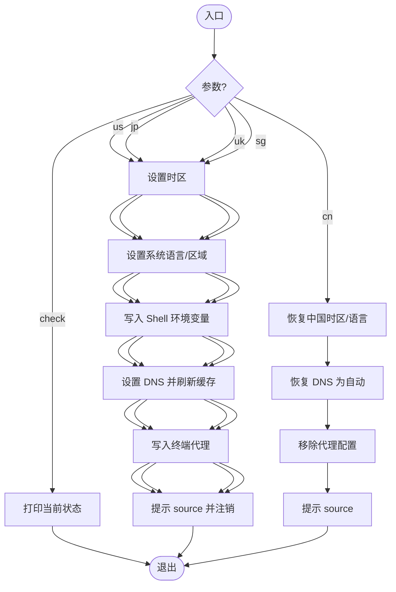
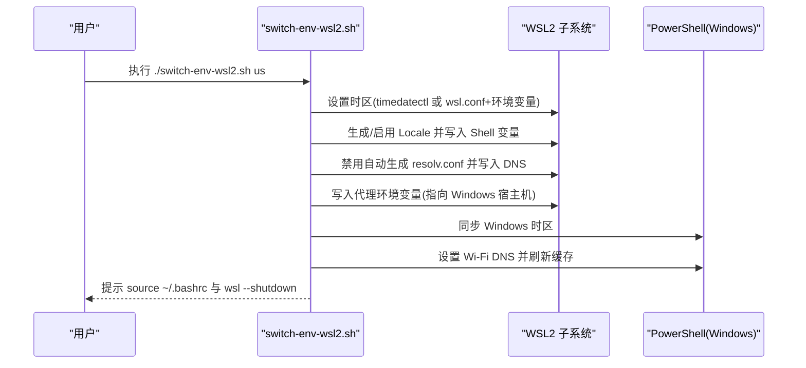
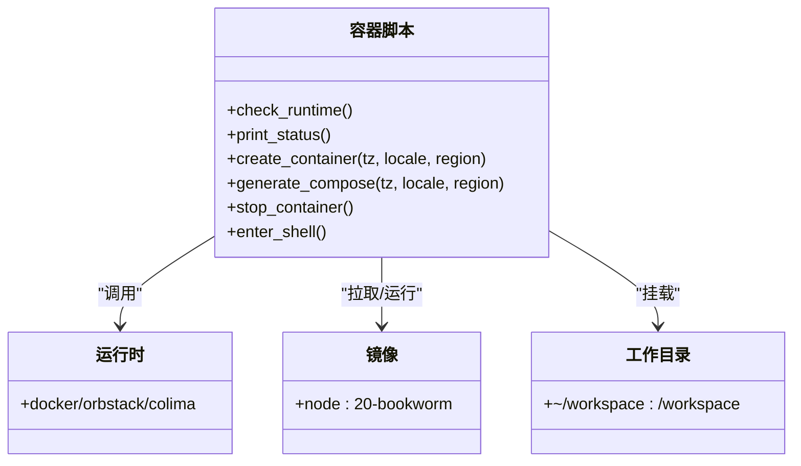
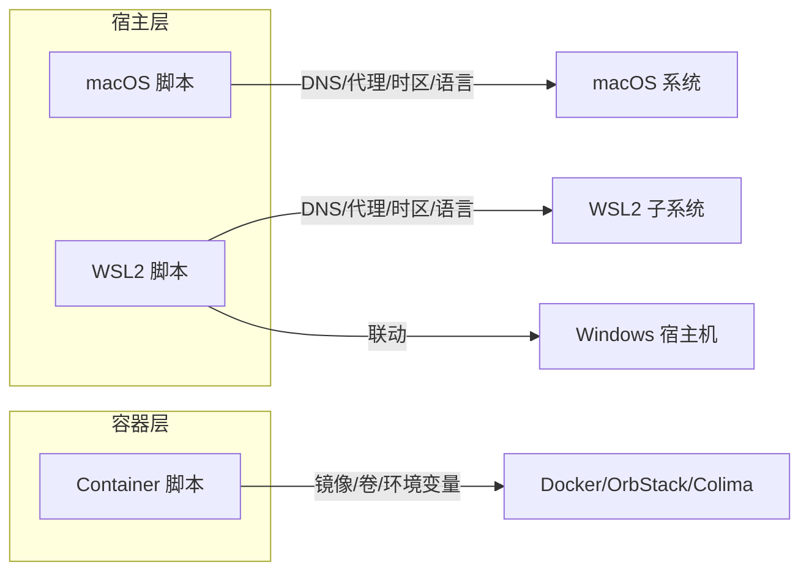

# 环境切换脚本集

<cite>
**本文引用的文件**   
- [switch-env-macos.sh](file://notes/qoderclicn/switch-env-macos.sh)
- [switch-env-wsl2.sh](file://notes/qoderclicn/switch-env-wsl2.sh)
- [switch-env-container.sh](file://notes/qoderclicn/switch-env-container.sh)
- [ai-coding-security-privacy-guide.md](file://notes/qoderclicn/ai-coding-security-privacy-guide.md)
</cite>

## 目录
1. [简介](#简介)
2. [项目结构](#项目结构)
3. [核心组件](#核心组件)
4. [架构总览](#架构总览)
5. [详细组件分析](#详细组件分析)
6. [依赖关系分析](#依赖关系分析)
7. [性能与稳定性考量](#性能与稳定性考量)
8. [故障排查指南](#故障排查指南)
9. [结论](#结论)
10. [附录：批量配置与环境验证](#附录批量配置与环境验证)

## 简介
本仓库提供一套面向跨平台（macOS、Windows WSL2、macOS Apple Container）的环境一致性管理脚本，用于在 Claude Code / Codex CLI 等 AI 编码工具的使用场景中，自动化完成时区、语言/Locale、DNS、代理等关键环境要素的切换与校验。通过统一参数化区域标识（us/jp/uk/sg/cn），实现“注册信息 ≈ IP 出口 ≈ 时区 ≈ DNS ≈ 系统语言 ≈ 支付区域”的一致性策略，降低风控风险并提升可维护性。

## 项目结构
qoderclicn 目录下包含三个核心脚本与一份安全隐私指南文档：
- switch-env-macos.sh：macOS 原生环境切换
- switch-env-wsl2.sh：WSL2 环境切换（含 Windows 宿主机联动）
- switch-env-container.sh：Apple Container（Docker/OrbStack/Colima）隔离环境创建与维护
- ai-coding-security-privacy-guide.md：安全隐私与防封禁最佳实践参考

图示来源
- [switch-env-macos.sh:1-217](file://notes/qoderclicn/switch-env-macos.sh#L1-L217)
- [switch-env-wsl2.sh:1-318](file://notes/qoderclicn/switch-env-wsl2.sh#L1-L318)
- [switch-env-container.sh:1-283](file://notes/qoderclicn/switch-env-container.sh#L1-L283)

章节来源
- [switch-env-macos.sh:1-217](file://notes/qoderclicn/switch-env-macos.sh#L1-L217)
- [switch-env-wsl2.sh:1-318](file://notes/qoderclicn/switch-env-wsl2.sh#L1-L318)
- [switch-env-container.sh:1-283](file://notes/qoderclicn/switch-env-container.sh#L1-L283)
- [ai-coding-security-privacy-guide.md:1-459](file://notes/qoderclicn/ai-coding-security-privacy-guide.md#L1-L459)

## 核心组件
- macOS 环境切换脚本
  - 功能要点：按区域一键切换系统时区、系统语言与区域、Shell 环境变量、全局 DNS、终端代理；支持恢复中国环境与状态检查。
  - 关键能力：遍历所有网络服务设置 DNS、刷新系统 DNS 缓存、写入 Shell 配置文件并提示重新加载。
- WSL2 环境切换脚本
  - 功能要点：在 WSL2 内切换时区与 Locale、锁定 resolv.conf 以固定 DNS、自动发现 Windows 宿主机地址并配置代理、同步 Windows 宿主机时区与 DNS。
  - 关键能力：检测是否在 WSL2 运行、兼容 systemd/timedatectl 或回退到 wsl.conf + 环境变量、生成持久化配置。
- Apple Container 环境脚本
  - 功能要点：基于 node:20-bookworm 镜像创建隔离容器，注入 TZ/LANG/LC_ALL/LANGUAGE 及代理环境变量，挂载工作目录，安装基础工具与常用 CLI，生成 docker-compose 文件以便编排。
  - 关键能力：运行时自检（Docker/OrbStack/Colima）、容器生命周期管理（创建/停止/进入）、环境验证与导出 Compose。

章节来源
- [switch-env-macos.sh:1-217](file://notes/qoderclicn/switch-env-macos.sh#L1-L217)
- [switch-env-wsl2.sh:1-318](file://notes/qoderclicn/switch-env-wsl2.sh#L1-L318)
- [switch-env-container.sh:1-283](file://notes/qoderclicn/switch-env-container.sh#L1-L283)

## 架构总览
三套脚本围绕同一目标——“区域一致性与网络出口一致性”，在不同执行环境中采用各自适配的系统调用与配置方式，最终达成一致的对外表现（时区、语言、DNS、代理）。

图示来源
- [switch-env-macos.sh:52-151](file://notes/qoderclicn/switch-env-macos.sh#L52-L151)
- [switch-env-macos.sh:169-216](file://notes/qoderclicn/switch-env-macos.sh#L169-L216)

## 详细组件分析

### macOS 环境切换脚本（switch-env-macos.sh）
- 参数与场景
  - 参数：us/jp/uk/sg/cn/check
  - 典型场景：开发前切换到美国/日本/英国/新加坡环境；回国后恢复中国环境；日常仅查看状态。
- 关键流程
  - 时区：systemsetup 设置系统时区
  - 语言/区域：defaults 写入 AppleLanguages/AppleLocale，重启 Finder 使 UI 生效
  - Shell 环境变量：向 .zshrc 或 .bash_profile 写入 LANG/LC_ALL/LC_CTYPE/LANGUAGE 并提示 source
  - DNS：遍历 networksetup 列出的所有网络服务，设置 Cloudflare DNS，刷新缓存
  - 代理：写入 http_proxy/https_proxy/all_proxy/no_proxy，默认端口 7897
  - 恢复：恢复 DNS 为 DHCP 自动，移除代理块
- 注意事项
  - 若已使用 Cloudflare WARP 的“仅 DNS”模式，请勿与本脚本同时启用 DNS 部分，避免冲突。
  - 切换完成后需重新登录以使系统语言完全生效。

图示来源
- [switch-env-macos.sh:169-216](file://notes/qoderclicn/switch-env-macos.sh#L169-L216)
- [switch-env-macos.sh:67-151](file://notes/qoderclicn/switch-env-macos.sh#L67-L151)

章节来源
- [switch-env-macos.sh:1-217](file://notes/qoderclicn/switch-env-macos.sh#L1-L217)

### WSL2 环境切换脚本（switch-env-wsl2.sh）
- 参数与场景
  - 参数：us/jp/uk/sg/cn/check
  - 典型场景：在 WSL2 中快速切换时区/Locale/DNS/代理，并联动 Windows 宿主机保持一致。
- 关键流程
  - 环境检测：确认在 WSL2 运行
  - 时区：优先 timedatectl，否则写入 /etc/wsl.conf 的 boot command 并在 Shell 中 export TZ
  - Locale：确保 locale 可用，写入 Shell 环境变量
  - DNS：禁止自动生成 resolv.conf，手动写入 Cloudflare DNS，锁定文件防止覆盖
  - 代理：动态获取 Windows 宿主机地址，写入 http/https/all_proxy/no_proxy
  - 宿主机联动：同步 Windows 时区与 Wi-Fi DNS，刷新 Windows DNS 缓存
  - 恢复：恢复 generateResolvConf=true，解锁 resolv.conf，移除代理配置，重置 Windows DNS
- 注意事项
  - 需要代理软件开启 TUN 或允许局域网连接
  - DNS 变更需 wsl --shutdown 后重启生效

图示来源
- [switch-env-wsl2.sh:79-233](file://notes/qoderclicn/switch-env-wsl2.sh#L79-L233)
- [switch-env-wsl2.sh:258-317](file://notes/qoderclicn/switch-env-wsl2.sh#L258-L317)

章节来源
- [switch-env-wsl2.sh:1-318](file://notes/qoderclicn/switch-env-wsl2.sh#L1-L318)

### Apple Container 环境脚本（switch-env-container.sh）
- 参数与场景
  - 参数：us/jp/uk/sg/cn/stop/shell/check
  - 典型场景：在容器中创建隔离环境运行 Claude Code/Codex，便于复用与迁移。
- 关键流程
  - 运行时检查：检测 Docker/OrbStack/Colima 是否可用
  - 容器创建：拉取镜像、启动容器、注入 TZ/LANG/LC_ALL/LANGUAGE 与代理环境变量、挂载工作目录
  - 初始化：安装基础工具、生成 locale、配置 git、安装 Claude Code/Codex CLI
  - 编排导出：生成 docker-compose.ai-env.yml，便于后续编排
  - 生命周期：stop 停止并移除容器；shell 进入运行中的容器；check 显示状态
- 注意事项
  - 默认使用 host.container.internal 作为 macOS 内置容器代理网关；如使用 Docker Desktop/OrbStack/Colima，请改为 host.docker.internal
  - 工作目录默认为 ~/workspace，可在脚本中调整

图示来源
- [switch-env-container.sh:46-205](file://notes/qoderclicn/switch-env-container.sh#L46-L205)
- [switch-env-container.sh:207-239](file://notes/qoderclicn/switch-env-container.sh#L207-L239)

章节来源
- [switch-env-container.sh:1-283](file://notes/qoderclicn/switch-env-container.sh#L1-L283)

## 依赖关系分析
- 外部依赖
  - macOS：systemsetup、networksetup、defaults、dscacheutil、mDNSResponder
  - WSL2：timedatectl（可选）、wsl.conf、resolv.conf、chattr、PowerShell
  - Container：Docker/OrbStack/Colima、apt-get、npm
- 内部耦合
  - 三个脚本共享相同的区域映射与时区/语言映射表，保证行为一致
  - 代理端口默认 7897，可根据实际代理软件修改
- 集成模式
  - 单点切换：分别在各平台独立运行对应脚本
  - 组合使用：先切换宿主环境（macOS/WSL2），再创建容器环境，形成“宿主一致 + 容器隔离”的组合

图示来源
- [switch-env-macos.sh:1-217](file://notes/qoderclicn/switch-env-macos.sh#L1-L217)
- [switch-env-wsl2.sh:1-318](file://notes/qoderclicn/switch-env-wsl2.sh#L1-L318)
- [switch-env-container.sh:1-283](file://notes/qoderclicn/switch-env-container.sh#L1-L283)

章节来源
- [switch-env-macos.sh:1-217](file://notes/qoderclicn/switch-env-macos.sh#L1-L217)
- [switch-env-wsl2.sh:1-318](file://notes/qoderclicn/switch-env-wsl2.sh#L1-L318)
- [switch-env-container.sh:1-283](file://notes/qoderclicn/switch-env-container.sh#L1-L283)

## 性能与稳定性考量
- DNS 刷新与缓存：macOS 侧会刷新系统 DNS 缓存，减少解析延迟；WSL2 侧锁定 resolv.conf 避免被覆盖导致反复重建。
- 镜像拉取：首次运行容器时会拉取镜像，后续复用本地镜像，缩短启动时间。
- 进程重启：macOS 侧重启 Finder 使语言设置即时生效；WSL2 侧建议 wsl --shutdown 后重启以获得完整效果。
- 代理连通性：确保代理软件处于 TUN/全局模式，避免 WebRTC 泄漏真实 IP。

[本节为通用指导，不直接分析具体文件]

## 故障排查指南
- 无法识别 WSL2 环境
  - 现象：提示需要在 WSL2 中运行
  - 处理：确认在 WSL2 终端执行脚本
- DNS 未生效
  - macOS：确认 networksetup 设置成功并刷新缓存；若使用 WARP 仅 DNS，避免与本脚本同时启用 DNS 部分
  - WSL2：确认 generateResolvConf=false 且 resolv.conf 被锁定；必要时 wsl --shutdown 后重启
- 代理不可用
  - 检查代理软件是否开启 TUN/全局模式
  - macOS：确认终端代理环境变量已写入并 source
  - WSL2：确认 Windows 宿主机代理允许局域网连接，且脚本正确解析了宿主机地址
  - Container：确认 host.container.internal 或 host.docker.internal 可达，端口 7897 开放
- 容器未运行或无法进入
  - 使用 check 查看状态；使用 stop 清理后重新创建；使用 shell 进入运行中的容器
- 语言/时区不一致
  - macOS：切换后需注销并重新登录
  - WSL2：source ~/.bashrc 并重启 WSL

章节来源
- [switch-env-macos.sh:10-12](file://notes/qoderclicn/switch-env-macos.sh#L10-L12)
- [switch-env-macos.sh:169-216](file://notes/qoderclicn/switch-env-macos.sh#L169-L216)
- [switch-env-wsl2.sh:45-50](file://notes/qoderclicn/switch-env-wsl2.sh#L45-L50)
- [switch-env-wsl2.sh:144-170](file://notes/qoderclicn/switch-env-wsl2.sh#L144-L170)
- [switch-env-container.sh:46-64](file://notes/qoderclicn/switch-env-container.sh#L46-L64)
- [switch-env-container.sh:243-282](file://notes/qoderclicn/switch-env-container.sh#L243-L282)

## 结论
通过统一的区域参数与跨平台适配，本脚本集实现了“时区/语言/Locale/DNS/代理”的一键切换与验证，既满足多平台一致性需求，又兼顾了容器的隔离与可移植性。结合安全隐私指南中的防封禁原则，可有效降低账号风控风险，提升开发与自动化体验。

[本节为总结性内容，不直接分析具体文件]

## 附录：批量配置与环境验证
- 批量配置建议
  - 将区域参数纳入 CI/CD 或任务调度，例如在构建阶段根据目标市场选择 us/jp/uk/sg/cn
  - 对容器环境，使用生成的 docker-compose.ai-env.yml 进行编排与版本化管理
- 环境验证清单
  - 时区：date +%Z 与预期一致
  - 语言/Locale：locale 输出与预期一致
  - DNS：nslookup/dig 解析结果与预期一致
  - 代理：curl https://ipinfo.io/country 返回预期国家代码
  - 容器：docker exec 进入容器后重复上述验证
- 故障恢复步骤
  - macOS：运行 cn 恢复中国环境；如需彻底清理，手动删除 Shell 配置块并恢复 DNS 为自动
  - WSL2：运行 cn 恢复中国环境；必要时重置 Windows DNS 并重启 WSL
  - Container：stop 清理后重新创建；检查代理与镜像可用性

章节来源
- [switch-env-macos.sh:190-204](file://notes/qoderclicn/switch-env-macos.sh#L190-L204)
- [switch-env-wsl2.sh:283-301](file://notes/qoderclicn/switch-env-wsl2.sh#L283-L301)
- [switch-env-container.sh:249-252](file://notes/qoderclicn/switch-env-container.sh#L249-L252)
- [ai-coding-security-privacy-guide.md:138-168](file://notes/qoderclicn/ai-coding-security-privacy-guide.md#L138-L168)