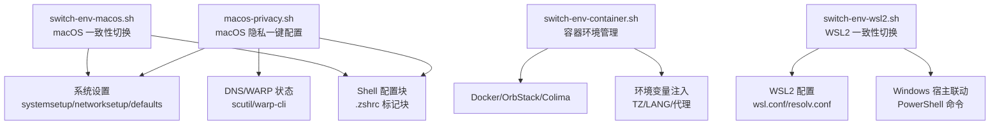
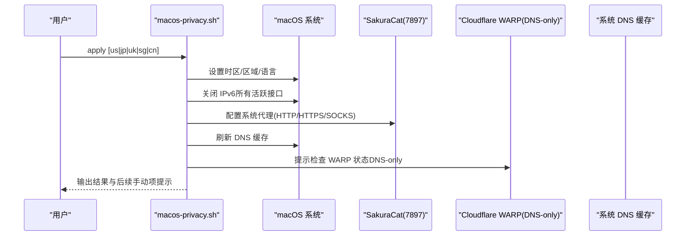
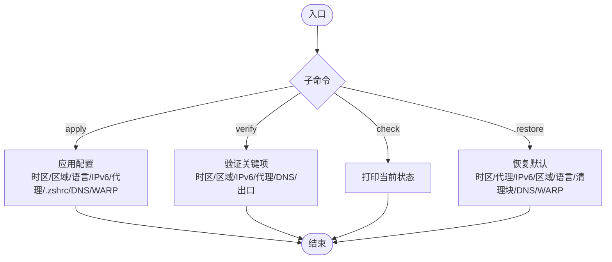
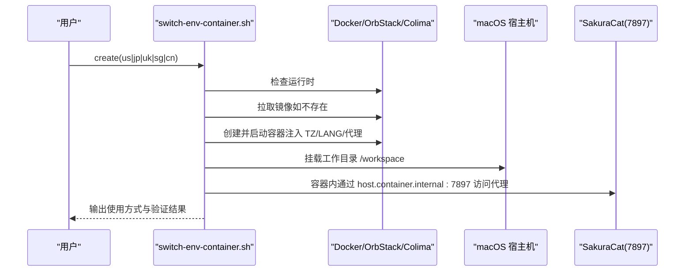
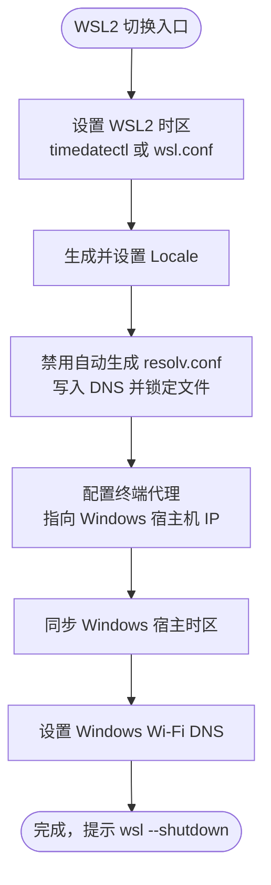
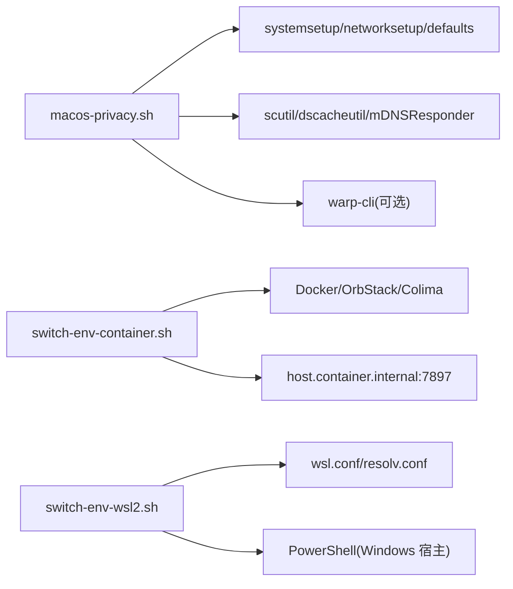

# 自动化脚本使用

<cite>
**本文引用的文件**   
- [macos-privacy.sh](file://notes/macos-privacy.sh)
- [switch-env-macos.sh](file://notes/qoderclicn/switch-env-macos.sh)
- [switch-env-container.sh](file://notes/qoderclicn/switch-env-container.sh)
- [switch-env-wsl2.sh](file://notes/qoderclicn/switch-env-wsl2.sh)
- [ai-coding-security-privacy-guide.md](file://notes/qoderclicn/ai-coding-security-privacy-guide.md)
- [macos-host-privacy-setup.md](file://notes/macos-host-privacy-setup.md)
</cite>

## 目录
1. [简介](#简介)
2. [项目结构](#项目结构)
3. [核心组件](#核心组件)
4. [架构总览](#架构总览)
5. [详细组件分析](#详细组件分析)
6. [依赖关系分析](#依赖关系分析)
7. [性能与幂等性](#性能与幂等性)
8. [故障排查指南](#故障排查指南)
9. [结论](#结论)
10. [附录：命令速查与扩展开发](#附录命令速查与扩展开发)

## 简介
本仓库提供一套面向 macOS、WSL2 与容器环境的“隐私与一致性”自动化配置工具，覆盖一键应用、验证、检查与恢复能力，支持多区域（us/jp/uk/sg/cn）快速切换，并通过标记块机制实现 Shell 配置的幂等管理。主管理脚本 macos-privacy.sh 聚焦 macOS 宿主机隐私与安全基线；qoderclicn 目录下提供三端环境切换脚本集，分别适配 macOS、Docker/OrbStack/Colima 容器与 WSL2。

## 项目结构
- notes/macos-privacy.sh：macOS 宿主机隐私一键配置主脚本（apply/verify/check/restore）
- notes/qoderclicn/switch-env-macos.sh：macOS 环境一致性切换（时区/语言/DNS/代理）
- notes/qoderclicn/switch-env-container.sh：Apple Container/Docker 隔离环境创建与管理
- notes/qoderclicn/switch-env-wsl2.sh：Windows WSL2 环境一致性切换（含 Windows 宿主联动）
- notes/qoderclicn/ai-coding-security-privacy-guide.md：AI 编码工具安全隐私最佳实践与防封禁策略
- notes/macos-host-privacy-setup.md：macOS 宿主机隐私设置清单与验证步骤

图表来源
- [macos-privacy.sh:1-262](file://notes/macos-privacy.sh#L1-L262)
- [switch-env-macos.sh:1-217](file://notes/qoderclicn/switch-env-macos.sh#L1-L217)
- [switch-env-container.sh:1-283](file://notes/qoderclicn/switch-env-container.sh#L1-L283)
- [switch-env-wsl2.sh:1-318](file://notes/qoderclicn/switch-env-wsl2.sh#L1-L318)

章节来源
- [macos-privacy.sh:1-262](file://notes/macos-privacy.sh#L1-L262)
- [switch-env-macos.sh:1-217](file://notes/qoderclicn/switch-env-macos.sh#L1-L217)
- [switch-env-container.sh:1-283](file://notes/qoderclicn/switch-env-container.sh#L1-L283)
- [switch-env-wsl2.sh:1-318](file://notes/qoderclicn/switch-env-wsl2.sh#L1-L318)

## 核心组件
- macOS 隐私主脚本（macos-privacy.sh）
  - 子命令：apply、verify、check、restore
  - 功能：时区/区域/语言、IPv6 关闭、系统代理、终端代理与 locale 写入、DNS 刷新、WARP 提示
  - 区域映射：us/jp/uk/sg/cn（默认 us）
  - 幂等：通过 .zshrc 中的标记块增删，避免重复写入
- 三端环境切换脚本（qoderclicn）
  - switch-env-macos.sh：macOS 一致性切换（时区/语言/DNS/代理），支持 check/us/jp/uk/sg/cn
  - switch-env-container.sh：容器环境创建、运行、进入、停止，生成 docker-compose 模板
  - switch-env-wsl2.sh：WSL2 时区/locale/DNS/代理，并联动 Windows 宿主时区与 DNS

章节来源
- [macos-privacy.sh:1-262](file://notes/macos-privacy.sh#L1-L262)
- [switch-env-macos.sh:1-217](file://notes/qoderclicn/switch-env-macos.sh#L1-L217)
- [switch-env-container.sh:1-283](file://notes/qoderclicn/switch-env-container.sh#1-L283)
- [switch-env-wsl2.sh:1-318](file://notes/qoderclicn/switch-env-wsl2.sh#L1-L318)

## 架构总览
整体采用“SakuraCat 代理模式（127.0.0.1:7897）+ Cloudflare WARP（仅 DNS 模式）”的分离式架构：
- 流量出口：SakuraCat 代理（HTTP/SOCKS）
- DNS 加密：WARP 接管系统 DNS，以 DoH/DoT 发往 1.1.1.1
- 区域一致性：时区、语言、区域、DNS、出口 IP 指向同一地理区域（默认 us）

图表来源
- [macos-privacy.sh:70-150](file://notes/macos-privacy.sh#L70-L150)
- [macos-host-privacy-setup.md:11-32](file://notes/macos-host-privacy-setup.md#L11-L32)

## 详细组件分析

### macOS 隐私主脚本（macos-privacy.sh）
- 关键能力
  - apply：按区域批量应用时区/区域/语言、关闭 IPv6、设置系统代理、写入 .zshrc 标记块、刷新 DNS、检测 WARP
  - verify：校验时区/区域/IPv6/系统代理、打印 DNS 解析链与出口信息
  - check：打印当前环境状态（时区/时间/区域/Locale/DNS/代理/IPv6/出口IP）
  - restore：恢复默认（自动时区、中国时区、关闭系统代理、恢复 IPv6、恢复区域/语言、清理标记块、断开 WARP）
- 幂等性保证
  - 通过 clear_block 函数删除 .zshrc 中指定标记块，再按需追加新块，确保多次执行不重复写入
- 多平台适配逻辑
  - 基于 networksetup/systemsetup/defaults/scutil 等原生命令，兼容不同网络服务名（Wi-Fi/Ethernet）
  - 支持环境变量 INTERFACE、PROXY_PORT、SKIP_PROXY 控制行为

图表来源
- [macos-privacy.sh:70-150](file://notes/macos-privacy.sh#L70-L150)
- [macos-privacy.sh:152-246](file://notes/macos-privacy.sh#L152-L246)

章节来源
- [macos-privacy.sh:1-262](file://notes/macos-privacy.sh#L1-L262)

### macOS 环境一致性切换（switch-env-macos.sh）
- 功能要点
  - 切换时区/语言/区域、配置 Shell 环境变量（locale）、配置系统 DNS、配置终端代理
  - 支持 check/us/jp/uk/sg/cn 参数
- 注意事项
  - 若已使用 WARP 的“仅 DNS”模式，请勿同时运行本脚本的 DNS 部分，以免冲突

章节来源
- [switch-env-macos.sh:1-217](file://notes/qoderclicn/switch-env-macos.sh#L1-L217)

### 容器环境管理（switch-env-container.sh）
- 功能要点
  - 检查运行时（Docker/OrbStack/Colima）
  - 创建并启动隔离容器（设置 TZ/LANG/LC_ALL/LANGUAGE、代理变量、工作目录挂载）
  - 进入容器 shell、停止并移除容器
  - 生成 docker-compose.ai-env.yml 模板，便于复用
- 关键点
  - macOS Apple Container 使用 host.container.internal 指向宿主机代理端口
  - 镜像拉取与基础工具安装（git/curl/wget/locales/sudo/vim）在容器内初始化完成

图表来源
- [switch-env-container.sh:111-205](file://notes/qoderclicn/switch-env-container.sh#L111-L205)
- [switch-env-container.sh:207-239](file://notes/qoderclicn/switch-env-container.sh#L207-L239)

章节来源
- [switch-env-container.sh:1-283](file://notes/qoderclicn/switch-env-container.sh#L1-L283)

### WSL2 环境一致性切换（switch-env-wsl2.sh）
- 功能要点
  - 切换 WSL2 时区（timedatectl 或 wsl.conf + 环境变量）、Locale、DNS、代理
  - 同步 Windows 宿主时区与 DNS，锁定 resolv.conf 防止重启覆盖
  - 支持 check/us/jp/uk/sg/cn 参数
- 关键点
  - 代理地址动态获取 Windows 宿主机 IP（resolv.conf nameserver）
  - 需要 wsl --shutdown 后重启生效

图表来源
- [switch-env-wsl2.sh:79-170](file://notes/qoderclicn/switch-env-wsl2.sh#L79-L170)
- [switch-env-wsl2.sh:198-233](file://notes/qoderclicn/switch-env-wsl2.sh#L198-L233)

章节来源
- [switch-env-wsl2.sh:1-318](file://notes/qoderclicn/switch-env-wsl2.sh#L1-L318)

## 依赖关系分析
- 外部依赖
  - macOS：systemsetup、networksetup、defaults、scutil、dscacheutil、mDNSResponder、curl、warp-cli（可选）
  - 容器：Docker/OrbStack/Colima、apt-get、npm（可选）
  - WSL2：timedatectl（可选）、wsl.conf、resolv.conf、PowerShell（Windows 宿主）
- 耦合与内聚
  - macos-privacy.sh 与 qoderclicn 脚本共享区域映射与代理端口约定，但各自独立维护
  - 容器脚本与宿主机代理解耦，通过环境变量注入与 host.container.internal 解析

图表来源
- [macos-privacy.sh:1-262](file://notes/macos-privacy.sh#L1-L262)
- [switch-env-container.sh:1-283](file://notes/qoderclicn/switch-env-container.sh#L1-L283)
- [switch-env-wsl2.sh:1-318](file://notes/qoderclicn/switch-env-wsl2.sh#L1-L318)

章节来源
- [macos-privacy.sh:1-262](file://notes/macos-privacy.sh#L1-L262)
- [switch-env-container.sh:1-283](file://notes/qoderclicn/switch-env-container.sh#L1-L283)
- [switch-env-wsl2.sh:1-318](file://notes/qoderclicn/switch-env-wsl2.sh#L1-L318)

## 性能与幂等性
- 幂等性
  - 通过标记块（MACOS-PRIVACY-PROXY/MACOS-PRIVACY-LOCALE 或 ENV-CONSISTENCY-*）在 .zshrc/.bashrc 中增删配置，避免重复写入
  - 多次 apply 不会累积多余行，clear_block 先删除旧块再追加新块
- 性能考量
  - 批量操作尽量使用系统命令一次性设置（如 networksetup 遍历接口）
  - DNS 刷新仅在必要时执行，减少 mDNSResponder 重启开销
  - 容器镜像拉取与工具安装仅在首次执行时进行

章节来源
- [macos-privacy.sh:64-132](file://notes/macos-privacy.sh#L64-L132)
- [switch-env-macos.sh:85-151](file://notes/qoderclicn/switch-env-macos.sh#L85-L151)
- [switch-env-container.sh:131-183](file://notes/qoderclicn/switch-env-container.sh#L131-L183)

## 故障排查指南
- 常见现象与处理
  - 无法解析域名：显式指定公网 DNS（1.1.1.1/8.8.8.8）或使用 container --dns
  - 容器出口连不上：检查代理变量与 host.container.internal 解析
  - WARP 全隧道模式导致出口异常：确认 WARP 为“仅 DNS”模式
  - IPv6 泄漏：关闭 IPv6 或将 IPv6 DNS 指向加密通道
  - WebRTC 泄露：浏览器层防护（Safari/Firefox/Chrome）
- 验证方法
  - 使用 1.1.1.1/cdn-cgi/trace 查看出口 IP 与地理位置
  - scutil --dns 检查 DNS 解析链是否包含 1.1.1.1
  - browserleaks.com 综合自查（IP/时区/WebRTC/DNS）

章节来源
- [macos-host-privacy-setup.md:84-141](file://notes/macos-host-privacy-setup.md#L84-L141)
- [macos-host-privacy-setup.md:169-228](file://notes/macos-host-privacy-setup.md#L169-L228)
- [macos-host-privacy-setup.md:258-284](file://notes/macos-host-privacy-setup.md#L258-L284)
- [ai-coding-security-privacy-guide.md:100-168](file://notes/qoderclicn/ai-coding-security-privacy-guide.md#L100-L168)

## 结论
本套脚本围绕“区域一致性”与“隐私保护”两大目标，提供跨平台的一键配置与验证能力。macos-privacy.sh 作为主管理脚本，结合 qoderclicn 下的三端切换脚本，形成从宿主机到容器与 WSL2 的完整闭环。通过标记块机制与严格的区域映射，确保幂等性与可重复性；配合 WARP DNS-only 与 SakuraCat 代理，有效降低指纹泄露风险。建议定期执行 verify/check，并结合浏览器层防护与 DNS 验证，保障长期稳定运行。

## 附录：命令速查与扩展开发

### 命令接口与示例
- macOS 隐私主脚本（macos-privacy.sh）
  - sudo ./macos-privacy.sh apply [us|jp|uk|sg|cn]：应用时区/区域/系统代理/终端代理/IPv6（默认 us）
  - ./macos-privacy.sh verify [us|jp|uk|sg|cn]：验证关键项（无需 sudo）
  - ./macos-privacy.sh check：打印当前环境状态（无需 sudo）
  - sudo ./macos-privacy.sh restore：恢复默认（需 sudo）
  - 环境变量（可选）：INTERFACE=Wi-Fi、PROXY_PORT=7897、SKIP_PROXY=1
- macOS 一致性切换（switch-env-macos.sh）
  - ./switch-env-macos.sh us|jp|uk|sg|cn|check
- 容器环境管理（switch-env-container.sh）
  - ./switch-env-container.sh us|jp|uk|sg|cn：创建并启动容器
  - ./switch-env-container.sh stop：停止并移除容器
  - ./switch-env-container.sh shell：进入已运行的容器
  - ./switch-env-container.sh check：检查容器状态
- WSL2 一致性切换（switch-env-wsl2.sh）
  - ./switch-env-wsl2.sh us|jp|uk|sg|cn|check

章节来源
- [macos-privacy.sh:7-17](file://notes/macos-privacy.sh#L7-L17)
- [macos-privacy.sh:249-261](file://notes/macos-privacy.sh#L249-L261)
- [switch-env-macos.sh:4-8](file://notes/qoderclicn/switch-env-macos.sh#L4-L8)
- [switch-env-container.sh:4-11](file://notes/qoderclicn/switch-env-container.sh#L4-L11)
- [switch-env-wsl2.sh:4-8](file://notes/qoderclicn/switch-env-wsl2.sh#L4-L8)

### 批量配置与环境状态验证
- 批量应用
  - 对多个区域依次执行 apply，记录输出差异，确保各区域配置一致
- 状态验证
  - 使用 verify 与 check 对比期望值与实际值，关注 IPv6、系统代理、DNS 解析链与出口 IP
- 故障恢复
  - 使用 restore 快速回滚至默认配置，再逐步定位问题

章节来源
- [macos-privacy.sh:152-246](file://notes/macos-privacy.sh#L152-L246)
- [macos-host-privacy-setup.md:288-314](file://notes/macos-host-privacy-setup.md#L288-L314)

### 扩展开发指南
- 添加新区域支持
  - 在区域映射字典中添加新区域条目（时区、区域、语言）
  - 在子命令分支中增加对应处理逻辑
  - 更新帮助信息与示例
- 自定义配置模板
  - 新增标记块（如 MACOS-PRIVACY-XXX），并在 clear_block 与写入逻辑中支持
  - 在 apply/restore 中统一处理新块的增删
- 多平台适配
  - 针对容器与 WSL2 的差异，调整代理地址（host.container.internal vs Windows 宿主机 IP）
  - 针对不同运行时（Docker/OrbStack/Colima）提供兼容性检查与提示

章节来源
- [macos-privacy.sh:31-41](file://notes/macos-privacy.sh#L31-L41)
- [macos-privacy.sh:64-132](file://notes/macos-privacy.sh#L64-L132)
- [switch-env-container.sh:36-43](file://notes/qoderclicn/switch-env-container.sh#L36-L43)
- [switch-env-wsl2.sh:52-59](file://notes/qoderclicn/switch-env-wsl2.sh#L52-L59)