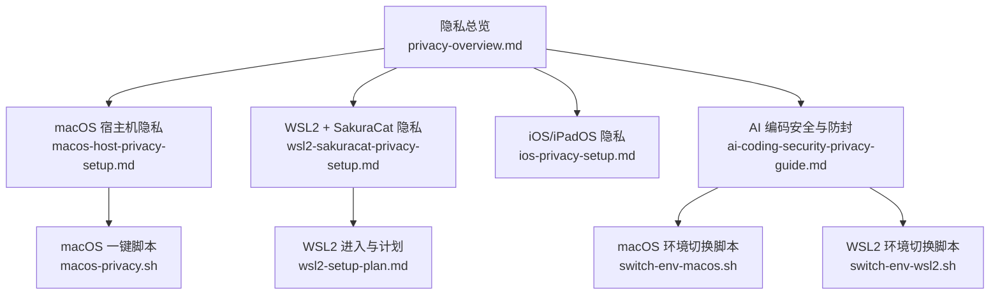
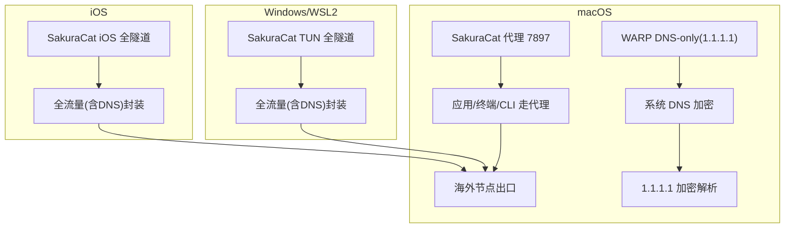
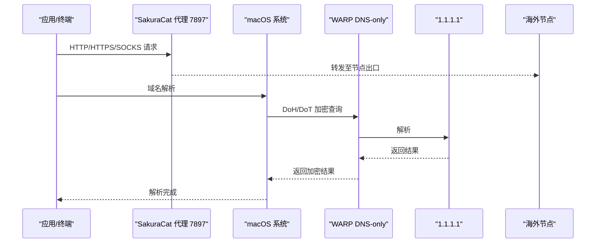
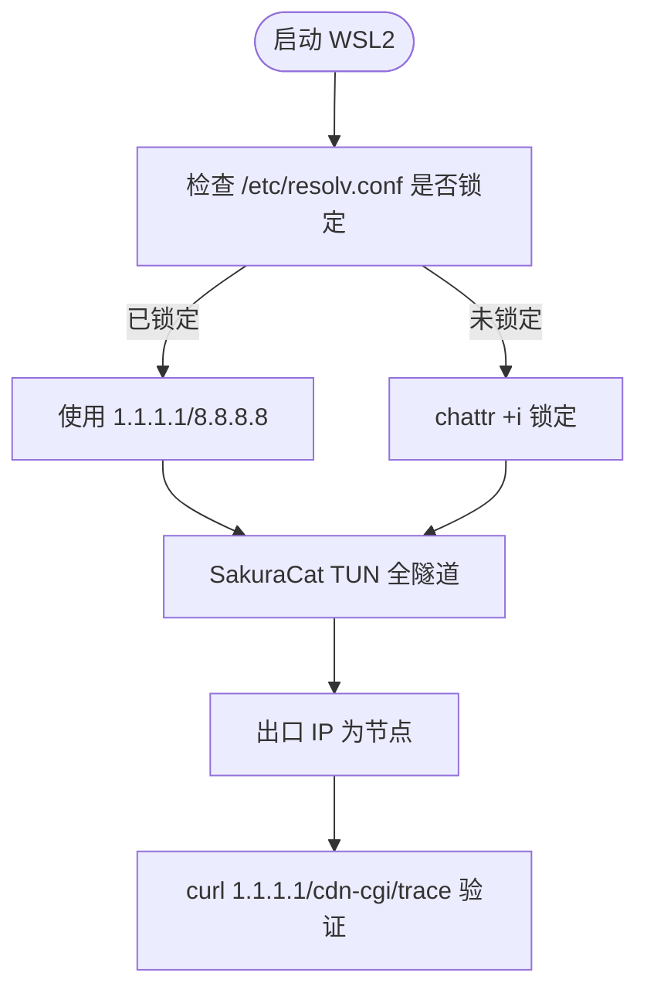
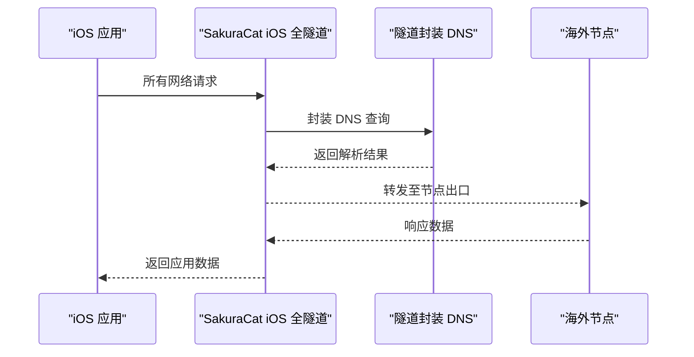
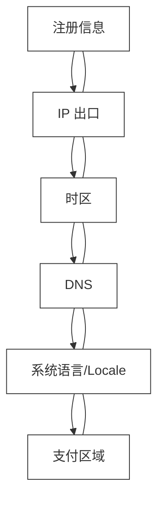
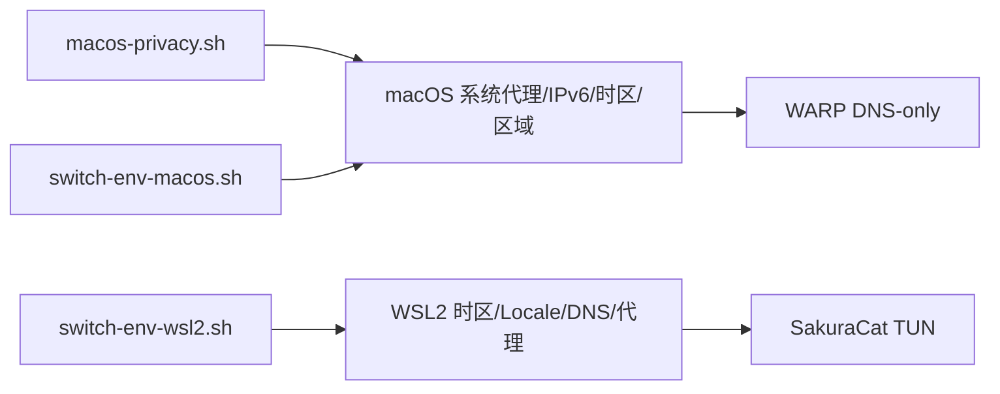

# 项目概述

<cite>
**本文引用的文件**   
- [notes/privacy-overview.md](file://notes/privacy-overview.md)
- [notes/macos-host-privacy-setup.md](file://notes/macos-host-privacy-setup.md)
- [notes/wsl2-sakuracat-privacy-setup.md](file://notes/wsl2-sakuracat-privacy-setup.md)
- [notes/ios-privacy-setup.md](file://notes/ios-privacy-setup.md)
- [notes/qoderclicn/ai-coding-security-privacy-guide.md](file://notes/qoderclicn/ai-coding-security-privacy-guide.md)
- [notes/macos-privacy.sh](file://notes/macos-privacy.sh)
- [notes/qoderclicn/switch-env-macos.sh](file://notes/qoderclicn/switch-env-macos.sh)
- [notes/qoderclicn/switch-env-wsl2.sh](file://notes/qoderclicn/switch-env-wsl2.sh)
- [notes/wsl2-setup-plan.md](file://notes/wsl2-setup-plan.md)
</cite>

## 目录
1. [引言](#引言)
2. [项目结构](#项目结构)
3. [核心组件](#核心组件)
4. [架构总览](#架构总览)
5. [详细组件分析](#详细组件分析)
6. [依赖关系分析](#依赖关系分析)
7. [性能与一致性考量](#性能与一致性考量)
8. [故障排查指南](#故障排查指南)
9. [结论](#结论)
10. [附录](#附录)

## 引言
本项目面向跨平台隐私保护与AI编码安全，目标是在 macOS、Windows、WSL2、iOS 四大平台上提供统一、可验证的隐私方案，并配套 AI 编码工具（如 Claude Code / Codex CLI）的账号防封与环境一致性策略。项目核心价值主张：
- 统一出口 IP、时区、DNS、语言区域，降低指纹识别风险
- 两套 DNS 加密机制适配不同平台特性，避免冲突与泄露
- 提供一键脚本与检查清单，确保配置可复现、可验证、可恢复

适用场景：
- 个人开发者在多平台环境下进行 AI 辅助编程，需稳定账号环境
- 企业或团队在合规前提下隔离网络与系统指纹
- 需要跨平台一致性的自动化流水线与容器化部署

技术优势：
- 基于成熟代理与隧道能力（SakuraCat），结合 Cloudflare WARP 的 DNS-only 模式，兼顾出口与解析安全
- 通过“环境一致性”原则与 WebRTC 防护，减少被风控识别的概率
- 提供脚本化落地与验证流程，降低运维复杂度

## 项目结构
仓库以文档与脚本为主，围绕四端隐私方案与 AI 编码安全展开：
- 总览与索引：notes/privacy-overview.md
- 平台专项：macOS、Windows/WSL2、iOS 的隐私设置文档
- AI 编码安全：qoderclicn/ai-coding-security-privacy-guide.md
- 自动化脚本：macos-privacy.sh、qoderclicn/switch-env-macos.sh、qoderclicn/switch-env-wsl2.sh
- 计划与参考：wsl2-setup-plan.md

图表来源
- [notes/privacy-overview.md:1-115](file://notes/privacy-overview.md#L1-L115)
- [notes/macos-host-privacy-setup.md:1-476](file://notes/macos-host-privacy-setup.md#L1-L476)
- [notes/wsl2-sakuracat-privacy-setup.md:1-580](file://notes/wsl2-sakuracat-privacy-setup.md#L1-L580)
- [notes/ios-privacy-setup.md:1-183](file://notes/ios-privacy-setup.md#L1-L183)
- [notes/qoderclicn/ai-coding-security-privacy-guide.md:1-459](file://notes/qoderclicn/ai-coding-security-privacy-guide.md#L1-L459)
- [notes/macos-privacy.sh:1-262](file://notes/macos-privacy.sh#L1-L262)
- [notes/qoderclicn/switch-env-macos.sh:1-217](file://notes/qoderclicn/switch-env-macos.sh#L1-L217)
- [notes/qoderclicn/switch-env-wsl2.sh:1-318](file://notes/qoderclicn/switch-env-wsl2.sh#L1-L318)
- [notes/wsl2-setup-plan.md:1-433](file://notes/wsl2-setup-plan.md#L1-L433)

章节来源
- [notes/privacy-overview.md:1-115](file://notes/privacy-overview.md#L1-L115)

## 核心组件
- 统一出口与代理层：SakuraCat（混合端口 7897，HTTP/SOCKS5；Windows/WSL2 支持 TUN 全抓流量）
- DNS 加密层：
  - macOS：Cloudflare WARP 仅 DNS 模式（DoH/DoT），不接管应用流量
  - Windows/WSL2/iOS：TUN/全隧道封装 DNS，无需 WARP
- 环境一致性：时区 America/New_York、DNS 1.1.1.1、区域 en_US
- 浏览器 WebRTC 防护：保留 mDNS 候选，必要时禁用 WebRTC 或收紧 ICE 策略
- 自动化与验证：macos-privacy.sh 提供 apply/verify/check/restore；各平台文档含验证步骤

章节来源
- [notes/privacy-overview.md:10-26](file://notes/privacy-overview.md#L10-L26)
- [notes/macos-host-privacy-setup.md:11-32](file://notes/macos-host-privacy-setup.md#L11-L32)
- [notes/wsl2-sakuracat-privacy-setup.md:1-22](file://notes/wsl2-sakuracat-privacy-setup.md#L1-L22)
- [notes/ios-privacy-setup.md:11-31](file://notes/ios-privacy-setup.md#L11-L31)
- [notes/macos-privacy.sh:1-18](file://notes/macos-privacy.sh#L1-L18)

## 架构总览
本方案在四类环境上采用两套不同的 DNS 加密机制，以避免平台差异导致的冲突与泄露：
- macOS：SakuraCat 代理 7897（出口）+ Cloudflare WARP DNS-only（加密 DNS）
- Windows/WSL2/iOS：SakuraCat TUN/全隧道（抓全流量，含 DNS），无需 WARP

图表来源
- [notes/privacy-overview.md:10-26](file://notes/privacy-overview.md#L10-L26)
- [notes/macos-host-privacy-setup.md:11-32](file://notes/macos-host-privacy-setup.md#L11-L32)
- [notes/wsl2-sakuracat-privacy-setup.md:1-22](file://notes/wsl2-sakuracat-privacy-setup.md#L1-L22)
- [notes/ios-privacy-setup.md:11-31](file://notes/ios-privacy-setup.md#L11-L31)

## 详细组件分析

### 组件一：macOS 宿主机隐私（代理 + WARP DNS-only）
- 架构要点
  - 不开启 TUN，避免与 WARP 抢网卡/路由
  - 系统代理指向 127.0.0.1:7897（HTTP/HTTPS/SOCKS）
  - WARP 必须为“仅 DNS”模式，不可全隧道
  - 关闭 iCloud 私有中继，防止覆盖 DNS/VPN
  - 建议关闭 IPv6 或确保 IPv6 DNS 也经加密通道
- 关键配置项
  - 时区：America/New_York（关闭自动时区，保留网络时间）
  - 区域/语言：en_US，AppleLanguages 优先英文
  - 终端环境变量：http_proxy/https_proxy/all_proxy
  - WebRTC：Safari/Firefox/Chrome 分别处理，保留 mDNS 候选
- 验证方法
  - scutil --dns 查看解析链是否包含 1.1.1.1
  - curl https://1.1.1.1/cdn-cgi/trace 检查 ip/loc
  - browserleaks.com 综合检测

图表来源
- [notes/macos-host-privacy-setup.md:84-142](file://notes/macos-host-privacy-setup.md#L84-L142)
- [notes/macos-host-privacy-setup.md:169-228](file://notes/macos-host-privacy-setup.md#L169-L228)
- [notes/macos-host-privacy-setup.md:258-285](file://notes/macos-host-privacy-setup.md#L258-L285)

章节来源
- [notes/macos-host-privacy-setup.md:11-32](file://notes/macos-host-privacy-setup.md#L11-L32)
- [notes/macos-host-privacy-setup.md:56-142](file://notes/macos-host-privacy-setup.md#L56-L142)
- [notes/macos-host-privacy-setup.md:169-228](file://notes/macos-host-privacy-setup.md#L169-L228)
- [notes/macos-host-privacy-setup.md:258-285](file://notes/macos-host-privacy-setup.md#L258-L285)

### 组件二：Windows/WSL2 隐私（TUN 全隧道）
- 架构要点
  - Windows 开启 SakuraCat TUN，全流量（含 UDP/DNS）被捕获
  - WSL2 继承 Windows TUN，无需额外代理变量（但终端可通过 7897 显式使用）
  - DNS 由隧道封装加密，无需 WARP
  - 锁定 /etc/resolv.conf，禁止 WSL 自动生成
- 关键配置项
  - 时区：America/New_York（WSL2 与 Windows 同步）
  - 语言/Locale：en_US.UTF-8
  - DNS：nameserver 1.1.1.1/8.8.8.8，chattr +i 锁定
  - 代理：可选 http_proxy/https_proxy/all_proxy 指向 127.0.0.1:7897
- 验证方法
  - nslookup/dig 确认 DNS 服务器
  - curl 检查出口 IP/地理位置
  - 浏览器测试 WebRTC（Windows 侧）

图表来源
- [notes/wsl2-sakuracat-privacy-setup.md:137-176](file://notes/wsl2-sakuracat-privacy-setup.md#L137-L176)
- [notes/wsl2-sakuracat-privacy-setup.md:179-212](file://notes/wsl2-sakuracat-privacy-setup.md#L179-L212)
- [notes/wsl2-sakuracat-privacy-setup.md:214-276](file://notes/wsl2-sakuracat-privacy-setup.md#L214-L276)

章节来源
- [notes/wsl2-sakuracat-privacy-setup.md:1-22](file://notes/wsl2-sakuracat-privacy-setup.md#L1-L22)
- [notes/wsl2-sakuracat-privacy-setup.md:137-176](file://notes/wsl2-sakuracat-privacy-setup.md#L137-L176)
- [notes/wsl2-sakuracat-privacy-setup.md:179-212](file://notes/wsl2-sakuracat-privacy-setup.md#L179-L212)
- [notes/wsl2-sakuracat-privacy-setup.md:214-276](file://notes/wsl2-sakuracat-privacy-setup.md#L214-L276)

### 组件三：iOS/iPadOS 隐私（全隧道优先）
- 架构要点
  - 优先使用 SakuraCat iOS 全隧道（NETunnelProvider），设备全部流量（含 DNS）经隧道出口
  - 若仅提供代理，则配合 Cloudflare 1.1.1.1/WARP 做 DNS 加密
  - 关闭 iCloud 私有中继，避免覆盖 DNS/VPN
- 关键配置项
  - 时区：New York（America/New_York）
  - 区域/语言：United States / English (US)
  - Safari WebRTC：保留 mDNS 候选，必要时用内容拦截器加固
- 验证方法
  - Safari 打开 1.1.1.1/cdn-cgi/trace 检查 loc/ip
  - browserleaks.com/webrtc 检查无公网 IP 泄露

图表来源
- [notes/ios-privacy-setup.md:11-31](file://notes/ios-privacy-setup.md#L11-L31)
- [notes/ios-privacy-setup.md:64-86](file://notes/ios-privacy-setup.md#L64-L86)
- [notes/ios-privacy-setup.md:102-122](file://notes/ios-privacy-setup.md#L102-L122)

章节来源
- [notes/ios-privacy-setup.md:11-31](file://notes/ios-privacy-setup.md#L11-L31)
- [notes/ios-privacy-setup.md:64-86](file://notes/ios-privacy-setup.md#L64-L86)
- [notes/ios-privacy-setup.md:102-122](file://notes/ios-privacy-setup.md#L102-L122)

### 组件四：AI 编码安全与防封（环境一致性）
- 检测维度与时序
  - 系统时区、日期分隔符、代理环境变量、IP 地址、DNS 解析、系统语言/Locale、WebRTC 泄漏、使用模式等
- 一致性原则
  - 注册信息 ≈ IP 出口 ≈ 时区 ≈ DNS ≈ 系统语言 ≈ 支付区域
- 最佳实践
  - 正规渠道订阅、固定干净网络、一人一号、控制频率、遵守政策
  - 沙箱/权限模型（Claude Code/Codex）、.claudeignore、permissions.deny
  - 容器化运行（Docker/OrbStack/Colima），限制文件系统与网络

图表来源
- [notes/qoderclicn/ai-coding-security-privacy-guide.md:100-168](file://notes/qoderclicn/ai-coding-security-privacy-guide.md#L100-L168)
- [notes/qoderclicn/ai-coding-security-privacy-guide.md:138-168](file://notes/qoderclicn/ai-coding-security-privacy-guide.md#L138-L168)

章节来源
- [notes/qoderclicn/ai-coding-security-privacy-guide.md:100-168](file://notes/qoderclicn/ai-coding-security-privacy-guide.md#L100-L168)
- [notes/qoderclicn/ai-coding-security-privacy-guide.md:138-168](file://notes/qoderclicn/ai-coding-security-privacy-guide.md#L138-L168)

## 依赖关系分析
- 平台依赖
  - macOS：SakuraCat 代理 + WARP DNS-only；系统代理与 DNS 分离
  - Windows/WSL2：SakuraCat TUN 全隧道；WSL2 继承 Windows 网络栈
  - iOS：SakuraCat iOS 全隧道优先；必要时搭配 Cloudflare 1.1.1.1/WARP
- 脚本依赖
  - macos-privacy.sh：apply/verify/check/restore，管理时区/区域/IPv6/系统代理/终端 locale
  - switch-env-macos.sh：多区域切换（注意与 WARP 的 DNS 冲突）
  - switch-env-wsl2.sh：WSL2 多区域切换，同步 Windows 宿主机时区/DNS
- 外部服务
  - Cloudflare WARP（DNS-only）
  - 1.1.1.1/cdn-cgi/trace（出口验证）
  - browserleaks.com（综合自查）

图表来源
- [notes/macos-privacy.sh:1-18](file://notes/macos-privacy.sh#L1-L18)
- [notes/qoderclicn/switch-env-macos.sh:1-217](file://notes/qoderclicn/switch-env-macos.sh#L1-L217)
- [notes/qoderclicn/switch-env-wsl2.sh:1-318](file://notes/qoderclicn/switch-env-wsl2.sh#L1-L318)

章节来源
- [notes/macos-privacy.sh:1-18](file://notes/macos-privacy.sh#L1-L18)
- [notes/qoderclicn/switch-env-macos.sh:1-217](file://notes/qoderclicn/switch-env-macos.sh#L1-L217)
- [notes/qoderclicn/switch-env-wsl2.sh:1-318](file://notes/qoderclicn/switch-env-wsl2.sh#L1-L318)

## 性能与一致性考量
- 性能
  - TUN 全隧道对 CPU/内存有一定开销，但能确保 UDP/命令行流量被捕获
  - WARP DNS-only 仅加密 DNS，不影响应用流量性能
  - 关闭 IPv6 可减少绕过风险，但可能影响部分服务兼容性
- 一致性
  - 时区、DNS、区域三者一致是防指纹的关键
  - 终端/CLI 必须显式设置代理变量（macOS 代理模式下）
  - 容器内需注入 host.container.internal:7897（macOS）或 host.docker.internal:7897（Windows Docker）

章节来源
- [notes/privacy-overview.md:29-38](file://notes/privacy-overview.md#L29-L38)
- [notes/macos-host-privacy-setup.md:118-142](file://notes/macos-host-privacy-setup.md#L118-L142)
- [notes/macos-host-privacy-setup.md:337-463](file://notes/macos-host-privacy-setup.md#L337-L463)

## 故障排查指南
- macOS
  - WARP 模式错误：务必保持 DNS-only，否则出口 IP 会被覆盖
  - iCloud 私有中继：会覆盖系统 DNS/VPN，必须关闭
  - IPv6 泄露：关闭 IPv6 或将 IPv6 DNS 指向加密通道
  - WebRTC：Safari 保留 mDNS 候选，Firefox/Chrome 扩展或 flags 加固
- Windows/WSL2
  - DNS 被覆盖：锁定 /etc/resolv.conf，禁止 WSL 自动生成
  - 代理不工作：确认 SakuraCat 运行且端口 7897 开放
  - 时区不同步：WSL2 与 Windows 同步时区，避免不一致
- iOS
  - 私有中继：关闭 iCloud 私有中继
  - WebRTC：Safari 默认行为较安全，必要时用内容拦截器加固

章节来源
- [notes/macos-host-privacy-setup.md:113-142](file://notes/macos-host-privacy-setup.md#L113-L142)
- [notes/macos-host-privacy-setup.md:169-228](file://notes/macos-host-privacy-setup.md#L169-L228)
- [notes/wsl2-sakuracat-privacy-setup.md:371-452](file://notes/wsl2-sakuracat-privacy-setup.md#L371-L452)
- [notes/ios-privacy-setup.md:77-86](file://notes/ios-privacy-setup.md#L77-L86)

## 结论
本项目通过“两套 DNS 加密机制 + 环境一致性原则”，在 macOS、Windows、WSL2、iOS 四大平台实现了统一的隐私保护方案。其核心价值在于：
- 出口 IP 与时区/区域一致，降低指纹识别风险
- 针对平台差异选择最优 DNS 加密路径，避免冲突与泄露
- 提供脚本化落地与验证流程，确保可复现、可维护

对于初学者，建议从总览与平台专项文档入手，逐步完成时区、DNS、区域与 WebRTC 的配置；对于有经验的开发者，可结合脚本与容器化方案实现自动化与隔离。

## 附录
- 快速命令速查（macOS）
  - 时区/区域/代理/IPv6 查看与设置
  - WARP 状态与 DNS 解析链检查
  - 出口 IP 验证（1.1.1.1/cdn-cgi/trace）
- 快速命令速查（WSL2）
  - 时区/Locale/DNS/代理设置
  - resolv.conf 锁定与恢复
  - 出口 IP 验证
- 快速命令速查（iOS）
  - 时区/区域/语言设置
  - 关闭私有中继
  - Safari WebRTC 检查

章节来源
- [notes/macos-host-privacy-setup.md:35-53](file://notes/macos-host-privacy-setup.md#L35-L53)
- [notes/wsl2-sakuracat-privacy-setup.md:475-502](file://notes/wsl2-sakuracat-privacy-setup.md#L475-L502)
- [notes/ios-privacy-setup.md:33-45](file://notes/ios-privacy-setup.md#L33-L45)