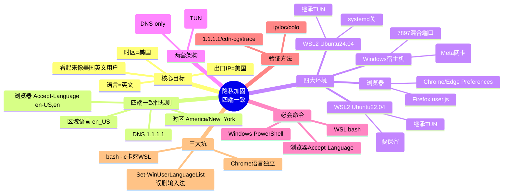

# 隐私加固 · 小白必读 Cheatsheet（教师视角）

> **写给「小白」的话**：本方案的目标只有一句话——**让全平台看起来都像「一个在美国、说英文、走美国出口」的人**。
> 只要时区、DNS、语言、浏览器语言头这四项「四端一致」，你的指纹就不会露馅。
> 本文把整个会话里的知识浓缩成「必知知识 + 必知命令 + 一张图」，你照着抄就能用。
> **最后更新**: 2026-07-26

---

## 〇、思维导图（先看这张图建立全局观）



> 看不懂 mermaid？没关系，下面用文字再拆一遍。

---

## 一、必知知识（考试重点，每条都懂即可）

### 1. 为什么叫「四端一致」？
你同时在 4 个地方活动，它们必须说同一套「故事」：

| 环境 | 是什么 | 关键点 |
|---|---|---|
| Windows 宿主机 | 你的电脑本身 | SakuraCat **TUN 模式**（自动抓全部流量） |
| WSL2 Ubuntu-24.04 | Windows 里的 Linux | **继承** Windows 的 TUN 隧道 |
| WSL2 Ubuntu-22.04 | Windows 里另一个 Linux（默认实例） | 同上，但**有 systemd，别动** |
| 浏览器 | Chrome/Edge/Firefox | 浏览器有**自己独立**的语言设置 |

> **小白类比**：4 个环境就像 4 个「马甲」，如果一个说英文、一个说中文，别人一眼就知道是同一人伪装——穿帮。

### 2. 四个必须统一的「指纹」项（口诀：时·DNS·语·头）
1. **时区** = `America/New_York`（纽约）→ Windows 里叫 `Eastern Standard Time`
2. **DNS** = `1.1.1.1`（隧道里加密，不用你手设）
3. **区域/语言** = `en_US` / `en_US.UTF-8` → Windows 区域设为美国
4. **浏览器 Accept-Language 头** = `en-US,en` ← **最容易被忽略！**

> **判读口诀**：出口 IP 是美国，时区也得是美国，语言也得是英文，三者一致才不露馅。

### 3. 两套「VPN 架构」的区别（最容易混）
- **Windows / WSL2 / iOS = 全隧道（TUN）**：SakuraCat 开 TUN 后，虚拟网卡 `Meta` 抓走**所有流量**（含命令行、UDP、DNS）。你**不用**手设任何代理变量。
- **macOS = 代理 + WARP**：macOS 上 SakuraCat 用「代理 7897」出口，再配 **Cloudflare WARP（只做 DNS 加密，不开全隧道）**。终端必须手设 `http_proxy=127.0.0.1:7897`。

> 为什么 macOS 不用 TUN？因为 TUN 会和 WARP 抢网卡。**记住：WARP 在 macOS 只能是 DNS 模式，千万别开全隧道。**

### 4. 浏览器 Accept-Language 是「独立」的（核心坑）
- Chrome / Edge 每个用户配置里有一项 `intl.accept_languages`，它**覆盖**系统语言。
- 你改了 Windows 系统语言为英文，**Chrome 仍可能发 `zh-CN` 头** → 露馅。
- 必须**退出浏览器后**直接改它的配置文件（Chrome 用 `Preferences` JSON，Firefox 用 `user.js`）。

### 5. WSL2 为什么要点三个文件？
`.bashrc` 里有「非交互就退出」的保护代码，所以只写 `.bashrc` 不够：
- `.bashrc` → 你手动开终端时生效
- `.profile` → 登录 shell 生效
- `/etc/environment` → PAM 全局，所有程序都读

> 脚本 `wsl2-privacy.sh` 会自动把环境变量写进这三个地方，你不用手改。

### 6. 一个危险命令（血泪教训）
`Set-WinUserLanguageList en-US -Force` 会**清空输入法列表**，把你的搜狗/中文输入法删掉！
正确写法是「新建列表再追加中文」（见下方命令区）。中文输入法丢了也能救回（写注册表 + 运行搜狗修复工具 + 注销）。

---

## 二、必知命令（抄作业区，按环境分类）

### A. Windows 宿主机（PowerShell，管理员不必、但改区域需普通用户权限即可）

```powershell
# ① 时区设为美东
Set-TimeZone -Id "Eastern Standard Time"

# ② 区域设为美国（GeoId 244=US；45=CN，千万别设回 45）
Set-Culture en-US
Set-WinHomeLocation -GeoId 244

# ③ 语言列表：英文为主 + 中文输入法（安全写法，不丢搜狗）
$list = New-WinUserLanguageList en-US
$list.Add("zh-Hans-CN")        # 自动挂上微软拼音；搜狗需单独修复
Set-WinUserLanguageList $list -Force

# ④ 验证 TUN 网卡是否生效（应看到 Meta 状态 Up）
Get-NetAdapter | Where-Object { $_.Name -eq "Meta" } | Select-Object Name, Status

# ⑤ 验证出口（看 ip= / loc= / colo= 三行）
(Invoke-RestMethod https://1.1.1.1/cdn-cgi/trace) | Select-String -Pattern "ip=|loc=|colo="
```

> **正确结果示例**：`ip=23.172.200.71` `loc=US` `colo=SJC`。
> **不要用 `ipinfo.io`** 验证（会限流 429），统一用上面的 `1.1.1.1/cdn-cgi/trace`。

### B. WSL2（在任意终端里）

```bash
# 进入指定实例（24.04 / 22.04 二选一）
wsl -d Ubuntu-24.04
wsl -d Ubuntu-22.04

# 一键加固（自动检测 systemd、写时区/DNS/三处环境变量）
sudo ./wsl2-privacy.sh apply

# 验证（只看文件是否到位，不会卡死）
sudo ./wsl2-privacy.sh verify

# 网络连通测试（HTTP 200 + 出口 IP 应为美国）
bash net-test.sh

# 单独看几项
timedatectl                                   # 看时区
cat /etc/resolv.conf                          # 看 DNS（应为 198.18.0.2，属正常）
cat /etc/environment                          # 看全局环境变量
lsattr /etc/resolv.conf                       # 看 DNS 是否被锁（有 i 标志=已锁）

# 卡死/要重来时
wsl --shutdown                                # 关掉所有 WSL（在 Windows 侧执行）
```

> ⚠️ **永远不要在脚本里用 `bash -ic`**（没有 TTY 会卡死、甚至搞崩 WSL 服务）。`wsl2-privacy.sh` 已避开。

### C. 浏览器 Accept-Language 修复（Windows 下，退出浏览器后执行）

```powershell
# Chrome / Edge：用 Python 改 Local State + 所有 Profile 的 Preferences
# 核心就是把 intl.accept_languages 改成 "en-US,en"
# 详见 windows-host-privacy-setup.md 第 4.2 节脚本（PowerShell + Python 一行版）
# Firefox：把下面内容写进 user.js
# user_pref("intl.accept_languages", "en-US,en");
```

> 改完**完全退出浏览器再重开**。Chrome 开了「同步」可能会把 zh-CN 又加回来 → 同步设置里关掉「语言」同步。

---

## 三、验证清单（每次改完照着打勾）

- [ ] Windows：时区 = `Eastern Standard Time`
- [ ] Windows：区域 `GeoId = 244`，Culture = `en-US`
- [ ] Windows：TUN 网卡 `Meta` 状态 `Up`
- [ ] Windows：`1.1.1.1/cdn-cgi/trace` 显示 `loc=US`
- [ ] WSL2(24.04)：时区纽约、resolv.conf=198.18.0.2、三处环境变量到位
- [ ] WSL2(22.04)：同上，且 systemd 仍保留
- [ ] WSL2：`net-test.sh` 全部 HTTP 200、出口 IP 美国
- [ ] 浏览器：Accept-Language = `en-US,en`（用 browserleaks.com/ip 验证）
- [ ] 中文输入法**仍然可用**（没被误删）

---

## 四、三大坑速记（考前必背）

1. **Chrome 语言独立**：改系统语言 ≠ 改浏览器语言头，必须单独改 `Preferences`/`user.js`。
2. **`Set-WinUserLanguageList en-US -Force` 会删输入法**：永远用 `New-WinUserLanguageList` + `Add` 的安全写法。
3. **`bash -ic` 会卡死 WSL**：脚本里禁用；验证改用文件检查 + `net-test.sh`。

---

## 五、配套脚本一览（都在 `notes/` 里）

| 脚本 | 用途 | 怎么用 |
|---|---|---|
| `wsl2-privacy.sh` | WSL2 双实例一键加固/验证 | `sudo ./wsl2-privacy.sh apply` |
| `net-test.sh` | WSL 内联网测试 | `bash net-test.sh` |
| `verify-env.sh` | WSL 内环境校验 | `bash verify-env.sh` |
| `macos-privacy.sh` | macOS 一键加固（含 Chrome 语言） | `sudo bash macos-privacy.sh apply` |

---

**教师寄语**：先记住「时·DNS·语·头」四字口诀，再记住 Windows 用 TUN、macOS 用代理+WARP，最后避開那三个坑——你就已经超过 90% 的初学者了。剩下的交给 `wsl2-privacy.sh` 和这份清单即可。
