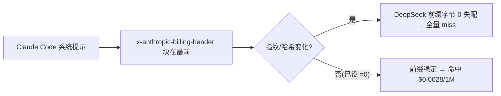

# REF: Claude Code × DeepSeek 缓存命中优化 — 前缀稳定性 / x-anthropic-billing-header / cc-switch 场景

DeepSeek API 默认开启**硬盘级自动前缀缓存**,命中 token 成本只有未命中的 1/50~1/120,且不需要 `cache_control`、不需要改代码——唯一敌人是**请求前缀不稳定**。Claude Code 注入的 `x-anthropic-billing-header`(含 `cc_version` + 动态指纹)正是打穿前缀的元凶,已通过 `CLAUDE_CODE_ATTRIBUTION_HEADER=0` 解决。

> **核心结论(前置):**
> - DeepSeek 缓存 = 自动 + 免费 + 无需 `cache_control`,命中/未命中输入价差当前 **50~120 倍**(V4 Flash 50 倍 / V4 Pro 120 倍,历史 10 倍)
> - 缓存按**请求体前缀字节**匹配,前缀一变 = 整段重算
> - Claude Code 在系统提示开头注入 `x-anthropic-billing-header: cc_version=…; cc_entrypoint=cli; cch=<动态哈希>` 文本块,指纹随会话 / 升级 / 请求变化
> - **解法已落地**:Ubuntu-24.04 `~/.bashrc:154` `export CLAUDE_CODE_ATTRIBUTION_HEADER=0`(用户 `hqzxj`,交互 shell 实测生效,`printenv` 返回 `0`)
> - `claude-code-cache-fix` 按 Anthropic 提示缓存语义设计,对本场景不适用(第 3 节)

姊妹篇:设备标识符 / 抓包 / 隐私防护见 [`REF-claude-code-privacy-analysis.md`](REF-claude-code-privacy-analysis.md)。

## 1. DeepSeek 缓存机制

### 1.1 自动、免费、无感知

DeepSeek 自 2024-08 起上线 **Context Caching on Disk**,对所有用户默认开启:

- 无需 `cache_control`、无需任何 SDK 或代码改动,请求照常发
- 命中 token 按特价计费,缓存本身存储免费、不额外收费
- 每个请求触发硬盘缓存构建,**后续请求如果前缀与缓存重叠,重叠部分按命中计费**

### 1.2 匹配规则:必须前缀逐字节完整匹配

| 规则 | 说明 |
|---|---|
| 从第 0 个 token 起匹配 | 只有与已持久化**前缀单元**完全一致的部分才算命中;**中间部分**匹配不算 |
| 最小单元 | 按 64 token 的存储单元切分,不足 64 token 的内容不缓存 |
| 持久化时机 | 请求边界、公共前缀检测、固定 token 间隔,三种路径把前缀切成独立单元 |
| best-effort | 不保证 100% 命中;缓存构建需数秒,闲置后自动清除(通常数小时~数天) |

> **推论:任何对提示前缀的字节级改动(哪怕系统提示里塞入一行动态日期/哈希),都会从命中变成整段未命中。**

### 1.3 命中价差(官方 Models & Pricing,2026-08 核对)

| 模型 | 输入·缓存命中 /1M | 输入·缓存未命中 /1M | 倍差 | 输出 /1M |
|---|---|---|---|---|
| `deepseek-v4-flash` | $0.0028 | $0.14 | **50×** | $0.28 |
| `deepseek-v4-pro` | $0.003625 | $0.435 | **120×** | $0.87 |
| 历史(V2 时代) | $0.014 | $0.14 | 10× | — |

本机 Claude 走的是 `claude-haiku-4-5 → deepseek-v4-flash` 映射(见 `SKILL-2-ccswitch-domestic-wiring.md`),按 Flash 定价,命中即省 98% 输入成本。价格会随官方调整,以 [Models & Pricing](https://api-docs.deepseek.com/quick_start/pricing) 为准。

### 1.4 一句话总结

**前缀稳定 = 命中白嫖;前缀一抖 = 全量重算。唯一敌人是前缀不稳定。**

## 2. 前缀不稳定的元凶:x-anthropic-billing-header

### 2.1 Claude Code 往系统提示开头塞了一段"计费头"

Claude Code 在**系统提示最前面**注入一个文本块(attribution block),官方文档称之为 billing header:

```
x-anthropic-billing-header: cc_version=2.1.113.244; cc_entrypoint=cli; cch=b29b8;
```

各字段含义:

| 字段 | 含义 | 稳定性 |
|---|---|---|
| `cc_version` | 客户端版本 + 会话指纹 | **版本段随升级变**(当前 2.1.222),尾部指纹随会话/请求变 |
| `cc_entrypoint` | 入口类型(cli / vs-code / github-action) | 稳定 |
| `cch=` | 每次请求的哈希 | **每个请求都在变**(社区实测 2.1.113 起重新跳动) |

### 2.2 为什么它会打穿 DeepSeek 缓存

- 该块位于 `system` 数组的第一个位置 = **请求体前缀的第 0 个字节附近**
- 官方协议说明:`api.anthropic.com` 端点在处理前会**按位置剥掉**这个块,所以对 Anthropic 自家缓存无害;但任何自定义 base_url / 网关 / 第三方上游都会把它**原样当作提示文本**,进入缓存 key
- DeepSeek 缓存 key 就是请求体前缀 → 指纹一变,前缀从字节 0 击穿,每轮全量重算



### 2.3 官方口径 + 本机解法

- 官方 env-vars 文档:`CLAUDE_CODE_ATTRIBUTION_HEADER` 设 `0` 即**省略**该 attribution 块,自 2.1.181 起官方建议自定义 base_url / 按请求体缓存的网关 / 转发第三方时设 `0`
- 本机**已设**(Ubuntu-24.04 用户 `hqzxj`,非默认 `wsl` 用户 `hqzxjczx`):

```bash
# ~/.bashrc:154
export CLAUDE_CODE_ATTRIBUTION_HEADER=0
```

验证(交互 shell 下生效):

```bash
wsl -d Ubuntu-24.04 -- bash -ic 'printenv CLAUDE_CODE_ATTRIBUTION_HEADER'   # 输出 0
```

> 注意区分:这个 env var 只管 **API billing header**,与 git commit 的 "Generated with Claude Code" 归属(`attribution` 偏好项)是两回事,互不影响。

## 3. claude-code-cache-fix 核实:存在但不适用

项目:[`cnighswonger/claude-code-cache-fix`](https://github.com/cnighswonger/claude-code-cache-fix)(proxy 模式默认监听 `localhost:9801` 拦截 `POST /v1/messages`;preload 模式用 Node `--import` patch `fetch`)。它解决的确实是同类问题(cc_version 指纹不稳定、附件块漂移、工具序抖动),但**对本场景不适用**,4 个原因:

| # | 原因 | 详情 |
|---|---|---|
| 1 | **Anthropic 语义** | 核心扩展(`fingerprint-strip`、`cache-control-normalize`、`ttl-management`、4-marker breakpoint)全部围绕 Anthropic 提示缓存的显式 `cache_control` 标记 / TTL / 头回报设计;DeepSeek 是**纯字节前缀自动缓存**,无 `cache_control` 语义,这套管线大半落空 |
| 2 | **端口/链路叠加冲突** | proxy 默认占 `localhost:9801`(本机 9801 当前虽未被占用,但与现有单代理拓扑冲突):需插在 Claude Code 与 cc-switch(`15721`)之间形成两跳转发,双份配置、多一层故障点,纯属冗余 |
| 3 | **DeepSeek 侧无效** | 它对用户的核心价值(缓存命中统计、`~/.claude/quota-status` 文件)依赖 Anthropic 响应头/`cache_control` 语义;DeepSeek 只在响应体 `usage` 字段回报命中,且会**忽略** `cache_control` 标记 |
| 4 | **fingerprint 已被源头解决** | 它要剥的 cc_version 指纹,已由 `CLAUDE_CODE_ATTRIBUTION_HEADER=0` 在客户端生成阶段消除,不需要再在代理层二次剥离 |

> 同类对齐代理(如 permafrost)同理:价值集中在对 **MCP 服务器、高度自定义工具集、并行子代理**造成的工具序/附件抖动;本场景单 agent + 固定工具集 + 指纹已关,命中率本身已接近 DeepSeek 共享 system prompt 的热前缀水平,不需要再上代理。

## 4. cc-switch 场景:已做对 + 建议

### 4.1 已做对的 3 项

| # | 项 | 说明 |
|---|---|---|
| 1 | `CLAUDE_CODE_ATTRIBUTION_HEADER=0`(`.bashrc:154`) | 消除 attribution 指纹,前缀不再带动态哈希 |
| 2 | 模型名固定映射 | `ANTHROPIC_MODEL=claude-haiku-4-5` → cc-switch 固定映射 `deepseek-v4-flash`,模型不抖、路由稳定 |
| 3 | 请求体顺序透传 | cc-switch 对 `system`/`messages` 做格式翻译但保留顺序与内容,长对话后续轮次的 `system + 历史` 前缀稳定,天然命中 |

### 4.2 建议操作 5 条

| # | 建议 | 原理 |
|---|---|---|
| 1 | **少用 `--resume`** | resume 会让附件块(CLAUDE.md / 插件 / MCP / 钩子)从 `messages[0]` 漂移到后段,改变前缀 → 整轮重算。能续的会话就续,别反复 resume |
| 2 | **少开新会话** | 新会话 = 新 conversation 指纹 + 冷前缀,首轮必然 miss;零散小任务合并进同一会话,让前缀一直热着 |
| 3 | **保持 CLAUDE.md · 插件 · MCP 稳定** | 工具/附件定义乱序、增删、启停 MCP 都会从字节 0 击穿前缀;固定工具集,别在工作间隙频繁改环境 |
| 4 | **验证命中** | 看 DeepSeek 响应 `usage.prompt_cache_hit_tokens` / `prompt_cache_miss_tokens`(方法见附录),不靠猜 |
| 5 | **错峰保热度** | 缓存闲置数小时~数天会被清除;同一前缀的重要任务保持使用节奏,别隔太久再用导致冷掉重建 |

## 5. 不推荐

| 做法 | 为什么不推荐 |
|---|---|
| `claude-code-cache-fix` | 见第 3 节:Anthropic 语义 + 链路冗余 + DeepSeek 侧无效 + fingerprint 已由 env var 解决 |
| 手动加 `cache_control` | DeepSeek 官方明确缓存**默认自动开启、无需任何代码/接口改动**;`cache_control` 是 Anthropic 语义,DeepSeek 会忽略,注入反而可能干扰 cc-switch 翻译,纯属多余 |
| 把动态内容写进顶层 `CLAUDE.md` | 如 `git status`、日期、随机哈希等每次变化的文本,一进前缀就把整段打穿;动态内容应放消息体内(每次都会变的部分)而不是稳定前缀里 |

## 6. 关键结论速查表

| 问题 | 答案 |
|---|---|
| DeepSeek 缓存要手动开启/传 `cache_control` 吗? | 不用,默认自动开启,硬盘级前缀缓存 |
| 命中/未命中输入价差? | 当前 V4:Flash 50×、Pro 120×(历史 10×);Flash 命中 $0.0028 vs 未命中 $0.14 |
| 缓存命中条件? | 从第 0 个 token 起与已持久化前缀单元**逐字节完整匹配**,中间匹配不算 |
| 缓存会一直留着吗? | 不会,闲置数小时~数天自动清除;构建需数秒,best-effort 不保证 100% |
| 前缀不稳定的元凶? | `x-anthropic-billing-header`(cc_version 版本段 + 会话指纹 + `cch=` 动态哈希)位于系统提示开头 |
| 怎么消除? | `CLAUDE_CODE_ATTRIBUTION_HEADER=0`(已设,`~/.bashrc:154`,Ubuntu-24.04 用户 hqzxj) |
| `claude-code-cache-fix` 适用吗? | 不适用:Anthropic 语义 / 9801 链路叠加冲突 / DeepSeek 侧无效 / fingerprint 已源头解决 |
| 已做对的? | env var 已关指纹、模型映射固定(haiku→flash)、cc-switch 请求体顺序透传 |
| 最该注意的操作? | 少 `--resume`、少开新会话、保持 CLAUDE.md/插件/MCP 稳定、验证命中、错峰保热度 |
| 怎么验证命中? | DeepSeek 响应 `usage.prompt_cache_hit_tokens` / `prompt_cache_miss_tokens`(见附录) |

## 附录:验证命中方法

### 方法 A:看 DeepSeek 响应的 usage 字段(推荐)

DeepSeek 在每次响应里回报命中情况:

```json
"usage": {
  "prompt_cache_hit_tokens": 6784,
  "prompt_cache_miss_tokens": 122,
  "prompt_tokens": 6906,
  ...
}
```

`prompt_tokens = hit + miss`。命中率 = `hit / prompt_tokens`。同一前缀连发两次,第二次 `hit_tokens > 0` 即为命中。

直连 DeepSeek(OpenAI 格式)自测:

```bash
PAYLOAD='{"model":"deepseek-v4-flash","messages":[{"role":"user","content":"1+1=? 请只回答数字"}]}'
# 第一次(建缓存):hit≈0
curl -s https://api.deepseek.com/chat/completions -H "Authorization: Bearer $DEEPSEEK_API_KEY" -H 'Content-Type: application/json' -d "$PAYLOAD" | jq '.usage'
# 第二次(同前缀):prompt_cache_hit_tokens > 0
curl -s https://api.deepseek.com/chat/completions -H "Authorization: Bearer $DEEPSEEK_API_KEY" -H 'Content-Type: application/json' -d "$PAYLOAD" | jq '.usage'
```

### 方法 B:cc-switch 日志 / 透传响应

cc-switch 是格式翻译代理,响应体原样透传,`usage` 字段会跟着回来。在日常会话里留意返回的 `usage.prompt_cache_hit_tokens`:长对话后续轮次若 hit 占比高,说明前缀稳定、策略生效;若长期 0,回查第 2 / 4 节的检查清单。
