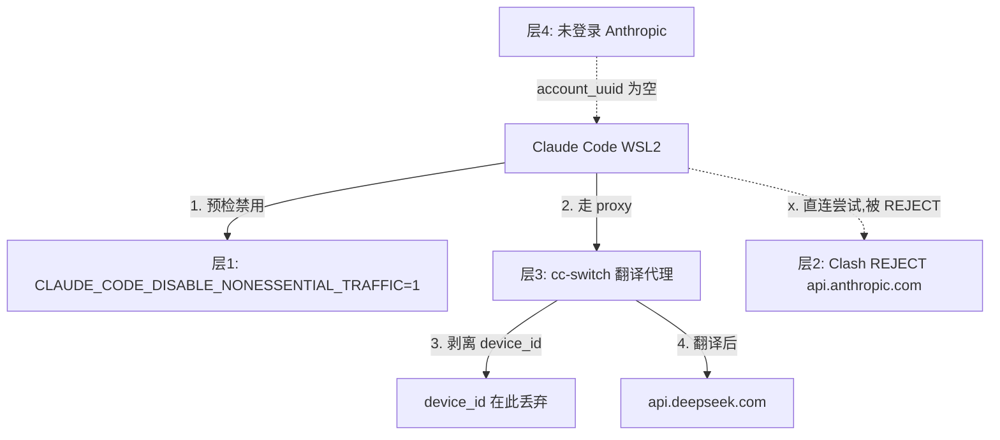

# REF: Claude Code 隐私分析 — 标识符体系 / 抓包证据 / cc-switch 防护 / ban 机制

对 Claude Code 发出的设备标识符、遥测请求、以及 cc-switch 翻译代理的隐私防护机制的系统性分析。基于 HTTP 捕获实测 + 搜索结果交叉验证。

## 1. 标识符体系

Claude Code 在本地和网络中使用了 **5 种不同的标识符**,来源和生命周期各不同:

| 标识符 | 来源 | 生命周期 | 备注 |
|---|---|---|---|
| `machineID` | `~/.claude.json` | 首次运行生成,永久(除非删文件) | `randomBytes(32)` hex 编码,64 字符 |
| `userID` | `~/.claude.json` | 同上,独立生成 | 与 machineID 无关的独立随机值 |
| `device_id` | 请求体 `metadata.user_id` | 每次请求携带 | 跟 machineID **不同**,可能是派生 hash |
| `account_uuid` | OAuth 登录时下发 | 登录后持久化,未登录=空 | 绑定到 Anthropic 账号 |
| `session_id` | 每次会话随机 | 单次会话 | 用于关联同一会话内的多次请求 |

**关键点:**
- `machineID` 和 `userID` 存在 `~/.claude.json`,是设备级指纹(删文件则重置)
- `device_id` 在网络请求中传输,是 `machineID` 的网络表达(可能经过 hash/编码)
- `account_uuid` 只在 OAuth 登录后非空 —— 未登录的 CLI 无法关联到账号,只能关联到设备

## 2. 实测捕获:Claude Code 发了什么

### 捕获方法

临时覆盖 `ANTHROPIC_BASE_URL` 指向本地 Python HTTP 服务,捕获 Claude Code 发出的原始请求:

```python
# capture_server.py — 启动: python3 capture_server.py
from http.server import HTTPServer, BaseHTTPRequestHandler
import json

class CaptureHandler(BaseHTTPRequestHandler):
    def do_HEAD(self):
        self._log_request("HEAD")
        self.send_response(200)
        self.end_headers()

    def do_POST(self):
        self._log_request("POST")
        self.send_response(200)
        self.send_header("Content-Type", "application/json")
        self.end_headers()
        self.wfile.write(json.dumps({"type": "message", "content": [{"text": "PONG"}]}).encode())

    def _log_request(self, method):
        print(f"\n{'='*60}")
        print(f"{method} {self.path}")
        print(f"Headers: {dict(self.headers)}")
        if method == "POST":
            length = int(self.headers.get("Content-Length", 0))
            body = self.rfile.read(length).decode() if length else ""
            print(f"Body: {body[:2000]}")

HTTPServer(("0.0.0.0", 9999), CaptureHandler).serve_forever()
```

启动后,在 WSL2 里临时指向本机(宿主 IP):

```bash
ANTHROPIC_BASE_URL="http://192.168.144.1:9999" claude -p 'hello'
```

> **注意:** 交互式 `claude` 启动时会**硬编码**预检 `api.anthropic.com/api/hello`,忽略 `ANTHROPIC_BASE_URL`。用 `claude -p` 或设 `CLAUDE_CODE_DISABLE_NONESSENTIAL_TRAFFIC=1` 避免预检干扰。

### HEAD /api/hello 预检请求

Claude Code 在发送消息前会先 HEAD 探测 `/api/hello`:

```
HEAD /api/hello HTTP/1.1
host: 192.168.144.1:9999
user-agent: claude-code/2.1.221
accept: */*
connection: keep-alive
```

- 这是连通性预检,不携带标识符
- 可用 `CLAUDE_CODE_DISABLE_NONESSENTIAL_TRAFFIC=1` 禁用

### POST /v1/messages 完整请求

```
POST /v1/messages HTTP/1.1
host: 192.168.144.1:9999
user-agent: claude-code/2.1.221
content-type: application/json
x-api-key: sk-cc-switch-dummy
anthropic-version: 2023-06-01
accept: application/json
X-Claude-Code-*: (多个内部头,被 cc-switch 剥离)

Body:
{
  "model": "claude-haiku-4-5",
  "max_tokens": 2000,
  "messages": [...],
  "metadata": {
    "user_id": "device_id=<64hex>|account_uuid=|session_id=<uuid>"
  }
}
```

#### 关键发现

| 发现 | 详情 |
|---|---|
| `metadata.user_id` 结构 | `device_id=<hex hash>` + `account_uuid=`(空) + `session_id=<uuid v4>` |
| `account_uuid` | **为空** —— 未登录 Anthropic 账号 |
| `x-anthropic-billing-header` | **无此头** —— Claude Code 不发送计费相关头 |
| `X-Claude-Code-*` | 多个内部调试/路由头,由 Claude Code 自动附加 |
| device_id 与 machineID | device_id 是 64 字符 hex,不同于 `~/.claude.json` 里的 machineID |

**结论:** 未登录状态下,Claude Code 发送的设备级指纹是 `device_id`(嵌入 `metadata.user_id`),无账号关联,不计费头。

## 3. cc-switch 如何处理(翻译代理机制)

cc-switch 作为 Anthropic → DeepSeek 的格式翻译代理,在翻译过程中**天然丢弃 Anthropic 专有字段**:

### 翻译流程

```
Claude Code 请求(Anthropic 格式)
        │
        ▼
   cc-switch proxy
        │
        ├─ 剥离 x-anthropic-* / X-Claude-Code-* 头
        ├─ 替换 x-api-key → 真实 DeepSeek API key
        ├─ 格式翻译: Anthropic Messages → OpenAI Chat
        ├─ 丢弃 metadata.user_id(DeepSeek 无此字段)
        └─ 构造 DeepSeek 请求
        │
        ▼
   api.deepseek.com
```

### 各字段去向

| Anthropic 字段 | cc-switch 处理 | 是否到达上游 |
|---|---|---|
| `x-api-key` | 替换为真实 DeepSeek key | 替换后的是 DeepSeek key,非 Anthropic 原始 key |
| `anthropic-version` | 剥离 | 否 |
| `metadata.user_id` | 丢弃(DeepSeek API 无对应字段) | **否** |
| `X-Claude-Code-*` | 剥离 | 否 |
| `model` | 映射(claude-haiku → deepseek-v4-flash) | 映射后的模型名 |
| `messages` | 翻译(Anthropic 格式 → OpenAI 格式) | 翻译后 |
| `system` prompt | 保留翻译 | 是 |

**核心结论:** `device_id` 在 cc-switch 层被丢弃,从不离开宿主机器。

## 4. 完整隐私栈(四层防护)



### 层层说明

| 层 | 机制 | 作用 |
|---|---|---|
| 层1 | `CLAUDE_CODE_DISABLE_NONESSENTIAL_TRAFFIC=1` | 禁止预检 HEAD /api/hello,减少不必要流量 |
| 层2 | Clash TUN REJECT `api.anthropic.com` | 即使 CLI 尝试直连 Anthropic,也会被 Clash 在 TCP/TLS 层切断(SSL_ERROR_SYSCALL,几十毫秒) |
| 层3 | cc-switch 翻译代理 | 核心防护:Anthropic 格式翻译为 DeepSeek 格式时,`metadata.user_id`(含 device_id)被丢弃,`x-api-key` 被替换,`X-Claude-Code-*` 被剥离 |
| 层4 | 未登录 Anthropic | `account_uuid` 为空,无法关联到具体账号 |

### 数据流图

```
device_id ──从 Claude Code 发出──▶ 进入 cc-switch ──被丢弃──▶ (不到达)
account_uuid ──为空,不发送────────────────────────────────▶ (不到达)  
x-api-key ──dummy──▶ cc-switch 替换为 DeepSeek key ──▶ api.deepseek.com
模型名 ──claude-haiku──▶ cc-switch 映射为 deepseek-v4-flash ──▶ api.deepseek.com
消息内容 ──原样──▶ cc-switch 翻译格式 ──▶ api.deepseek.com
```

**实际上报给 DeepSeek 的信息:** 只有翻译后的消息内容(带 cc-switch 注入的 DeepSeek API key)。DeepSeek 看到的是一次普通的 API 调用,无法关联到 Claude Code 或 Anthropic 设备标识符。

## 5. ban 机制 Q&A

以下结论基于公开文档、社区讨论和实测推理:

### Q: 新装 WSL2 distro 会生成新 machineID 吗?

**会。** `~/.claude.json` 不存在时,Claude Code 首次运行用 `randomBytes(32)` 生成新的 `machineID` 和 `userID`。新 distro = 新文件系统 = 新身份。

### Q: 宿主 vs WSL2 的 machineID 相同吗?

**不同,各自独立。** 宿主和 WSL2 有独立的 `~/.claude.json`,即使同一台物理机。宿主可能甚至没有 `~/.claude.json`(如果没在宿主装过 Claude Code)。

### Q: 重置 Windows 能避免封号吗?

| 封禁依据 | 重置 Windows 有效? |
|---|---|
| Device ID(device_id) | **有效** —— 新系统 = 新 `~/.claude.json` = 新 device_id |
| Account(account_uuid) | **无效** —— 登录同一 Anthropic 账号,account_uuid 不变 |

### Q: 新装 Ubuntu(WSL2)会被封吗?

**取决于封禁依据:**
- Device ID 封禁 → 新 distro = 新 device_id,不会被关联
- Account 封禁 → 如果登录同一 Anthropic 账号,account_uuid 不变,仍被封
- IP 封禁 → 如果 IP 不变,可能被封

### Q: 我的 cc-switch setup 会被 Anthropic ban 吗?

**不会。** 原因:
1. cc-switch 丢弃 device_id,Anthropic **看不到**你的设备
2. 层2 Clash REJECT 切断 `api.anthropic.com`,即使 CLI 尝试直连也被阻断
3. 层4 未登录,account_uuid 为空
4. 你的请求到的是 DeepSeek 服务器,不经过 Anthropic 基础设施

**Anthropic 不知道你在用 Claude Code。**

### Q: 频繁删除 device_id(删 `~/.claude.json`)有风险吗?

**有风险。** 频繁更换设备标识符可能被视为规避封禁的行为。如果你被 Anthropic 封了,靠删文件换新 device_id 绕过封禁,这在 Anthropic ToS 下可能构成违规。正常使用不要频繁删。

## 6. 捕获方法(可复现)

### 方法 A: Python capture_server.py(推荐,完整捕获)

见第 2 节的 Python 代码。支持 HEAD + POST 完整记录,输出 headers 和 body。

**启动:**
```bash
python3 capture_server.py  # 监听 0.0.0.0:9999
```

**触发捕获(WSL2 内):**
```bash
ANTHROPIC_BASE_URL="http://192.168.144.1:9999" claude -p 'hello'
```

**文件中转方式(PowerShell → WSL2,避免转义问题):**

参见 `REF-powershell-wsl-escaping.md`。如果用 PowerShell 驱动 WSL2,把 Python 脚本**写到 WSL2 ext4 文件**后再执行,避免命令行转义坑:

```powershell
$pyScript = @'
from http.server import HTTPServer, BaseHTTPRequestHandler
import json

class CaptureHandler(BaseHTTPRequestHandler):
    def do_HEAD(self):
        print(f"HEAD {self.path}")
        print(f"Headers: {dict(self.headers)}")
        self.send_response(200)
        self.end_headers()

    def do_POST(self):
        print(f"POST {self.path}")
        print(f"Headers: {dict(self.headers)}")
        length = int(self.headers.get("Content-Length", 0))
        body = self.rfile.read(length).decode() if length else ""
        print(f"Body: {body[:2000]}")
        self.send_response(200)
        self.send_header("Content-Type", "application/json")
        self.end_headers()
        self.wfile.write(json.dumps({"type":"message","content":[{"text":"PONG"}]}).encode())

HTTPServer(("0.0.0.0", 9999), CaptureHandler).serve_forever()
'@
[System.IO.File]::WriteAllText(
  '\\wsl.localhost\Ubuntu-24.04\tmp\capture_server.py',
  $pyScript,
  [System.Text.UTF8Encoding]::new($false)
)
```

### 方法 B: nc 单连接捕获(简易方案)

最简单,但只能抓第一个请求(HEAD 或 POST,取决于顺序):

```bash
# 在宿主机的 bash/WSL 里
nc -l -p 9999 | tee capture_raw.txt
```

```bash
# 在 WSL2 里触发
ANTHROPIC_BASE_URL="http://192.168.144.1:9999" claude -p 'hello'
```

**限制:**
- 只能捕获第一次连接(HEAD 或 POST,取决于哪个先到)
- 需要手动关闭 nc 才能看到输出
- 原始 HTTP 格式,需手动解析

## 7. 关键结论速查表

| 问题 | 答案 |
|---|---|
| Claude Code 会发送设备标识符吗? | 会,通过 `metadata.user_id` 发送 `device_id`(64 字符 hex) |
| device_id 和 machineID 一样吗? | 不同,device_id 是网络传输值,machineID 是本地存储值 |
| 未登录时能关联到账号吗? | 不能,`account_uuid` 为空 |
| cc-switch 会把 device_id 发给 DeepSeek 吗? | 不会,翻译时丢弃(DeepSeek API 无此字段) |
| Anthropic 能看到你的 cc-switch setup 吗? | 不能,所有请求到 DeepSeek,不经过 Anthropic |
| 如何验证隐私防护生效? | `curl api.anthropic.com` → SSL_ERROR_SYSCALL(Clash REJECT) |
| 新装 WSL2 distro 会换 device_id 吗? | 会,新 `~/.claude.json` = 新 device_id |
| 重置 Windows 能逃过 Anthropic ban 吗? | Device ID ban 可以,Account ban 不行 |
| 用什么工具捕获 Claude Code 原始请求? | Python HTTP server(推荐) 或 nc(简易) |
| `CLAUDE_CODE_DISABLE_NONESSENTIAL_TRAFFIC=1` 的作用? | 禁用预检 HEAD /api/hello,减少非必要流量 |
